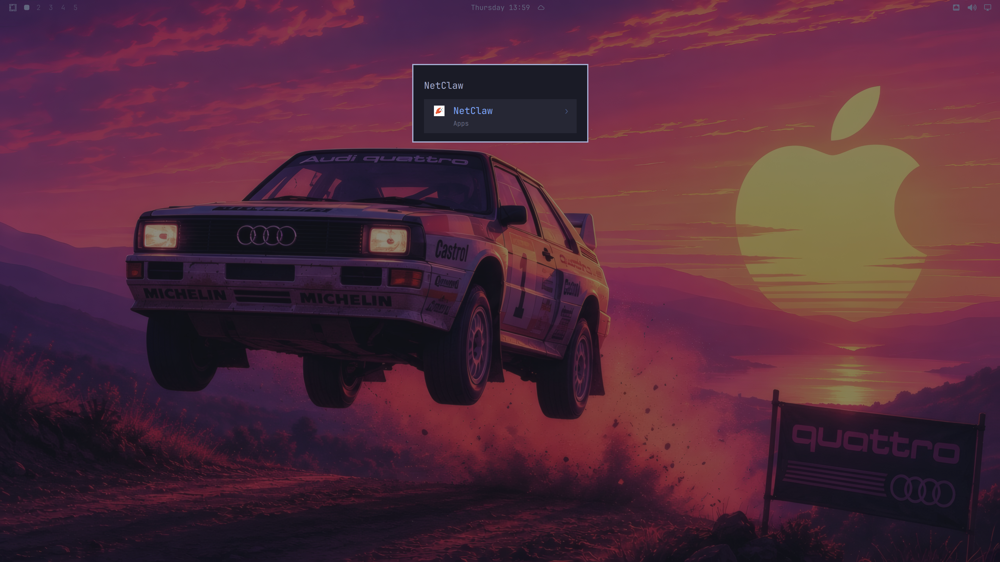
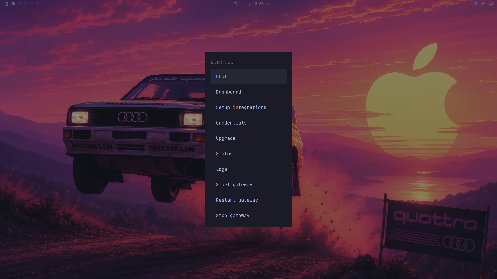
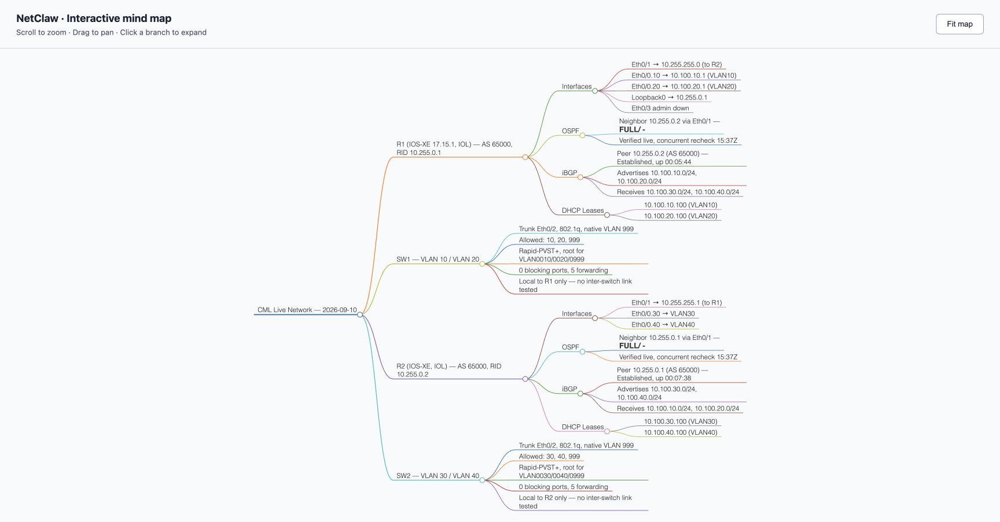
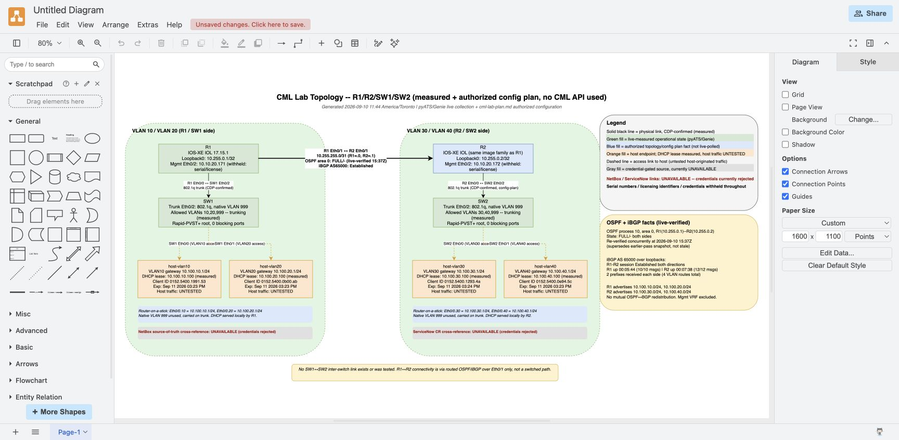
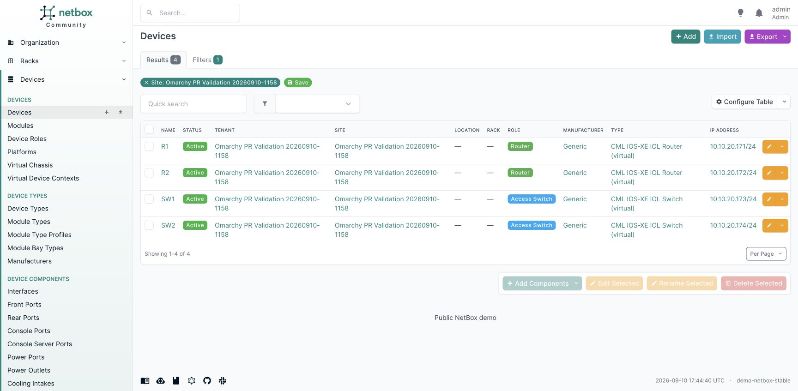
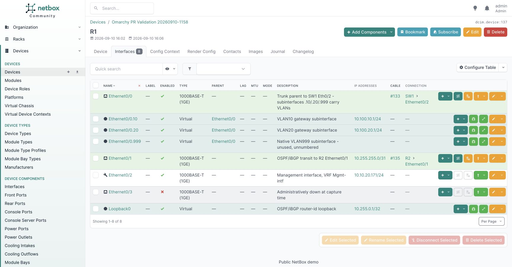
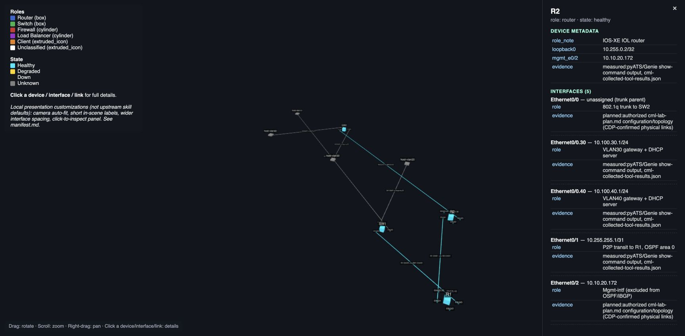
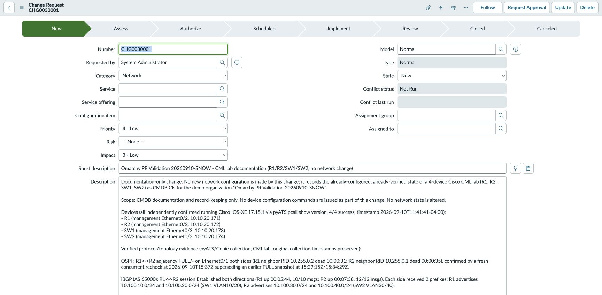
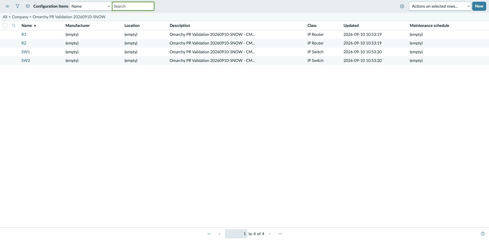

# NetClaw for Omarchy

[NetClaw](https://github.com/automateyournetwork/netclaw) is an open-source AI network engineering agent. It combines a language model with network-specific instructions and tools that can inspect real devices, query inventories, investigate faults, generate diagrams and support operational workflows.

This Omarchy fork integrates NetClaw into the Linux desktop: application launcher, menu, first-use setup, terminal chat, browser dashboard, service controls, status and updates.

**Start with a question:** “Which interfaces are up on my router? Show me the evidence and make a mind map.”

NetClaw uses the systems you connect to answer. A configured integration can collect live facts; an unconfigured integration cannot. Device access, model access and external service accounts remain yours to configure.

[Watch the recorded Omarchy + NetClaw demonstration on YouTube](https://youtu.be/nEp0g5rC6Hk).

## How it works

A **model** interprets your request. A **skill** describes how to perform a network engineering task. An **MCP integration** connects the agent to a tool or service, such as pyATS, NetBox or ServiceNow. NetClaw combines these into a conversation with actual tool calls and results.

**OpenClaw** is the agent runtime underneath NetClaw. Its **gateway** is the background service that connects your chat session, model and tools. A **testbed** is your device inventory: the names, platforms and connection details NetClaw needs to reach your network. You will see these terms during setup and in the logs.

The agent and its gateway run in Linux user space. Omarchy manages their desktop entry points and lifecycle. You do not need to start a separate pyATS assistant to ask NetClaw about a Cisco device.

## What you can do

- **Inspect devices:** interfaces, software versions, routing, reachability and supported platform-specific state.
- **Investigate problems:** correlate device output with logs, metrics, packets, flows, streaming telemetry and network intelligence.
- **Work with inventory:** query NetBox, Nautobot or Infrahub and compare intended state with observed state when the records identify the same devices.
- **Visualize evidence:** generate Markmap mind maps, Draw.io diagrams, UML, inline Canvas/A2UI views and interactive Three.js scenes. Blender and Unreal integrations require their respective backends.
- **Rehearse changes:** use CML, ContainerLab, GNS3, EVE-NG or Batfish workflows with an available lab or analysis service.
- **Support operations:** inspect incidents and change records, draft verification plans and preserve evidence through the configured ITSM and audit tools.
- **Build useful documentation:** produce reports from collected facts and retrieve supporting material from a configured document knowledge base.
- **Extend your workstation:** configure collaboration channels, voice, mobile access, local-model routing and federation with specialist NetClaws.

The upstream catalog covers Cisco devices and controllers, Juniper, Arista, Aruba, F5, Palo Alto, Fortinet, Check Point, Infoblox, Zscaler, Cloudflare, AWS, Azure, Google Cloud, Kubernetes and additional platforms through its multivendor CLI driver. It also includes tools for Grafana, Prometheus, Datadog, Splunk, Zabbix, Auvik, SuzieQ, PagerDuty, Claroty, Lantronix, Redfish, Itential, Ansible Automation Platform, Terraform, GitHub, GitLab and Jenkins.

Supported operations differ by integration. Some are intentionally read-only. Consult the [upstream catalog](https://github.com/automateyournetwork/netclaw#readme) for individual tools, platform coverage and requirements.

## Peer your Omarchy workstation with other NetClaws

NetClaw includes **NCFED**, its application-layer federation protocol. An Omarchy machine can host a NetClaw that discovers a consenting peer's capabilities, delegates authorized work and receives attributed results. The peer may run Omarchy or another supported Linux environment. Federation is configured explicitly; installing the desktop does not automatically join a public mesh.

| Mode | Who participates | What it means on Omarchy |
|---|---|---|
| **iN2N — internal** | One operator's specialist NetClaws behind a Border Claw | Your workstation hosts a Border, with pyATS, inventory or cloud specialists running locally or on reachable Linux hosts. Members connect outward to the Border, forming a hub-and-spoke group called a “risk.” |
| **eN2N — external** | Independently operated Borders with mutual consent | Your Omarchy NetClaw peers with another operator's NetClaw. Borders exchange advertised capabilities and route permitted tasks while their internal members remain behind each Border. |

For example: ask your Omarchy Border to check local OSPF through your pyATS member, then ask an authorized peer for a second opinion using its advertised analysis capability. Each operator controls permissions and credentials on their own side. Peer permission is distinct from network configuration permission.

NCFED carries framed JSON-RPC with MCP-style tools and A2A-style delegation/chat over the NetClaw mesh transport. The mesh's BGP identity/control plane and NCFED's agent conversations have different jobs. NCFED is documented as an experimental Internet-Draft; it is not an established IETF standard. Use the upstream certificate and peering guides to configure identity, trust, grants and auditing.

[NCFED / eN2N](https://github.com/automateyournetwork/netclaw/blob/main/N2N-PEERING-NETCLAWS.md), [iN2N](https://github.com/automateyournetwork/netclaw/blob/main/docs/N2N-RISK.md), [certificate onboarding](https://github.com/automateyournetwork/netclaw/blob/main/docs/N2N-FEDERATION-GUIDE.md). **Validation boundary:** this fork's current evidence covers one Omarchy NetClaw and its device/visualization workflows. A two-Omarchy NCFED peering demonstration has not been performed.

## Before you start

You need an installed system using this fork, internet access for first-use downloads, and a supported model provider. Configure credentials for the devices and services you intend to use. A model subscription and an API key are different authentication routes; select one that your provider and runtime support.

Start with a lab device and read-only questions. You can add other systems as you go. External products, hosted MCP endpoints and licensed visualization or lab backends require their own setup.

## Install: Light or Full

Open **Omarchy menu → Apps → NetClaw → Chat**, or search for **NetClaw** in the application launcher. The application appears before provider onboarding is complete and uses the NetClaw App Store icon.



The NetClaw submenu includes Chat, Dashboard, Setup integrations, Credentials, Upgrade, Status, Logs, and gateway start/restart/stop. Chat uses its own persistent `netclaw` session; previous OpenClaw `main` history remains available.



**Light** deploys the upstream skill library and selects the minimal component profile:

```bash
omarchy netclaw setup --profile minimal
```

**Full** deploys the same skill library and selects the entire upstream component catalog:

```bash
omarchy netclaw setup
```

The explicit equivalent is `omarchy netclaw setup --all`. Full is the default. It selects all catalog components; remote services, external applications, mobile pairing and federation still require their documented configuration.

Setup asks for provider configuration when needed, provisions the pinned NetClaw source, installs selected dependencies and configures the user gateway. Let setup finish before opening Chat or Dashboard. A visible menu does not mean component installation has completed.

NetClaw adopts the existing OpenClaw workspace and persona. Setup makes a private backup first; see the [manual](manual/52-netclaw.md) for recovery.

## Your first conversation

First, connect something for NetClaw to inspect:

1. Run Light or Full setup above and complete the model-provider wizard.
2. Run `omarchy netclaw credentials` to configure the selected integrations.
3. For device access, configure your lab inventory in `~/.config/netclaw/testbed.yaml`. Use the device aliases from this file in your prompts. For NetBox or ServiceNow, configure the service endpoint and credentials instead.
4. Run `omarchy netclaw status` to check setup and the gateway, then open chat. A healthy gateway means the agent service is available; your first tool request will also check access to the target system.

```bash
omarchy netclaw chat
```

After configuring a testbed, try:

> List the configured device aliases. For my lab router, collect its software version and interface summary using your pyATS skill. Keep it read-only and show the commands and collection timestamp.

Then follow up:

> Explain which interfaces deserve a closer look. Distinguish administratively down from operationally down.

For a graphical conversation:

```bash
omarchy netclaw dashboard
```

Both entry points use the configured NetClaw workspace and gateway. Chat uses a terminal interface; Dashboard opens a browser interface on the Linux desktop.

## Commands

| Command | Purpose |
|---|---|
| `omarchy netclaw setup` | Configure NetClaw with the full catalog selected |
| `omarchy netclaw setup --profile minimal` | Configure the Light component profile |
| `omarchy netclaw setup --add "markmap netbox servicenow"` | Add named upstream components |
| `omarchy netclaw chat` | Open terminal chat |
| `omarchy netclaw chat --message "Inspect my lab interfaces"` | Open chat with an initial prompt |
| `omarchy netclaw dashboard` | Open the browser dashboard |
| `omarchy netclaw credentials` | Open integration credential setup |
| `omarchy netclaw status` | Inspect provisioning and gateway health |
| `omarchy netclaw service logs` | Follow gateway logs |
| `omarchy netclaw service restart` | Restart the gateway |
| `omarchy netclaw service stop` | Stop the gateway |
| `omarchy netclaw service start` | Start the gateway |
| `omarchy netclaw update` | Apply the NetClaw revision selected by this distro |
| `omarchy default agent netclaw` | Select NetClaw for Omarchy's agent launch flow |

## Four conversations to try

These examples use our four-device lab aliases. Substitute your own aliases and endpoints. Prompt 3 explicitly authorizes creating scoped demo records; use an environment where you have that permission. Actual supported writes depend on the connector: the currently installed NetBox MCP exposes reads, so authorized NetBox writes require the supported REST API or a write-capable connector inside the agent workflow.

### 1. Meet my network — then make it visual

Use your pyats-network skill to discover my configured devices, then use pyats_pcall_show_command to collect show version and show ip interface brief across R1, R2, SW1 and SW2. Run one four-device pcall batch per command and allow the configured long timeouts. Tell me what these devices actually are, their software versions, and how many interfaces are up/up, administratively down or in another state. Explain what deserves attention. Then use markmap-viz to create an interactive mind map grouped by device and interface state. Include source commands and collection timestamps, hide serial numbers and licensing identifiers, and keep everything read-only. Save the report and a new interactive HTML map under showcase/ and give me links to both.

### 2. Follow a packet across my network

Investigate how traffic travels from VLAN 10 to VLAN 40. Use pyats-network and pcall across the relevant devices to collect actual CDP neighbors, VLANs, trunks, spanning-tree state, OSPF neighbors, BGP peers and learned routes. Explain how the /31 transit, router-on-a-stick, OSPF underlay and loopback-based iBGP work together. Check PortFast and BPDU Guard on the host-facing switch ports. Use the DHCP bindings to identify the hosts, then run five pings from R1's VLAN 10 gateway to the VLAN 40 host and report the real result. Build a Draw.io diagram from the discovered links, with interface labels, VLAN gateways and the tested traffic path. Identify single points of failure; distinguish router-sourced probes from host-originated traffic. Use long timeouts, no configuration changes, no invented links, and hide sensitive identifiers. Save the findings and diagram under showcase/.

### 3. Turn my live lab into a documented network operations platform

Use your pyats-network skill and MCP to discover and document my running four-device lab: R1, R2, SW1 and SW2. Use pyATS pcall across the devices for measured configuration, CDP neighbors and operational state. Do not use a CML API. Collect the platform, software, interfaces, addresses and prefixes, VLANs, access/trunk settings, CDP neighbors, STP roles and protections, OSPF, BGP, and DHCP leases. Correlate both ends of discovered links with interface and neighbor observations; label conflicts, missing data and timestamps. Use the configured long timeouts and keep device access read-only.

I authorize you to create and update records for this lab in NetBox and ServiceNow. In NetBox, find or create an Omarchy tenant/organization and a clearly named CML demo site, then fully document the four devices and their observed interfaces, management addresses, prefixes, VLANs, cable endpoints and supported relationships. Use the platform's correct object types. Represent host connections only where measured evidence identifies them. Preserve routing and STP details in supported metadata, journal entries or linked documentation when they have no native inventory field. Match existing lab records before creating anything, avoid duplicates, and do not modify unrelated records or delete anything.

In ServiceNow, create or update the four network configuration items in the available CMDB classes, associate them with the Omarchy demo organization using supported fields, and add verified relationships and a real demo documentation/change record containing the baseline, validation results and links to NetBox. Keep the change in draft or its initial available state; do not approve, implement or close it. Do not invent an incident or outage. Mark all created records as CML demonstration data and use actual returned record identifiers. Read back the records to verify they were saved, and give me clickable NetBox and ServiceNow links for every device and the documentation/change record. Never claim a write succeeded without API confirmation.

Then turn that same evidence into three visuals: a real Draw.io topology with device/interface labels, VLANs, the /31 transit and the tested traffic path; an interactive Markmap mind map of the complete inventory and findings; and an explorable Three.js network scene with device details, routing relationships and clickable NetBox/ServiceNow record links. Use the respective visualization skills and tools. Give me a working Draw.io editor link and its editable artifact, plus links to open the Markmap and Three.js artifacts. Verify the links or local artifacts are accessible; do not invent hosted URLs or describe an unrendered file as a working visualization.

Finish with a concise on-camera briefing: what was discovered, what was actually written to each system, what the routing and switching evidence proves, and which design risks or visibility gaps remain. Include an evidence table and all record/diagram links. Distinguish discovered links, measured live state and documented inventory. Hide passwords, tokens, serial numbers and licensing identifiers. If any API or visualization tool fails, clearly label that segment, continue the independent work, and never substitute fabricated records or screenshots. Save the briefing and visual artifacts under showcase/.

### 4. Build an engineering workspace on my desktop

This composition uses optional desktop applications: Obsidian, LibreOffice Calc/Impress and Git, plus NetClaw's document component (`omarchy netclaw setup --add document`). Install the applications and open or register an Obsidian vault first; NetClaw setup does not install these desktop applications automatically.

Use pyats-network with four-device pcall and the configured long timeouts to refresh interface and software facts for R1, R2, SW1 and SW2. Compare equivalent fields with my previous baseline and preserve both collection timestamps. Keep network access read-only. Create a timestamped directory in my registered Obsidian vault with linked device, VLAN, routing and evidence notes. Explain that the note graph represents knowledge relationships, not physical cabling. Use network-report-documents and document-generation to produce an interface audit workbook for Calc and a handover deck for Impress, including failed collections, separate administrative/operational states, sources and limitations. Make a local Git baseline commit containing only reviewed, sanitized deliverables in this new directory; do not push or modify another repository. Open the landing note, workbook, slides and existing interactive map on my Omarchy desktop, label older diagrams with their collection dates, and give me clickable artifact paths. Report missing applications or failed tools accurately and continue independent work. Do not depend on ServiceNow.

### What the live lab produced

NetClaw collected real device results and generated these artifacts. The full [test report](docs/netclaw-test-results.md) separates direct network checks, actual agent/MCP runs and automated fixtures. These diagrams reflect the recorded collection time; they are not continuously updating dashboards.





The Markmap HTML and editable Draw.io artifact are retained in the persistent demo workspace. The screenshots above were captured in Chrome on the Mac while inspecting those actual artifacts; NetClaw itself ran in the native Omarchy VM. NetBox record creation and MCP read-back succeeded. ServiceNow created and independently verified 13 records; the Three.js inspector was also opened and captured.





### Explorable network evidence

The actual Three.js artifact renders the same recorded lab evidence. This capture tests zoom and the R2 inspector, showing management, VLAN gateways and the /31 transit. Camera fit, labels, spacing and the inspector are local presentation customizations made by NetClaw; they are not upstream defaults. This is a subset visualization of interfaces, not a complete interface inventory. Whole-scene labels remain small; use the inspector for readable detail.



### ServiceNow records from a real NetClaw run

NetClaw created and read back 13 ServiceNow objects: one Normal change in New state, one demo organization, four network CIs, three relationships and four affected-CI links. The change used the real ServiceNow MCP; CMDB/company/relationship writes used authorized Table API calls inside NetClaw because this MCP lacks those tools. Independent REST verification passed for all 13 records. Screenshots show actual saved records. After capture, all 75 NetBox/ServiceNow validation records were removed and their absence verified, leaving the sandbox ready for a fresh demonstration.





## Beyond the desktop

Configure supported channels to reach NetClaw through Slack, Webex, Discord, Telegram or WhatsApp. Twilio integrations add voice/SMS workflows.

The [NetClaw iPhone and Apple Watch app](https://apps.apple.com/us/app/netclaw/id6800859524) connects to a configured and paired NetClaw Border. That lets you reach an agent hosted on your Omarchy machine from your phone or watch. Installing the desktop entry alone does not configure the Border or pair a device.

The upstream Zoom RTMS integration connects meeting questions to NetClaw's investigation workflow. It requires Zoom application configuration and the Border integration. See [NetClaw's documentation](https://github.com/automateyournetwork/netclaw) for these additional setup paths.

## Configuration and troubleshooting

Credentials and inventory belong in private per-user configuration, outside the source repository. The integration uses `~/.config/netclaw/testbed.yaml` for mutable device inventory and `~/.openclaw/` for runtime configuration and workspace state. Never commit keys or secret-bearing testbeds.

If Chat or Dashboard cannot open, read the error in the terminal and run:

```bash
omarchy netclaw status
omarchy netclaw service logs
```

- **Setup is still running:** let the installation finish before trying again.
- **Setup failed:** resolve the reported component or provider error, then rerun the chosen setup command.
- **Provider rejects a request:** verify the selected authentication route, model access and provider billing. Restarting the gateway cannot fix an account entitlement problem.
- **A device or service cannot be reached:** verify its endpoint, credentials and network access. Do not treat a connection failure as an empty inventory or a healthy device.
- **An integration is unavailable:** check that its component and prerequisites are installed. The presence of a skill file does not establish that its backend is operational.

For experienced operators, the [integration reference](docs/netclaw.md) covers source ownership, component isolation, gateway configuration and updates. The [testing guide](docs/netclaw-testing.md) describes the Arch container checks. The [showcase plan](docs/netclaw-showcase.md) describes live validation scenarios.

## Project status

This is an independent Omarchy fork under development. It contains integration source, not a newly published installation image. The native Try Omarchy test VM has the menu, packaged ARM runtime and selected showcase components installed. The test suite passes 358 checks across eleven suites, all 227 NetClaw skills register, and earlier actual four-device pyATS pcall collection passed both tested commands. After the operator restored the VPN, a fresh two-command, four-device pcall recheck passed 8/8 device results at 14:04 EDT on September 10. NetClaw has generated a live network Markmap from collected Cisco evidence. NetBox created and verified 62 scoped demo records; native Obsidian, Calc and Impress opened NetClaw-generated deliverables. The operator confirmed Dashboard operation and reboot/login. ServiceNow created and independently verified 13 records; see the [test suite results](docs/netclaw-test-results.md) for exact outcomes and screenshots.

Full-catalog selection, successful installation, skill registration and authenticated end-to-end operation are separate checks. See the [validation record](docs/netclaw-validation.md) for the evidence and remaining work.

## The Omarchy Manual

The manual lives in [`manual/`](manual/). The upstream Omarchy manual is published at [learn.omacom.io](https://learn.omacom.io/2/the-omarchy-manual); this fork adds its own [NetClaw guide](manual/52-netclaw.md).

- [Welcome to Omarchy!](manual/01-welcome-to-omarchy.md)

**The Basics**

- [Getting Started](manual/02-getting-started.md)
- [Coming From Mac or Windows](manual/03-coming-from-mac-or-windows.md)
- [Navigation](manual/04-navigation.md)
- [The top bar](manual/05-the-top-bar.md)
- [Themes](manual/06-themes.md)
- [Hotkeys](manual/07-hotkeys.md)
- [Unified Clipboard & History](manual/08-unified-clipboard-history.md)
- [Reminders](manual/09-reminders.md)
- [Notices](manual/10-notices.md)
- [Text Extraction & Dictation](manual/11-text-extraction-dictation.md)
- [Screenshots & Recording](manual/12-screenshots-recording.md)
- [Toggles, idle & screensaver](manual/13-toggles-idle-screensaver.md)
- [Omarchy CLI](manual/14-omarchy-cli.md)

**The Applications**

- [Terminal](manual/15-terminal.md)
- [Neovim](manual/16-neovim.md)
- [AI](manual/17-ai.md)
- [Development Tools](manual/18-development-tools.md)
- [Shell Tools](manual/19-shell-tools.md)
- [Shell Functions](manual/20-shell-functions.md)
- [TUIs](manual/21-tuis.md)
- [GUIs](manual/22-guis.md)
- [Browsers](manual/23-browsers.md)
- [Commercial apps/services](manual/24-commercial-apps-services.md)
- [Web Apps](manual/25-web-apps.md)
- [Gaming](manual/26-gaming.md)
- [Filling out PDFs](manual/27-filling-out-pdfs.md)
- [Windows VM](manual/28-windows-vm.md)
- [Other Packages](manual/29-other-packages.md)

**Configuration**

- [Updates](manual/30-updates.md)
- [Dotfiles](manual/31-dotfiles.md)
- [Shell plugins](manual/32-shell-plugins.md)
- [Monitors](manual/33-monitors.md)
- [Keyboard, Mouse, Trackpad](manual/34-keyboard-mouse-trackpad.md)
- [Networking](manual/35-networking.md)
- [System sleep](manual/36-system-sleep.md)
- [Hardware authentication](manual/37-hardware-authentication.md)
- [Fonts](manual/38-fonts.md)
- [Backgrounds](manual/39-backgrounds.md)
- [Prompt](manual/40-prompt.md)
- [Branding](manual/41-branding.md)
- [Common tweaks](manual/42-common-tweaks.md)
- [Making your own theme](manual/43-making-your-own-theme.md)

**The Rest**

- [Mac support](manual/44-mac-support.md)
- [Troubleshooting](manual/45-troubleshooting.md)
- [FAQ](manual/46-faq.md)
- [System snapshots](manual/47-system-snapshots.md)
- [Security](manual/48-security.md)
- [Omarchy on...](manual/49-omarchy-on.md)
- [Dual Boot Install](manual/50-dual-boot-install.md)
- [Unattended Installs](manual/51-unattended-installs.md)

## License

Omarchy is released under the [MIT License](LICENSE). NetClaw is a separate [Apache-2.0 project](https://github.com/automateyournetwork/netclaw/blob/main/LICENSE), fetched from its upstream repository; its dependencies retain their own licenses.
