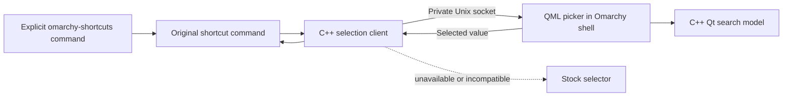

# Native shortcut picker prototype

An opt-in picker for Hyprland, Tmux, and Herdr shortcuts. It combines a small C++ socket client with a native Qt list model and a QML view inside the existing Omarchy shell. It does not add a daemon. Omarchy's original commands still generate the shortcut records and execute the selected action.

This is a draft follow-up to the stock selector batching change. Keeping the prototype under `contrib/` lets that smaller change ship independently. Nothing here is auto-discovered, built, installed, or enabled by a normal Omarchy update. Packaging and eventual first-party integration need maintainer agreement before this becomes a default feature.

## Design



The wrapper substitutes `omarchy-menu-select` through a process-local PATH. Ordinary calls to the original shortcut commands and the application launcher keep their stock behavior. Enabling the plugin does not change keybindings, Learn menu entries, or update hooks.

The model prepares records once, retains result storage, coalesces changed-role notifications, and formats rich text only when visible delegates request it. The view reuses delegates, has no offscreen delegate cache, and draws one shared selection surface. The socket client blocks while waiting for the user, without polling or result-writer subprocesses.

Search intentionally differs from stock substring filtering: modifier aliases and ordering are normalized, exact chords rank ahead of extra modifiers, descriptions support word/substring/fuzzy matches, and matches are bold and underlined. The QML uses Omarchy's shared theme components, but its placement, row spacing, group headings, and caret are not pixel-identical to the stock picker. This proposal includes those behavior and layout choices, not just a language translation.

## Build and try

Build dependencies: a C++17 compiler, `make`, `pkg-config`, json-c, Qt 6 Core/Qml development tools (`qmake6`), and Qt Test for the model tests. Build against the Qt libraries used by Quickshell; binaries are architecture-specific and are not checked in.

From this directory:

```bash
./build-native.sh
./build-search.sh
python3 tests/verify-native.py
python3 -m unittest discover -s tests -p 'test_*.py' -v
```

For a first installation, copy the plugin into the user plugin directory, then rebuild the module there. Quickshell virtualizes QML paths, so the generated `qmldir` must name the actual library directory:

```bash
picker="$HOME/.config/omarchy/plugins/experimental.shortcuts"
mkdir -p "$picker"
cp -a plugin/. "$picker/"
./build-search.sh "$picker/Native"
omarchy-shell shell rescanPlugins
omarchy-shell shell setPluginEnabled experimental.shortcuts true
omarchy-restart-shell
./omarchy-shortcuts hyprland
./omarchy-shortcuts tmux
./omarchy-shortcuts herdr
```

The wrapper is usable directly from this checkout; no global PATH change is needed. Do not enable two copies of this prototype at once: they use the same per-display socket. When replacing an already-loaded native module, rebuild it at the installed path and restart the shell; QML hot reload does not unload C++ code. `build-search.sh` replaces the shared library atomically so an existing mapping keeps its old inode until restart.

Disable the plugin with `omarchy-shell shell setPluginEnabled experimental.shortcuts false`, then restart the shell. The explicit wrapper falls back to stock when the plugin is unavailable. Ordinary stock commands remain usable throughout.

## Compatibility and review boundaries

The client preserves the original arguments and input on fallback. Unknown flags, missing/unloadable binaries, failed handshakes, incompatible protocol versions, and interrupted connections use the stock selector. A returned selection must match an input record literally. The picker itself never executes actions.

Qt ABI changes or changes to shared QML components can require rebuilding or adapting this prototype. The fallback covers loading and protocol failures, not every possible rendering or behavioral regression. The native model runs in the shell process, so a native-code crash can take down that process. There is no automatic build or post-upgrade repair hook.

Before default integration, maintainers need to decide where to package the Qt module and client, whether the ranked search/layout changes are desirable, and how users should opt into shortcut routing. This draft deliberately leaves the installed desktop unchanged until the explicit steps above are run.

## Validation

`tests/Oracle.js` preserves the independent JavaScript matcher used as the behavior reference. The test runs both implementations in Qt's JavaScript engine, checks exact ordering, groups, HTML escaping/underlining, Unicode cases, replacement lists, and literal selection values, and attaches `QAbstractItemModelTester` to every transition. It uses checked-in fixtures and deterministic fuzzing, with no dependency on a user's cache or Git history. Use `python3 tests/verify-native.py --sanitize` for AddressSanitizer and UndefinedBehaviorSanitizer coverage.

The socket tests use private temporary servers and a fake stock command; they never contact the desktop or dispatch an action. The focused repository entry point is `bash test/shell.d/shortcut-picker-test.sh` from the repository root. It skips when optional native build dependencies are missing.

Performance measurements and source/fixture hashes are on the [separate evidence branch](https://github.com/ryankirkman/omarchy/blob/benchmarks/selector-batching/benchmarks/selector-batching/NATIVE.md). CPU-work measurements are not physical keypress-to-screen latency, and a fast workstation is not a substitute for testing on older hardware.
