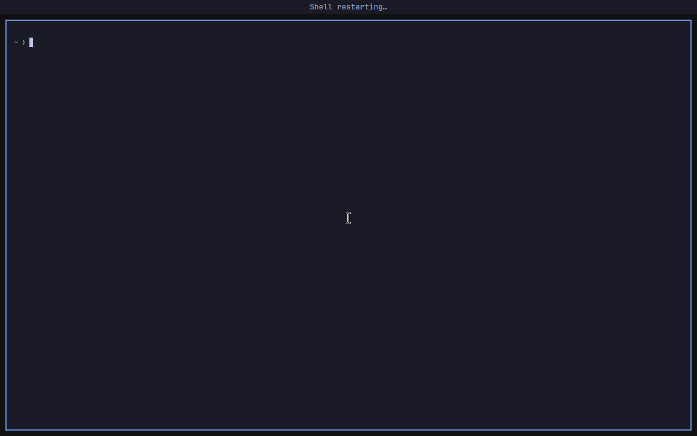

# Bar space during shell recovery

The built-in bar keeps its screen space when plugins reload or the main shell stops. An independent Quickshell configuration at `shell/bar-reservation/` owns the layer-shell exclusive zones. The interactive bar uses `ExclusionMode.Ignore`, so it occupies that same strip without reserving it a second time.

The reservation process loads no plugins, authentication services, or main-shell singletons. Its surfaces sit on the bottom layer, accept no pointer or keyboard input, and are transparent during normal operation. During an outage they use the last bar colors and show a short status message. Fullscreen windows can cover them normally; session-lock surfaces remain above them.

## Lifetime and state

`omarchy-launch-shell` starts one reservation host per configuration and Wayland display with `quickshell -d -n`. A socket under `XDG_RUNTIME_DIR`, named using a hash of the display name, connects the two processes. The socket is private to the user's runtime directory; this is coordination between processes belonging to the same user, not a security boundary against that user.

The main shell sends bounded, versioned JSON containing only screen names, edge, thickness, visibility, readiness, and opaque foreground/background colors. Incomplete and oversized frames and invalid fields are rejected. The receiver retains detached scalar values, accepts one active owner, and never evaluates code or starts commands supplied through the protocol. Loading a new bar does not clear the previous snapshot.

The host retains the last reservation when the connection closes. A deliberate restart announces “Shell restarting…”. The existing launcher reports “Shell crashed — restarting…” when it retries an abnormal exit, and “Shell stopped — restart required” when its retry budget is exhausted. A clean stop without a restart request shows “Shell unavailable”. These messages describe observed lifecycle events; there is no speculative crash diagnosis.

The built-in bar waits for the initial snapshot acknowledgement, and initial widget loading, with a two-second fallback, before mapping. If the reservation process is absent or disconnects, the bar resumes owning its own zone. A failure of the reservation host must not prevent launching or restarting the main shell.

## Configuration and monitors

The main shell supplies the actual bar thickness, including theme changes, and updates all connected screen names. Each reservation surface is tied to its `QuickshellScreen`, so unplugging a screen removes that surface. A newly connected screen receives a reservation once the main shell publishes it. A returning screen with a previously known name can retain its last reservation while the main shell is down.

Hidden bars reserve no space. The reservation host also watches the existing `bar-off` flag, with a one-second recheck during outages, so the user can release the space while the main shell is unavailable. Moving the bar to another edge is an intentional layout change. Shell recovery at that edge preserves the resulting layout.

Full replacement bars from third-party plugins continue to own their existing exclusive zones; selecting one releases the built-in reservation. Arbitrary third-party surfaces cannot be moved between processes without changing their plugin contract. This change protects the built-in bar and its hosted widgets, not every possible replacement bar implementation.

## Limits

A second Qt Quick process has a resource cost. The accelerated QA VM measured approximately 80 MiB proportional resident memory for this process after repeated restarts; that figure depends on Qt, the graphics driver, and monitor configuration.

The reservation host itself still depends on the compositor and Qt. Losing that host or the entire compositor can cause a layout change. Its job is to survive failure or restart of the much larger process that loads plugins. It does not add a new restart policy for the main shell, override intentional stops, or restart a healthy lock client.

The reservation host stays running across main-shell restarts; changes to its QML take effect at the next session start. During development, stop its specific configuration in the disposable VM before restarting the main shell. Do not restart every Quickshell process indiscriminately.

## Verification

`test/shell.d/bar-reservation-test.sh` covers the state protocol and bounded frame assembly. The existing launcher and restart tests cover abnormal exits, retry limits, session environment, duplicate main-shell instances, and lock preservation.

Run `test/acceptance.d/bar-reservation-test.sh` in a disposable Omarchy VM. It opens a real tiled terminal, samples its position and size and the compositor's reservations throughout deliberate outages, restarts, and `SIGKILL`, and waits for a replacement process before accepting recovery. It exercises all four edges, repeated restarts, hidden and transparent bars, saves the samples as JSON, captures screenshots, and restores configuration and the test window on exit. This graphical test is excluded from `test/all`.
