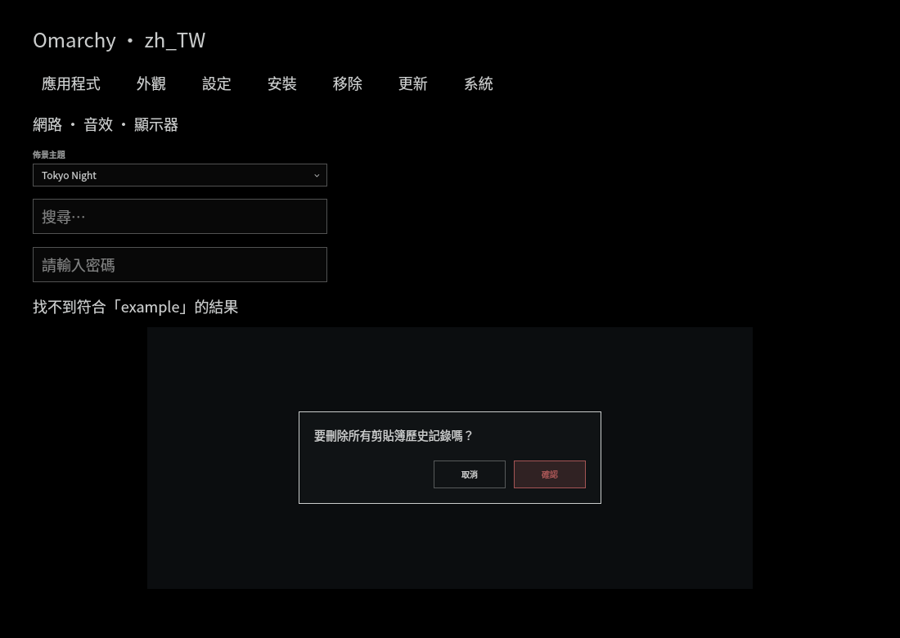
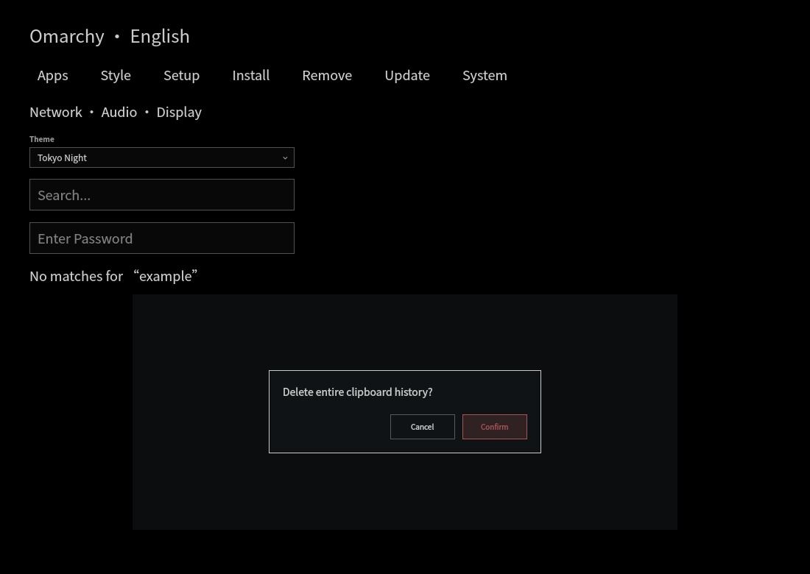

# Shell localization

The shell includes an initial Traditional Chinese catalog in `shell/translations/zh_TW.json`. Shared controls and built-in panels call `qs.Commons.I18n.tr(source)` for their display text. Missing keys, malformed catalogs and unsupported locales render the original English source string.

Locale selection follows `LC_ALL`, `LC_MESSAGES`, then `LANG`. With a non-C message locale, `LANGUAGE` supplies an ordered list of translation preferences; an English preference ends the search. `C` and `POSIX` remain untranslated. `zh_TW`, `zh-Hant` and `zh-Hant-TW`, including codeset/modifier variants, select this catalog. A Simplified Chinese locale does not automatically select Traditional Chinese.

The locale is selected once when the shell starts. Configure the system's `zh_TW.UTF-8` locale normally, or add `export LANGUAGE=zh_TW:en` to `~/.config/uwsm/env.d/20-language`, then log out and back in. `LANGUAGE` does not override a `C` message locale. The existing `noto-fonts-cjk` base dependency supplies Chinese glyphs; choosing an input method is separate from translating the shell.

## Adding display text

Import `qs.Commons` and wrap a human-facing source string:

```qml
text: I18n.tr("Network")
```

Add the same source string as a key in the JSON catalog:

```json
{
  "Network": "網路"
}
```

For messages containing names or counters, use positional arguments such as `I18n.tr("Do you want to uninstall %1?", [name])`. Arguments are inserted in one pass as literal data; an argument containing `%2` is never expanded again. Keep each source placeholder in its translation.

Catalogs contain data only: string-to-string entries. Other value types and empty translations are ignored. A single allowlisted catalog path is read synchronously before the first translated binding; there is no fallback sequence of failed file reads. Editing the catalog reloads the bindings and rebuilds the default menu labels.

Menu labels, titles and descriptions are translated before user extensions are merged. User-written menu labels take precedence. Actions, command identifiers, routes, aliases, guards, provider values, application names, file paths and user input are never translated. Keep model state and parsed command output outside the translation layer; translate a model's human-facing result at its display binding instead.

The initial catalog is source-string based, following the shape discussed in #7434. It is intentionally limited to common controls, default menu labels and a first set of built-in panel labels. It does not translate every shell message, plugin manifest, CLI prompt, setup console, application or external plugin. There is no language-pack plugin API, plural engine or system-locale installer in this change. The catalog can be adapted to the localization mechanism proposed in #8765 if that interface is selected upstream.

## Validation

Run `bash test/shell.d/i18n-test.sh`, `bash test/shell.d/i18n-runtime-test.sh` and `bash test/shell.d/menu-test.sh`. The localization test covers locale precedence, missing/malformed data, catalog coverage for literal QML calls, unchanged menu behavior and user override precedence. The runtime test uses an isolated offscreen Quickshell process to verify initial loading and fallback; it skips when Quickshell is unavailable. Existing panel tests continue to exercise their original English model outputs.

Inspect the translated interface in a running session, including its empty states and confirmation dialogs. Check both English and Traditional Chinese at the intended font size for clipping, wrapping, punctuation and focus behavior. Headless Qt renders help check catalog loading and shared controls, but do not replace full desktop acceptance testing.

These previews render actual shared controls with the catalog in an isolated offscreen fixture. The navigation row is sample data, not a running desktop menu; the previews do not verify panel positioning, compositor interaction or keyboard focus in a full Omarchy session.




