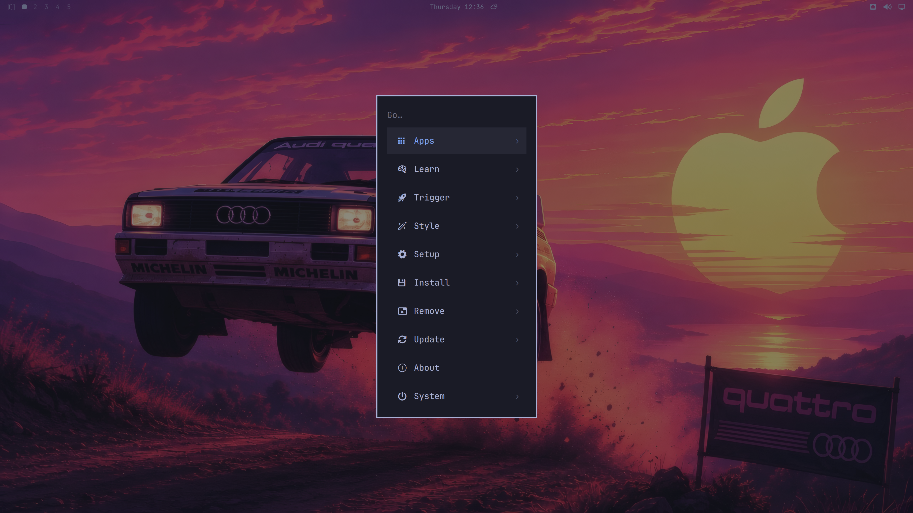
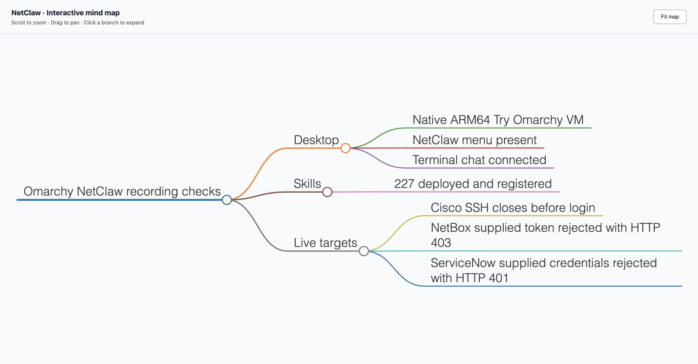
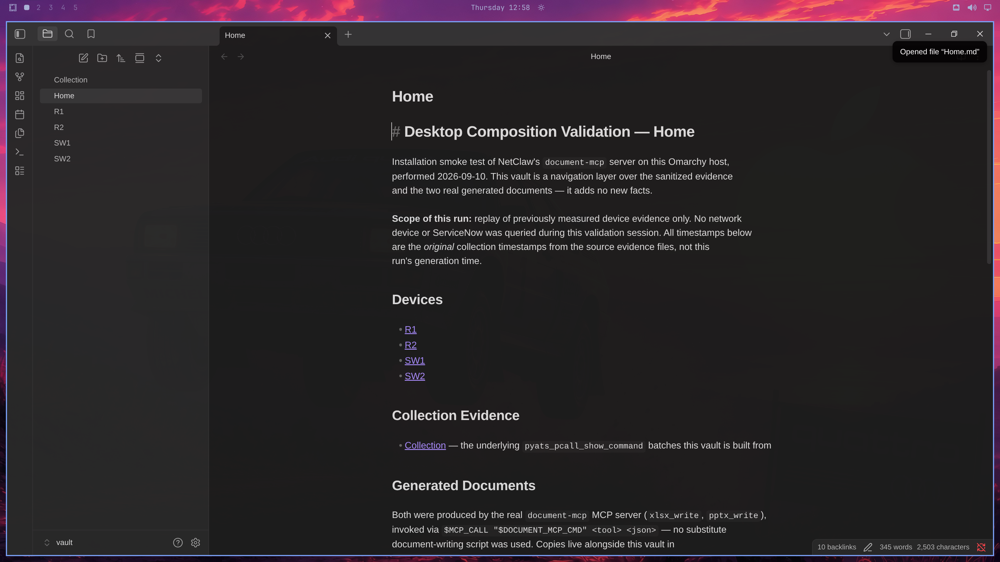
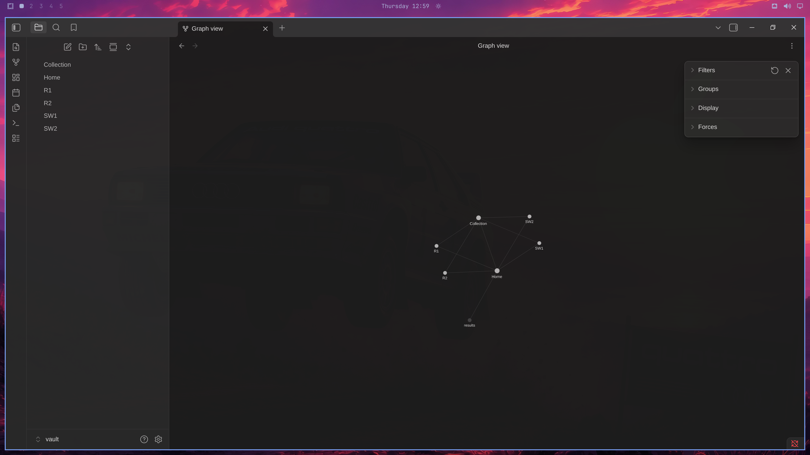
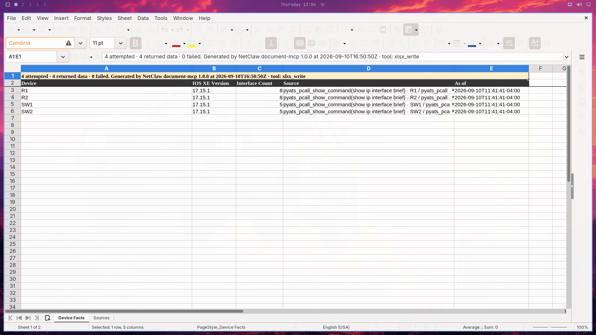
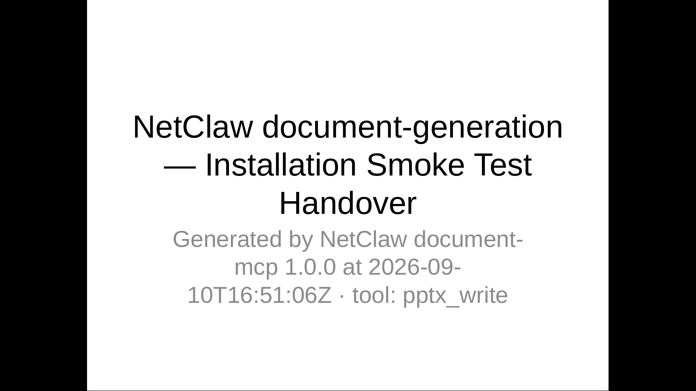
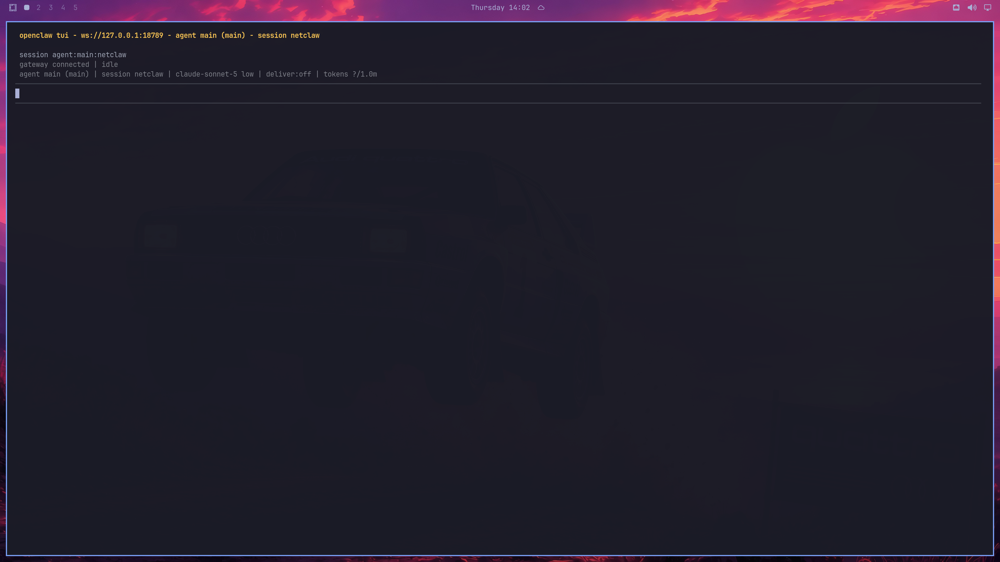

# NetClaw test suite results

Date: 2026-09-10. Branch: `codex/netclaw-os-integration`. These results cover the working integration source and the persistent native ARM64 Try Omarchy demo VM. NetClaw source is pinned to `7599220c0290184d3c9ff31662969abfecbe55f3`; external component installers can fetch newer dependencies independently.

**Recording status: fresh four-device collection passes after VPN restoration.** The 13:57 R1 failure and independent connection refusals are retained below; a new NetClaw run completed both commands on all four devices at 14:04 EDT, 8/8 successful results. Four-device pyATS pcall passes both tested commands (8/8 results). NetBox record creation and MCP read-back succeeded; the operator also inspected a real device link. ServiceNow created and independently verified 13 records, with real change and CMDB screenshots. Draw.io was opened in its editor; Three.js rendered and its zoom/R2 inspector were visually verified; whole-scene label readability remains a presentation limitation.

[Watch the recorded Omarchy + NetClaw demonstration on YouTube](https://youtu.be/nEp0g5rC6Hk). The recording complements the timestamped test evidence below; it does not certify every upstream integration.

## Replacement CML lab — 2026-09-10

The operator authorized configuration of a disposable four-device CML lab. Management interfaces, management VRFs and access credentials were preserved. Initial configurations were backed up privately; validated running configurations were saved to startup on all four devices.

- R1/SW1 serve VLANs 10 and 20; R2/SW2 serve VLANs 30 and 40 using 802.1Q router subinterfaces. Native VLAN 999 is unused for host traffic.
- R1–R2 use `10.255.255.0/31`. OSPF area 0 provides loopback reachability; iBGP AS 65000 exchanges the four host subnet routes without redistribution.
- Both OSPF neighbors are FULL; both BGP peers are established and receive two remote VLAN prefixes.
- Both switch trunks forward their two host VLANs and VLAN 999. Rapid PVST is active; all four host-facing ports have PortFast and BPDU Guard enabled.
- Four hosts obtained DHCP leases: `10.100.10.100`, `10.100.20.100`, `10.100.30.100`, `10.100.40.100`.
- Router-sourced probes to all four hosts from both routers returned **40/40 replies**. This proves those tested routed paths, not a host-originated full mesh or STP failure recovery.

[Timestamped direct network checks](netclaw-evidence/cml-lab-network-checks.json). These configuration/validation checks used SSH directly. Actual NetClaw agent results are reported separately; they must not be inferred from these checks.

### Actual NetClaw verification of the replacement lab

- **14/14 device commands completed** through NetClaw's pyATS MCP on R1, R2, SW1 and SW2. Initial simultaneous backend starts exceeded the upstream 10-second initialization window; sequential retries succeeded, but that long agent run exhausted its original overall timeout before report writing. A subsequent agent run produced the report and Markmap from the preserved evidence and fresh OSPF queries.
- **Four-device pcall: 8/8 results passed.** Two actual `pyats_pcall_show_command` invocations each queried all four devices: `show ip interface brief` and `show version`. Both returned `pcall (process per device)` and `total: 4, success: 4, failed: 0`. All four devices report IOS XE 17.15.1. [Tool summaries](netclaw-evidence/cml-pcall-evidence.json), [agent report](netclaw-evidence/cml-pcall-validation.md).
- **Markmap generated and rendered.** NetClaw generated the live lab map through its Markmap MCP. The artifact was opened in Chrome on the Mac, Fit map was exercised, and an actual screenshot was saved. The HTML also remains in the native VM workspace; this browser check does not establish native GUI Dashboard behavior.
- **Long timeouts applied:** MCP initialization 180s, tool response 1800s, pyATS connection/command defaults 300s, single show operation 900s, shell execution 2100s, agent turn 3600s. Explicit testbed settings and supplied tool deadlines remain configurable. The deployed skill now directs multi-device queries to upstream pcall. No upstream source checkout was edited.

[Sanitized 14-command evidence](netclaw-evidence/cml-netclaw-tool-results.json), [reviewed live baseline](netclaw-evidence/cml-live-baseline.md). The report received editorial corrections for an inherited example hostname, interface count wording and sampling limits.


## Apps menu revision — 2026-09-10

The custom NetClaw root submenu was removed. NetClaw now appears through the existing Apps provider and desktop launcher, using John Capobianco’s App Store icon. The persistent native Mac VM received the revised source, desktop entry and hicolor icon. Live visual checks confirmed the root menu, the Apps result and launch into a gateway-connected Chat. Screenshots below were replaced with fresh captures. This updates the development VM; it is not a clean ISO installation test.

## Automated integration suite

**PASS — 358 reported checks across 11 suites.** The runner completed with exit code 0 in the x86-64 Arch container on OrbStack, with networking disabled. [Complete publication test output](netclaw-evidence/publication-tests.log).

| Suite | Result | Passing checks |
|---|---|---:|
| `test/shell.d/netclaw-test.sh` | PASS | 16 |
| `test/shell.d/netclaw-credentials-test.sh` | PASS | 3 |
| `test/shell.d/netclaw-workspace-test.sh` | PASS | 3 |
| `test/shell.d/netclaw-markmap-test.sh` | PASS | 1 |
| `test/shell.d/netclaw-launch-test.sh` | PASS | 3 |
| `test/cli` | PASS | 112 |
| `test/shell.d/default-agent-test.sh` | PASS | 47 |
| `test/shell.d/menu-test.sh` | PASS | 136 |
| `test/shell.d/menu-guards-test.sh` | PASS | 18 |
| `test/shell.d/launch-openclaw-test.sh` | PASS | 9 |
| `test/shell.d/restart-shell-test.sh` | PASS | 10 |

The assertions exercise real filesystem state, Git provisioning fixtures, backup preservation, failure propagation, component launchers, skill metadata repair, CLI routing, menu dispatch and the desktop path regression. Provider onboarding, package/component downloads, backend implementations in adapter fixtures, and gateway responses are mocked. These tests establish integration behavior, not authenticated operation of every upstream MCP.

The recorded exact-value scan checked the changed/new files against four configured credential values and found no matches. The final publication pass also scanned credential patterns, including embedded Office document contents, and checked all local Markdown links. No credential matches or missing local targets were found. [Scan summary](netclaw-evidence/final-credential-scan.json).

After increasing the network timeouts, the two affected suites were rerun successfully (17 reported checks). [Focused retest output](netclaw-evidence/long-timeout-tests.log).

ShellCheck also passed with external source following enabled (`-x`). The command excludes SC2010 for the existing shell process-selection code and SC1091 for dynamic external installer sourcing; it does not suppress other findings.

### Reproduce

```bash
DOCKER_CONTEXT=orbstack ./test/netclaw-container
```

This builds the current source into the validation image, then runs the same suite selection without network access. On a Linux Docker host, omit `DOCKER_CONTEXT=orbstack`. The recorded development run reused the existing image's toolchain and mounted the current checkout read-only:

```bash
docker --context orbstack run --rm --platform linux/amd64 --network none \
  -e OMARCHY_PATH=/src -v "$PWD:/src:ro" --workdir /src \
  omarchy-netclaw-test bash test/containers/netclaw/run.sh
```

## Native VM checks

The native Try Omarchy ARM64 VM uses packaged OpenClaw 2026.9.2 and Python 3.12.14 for NetClaw's isolated component environments. It is a persistent development overlay on the existing Try Omarchy desktop, not a newly published distro image.

| Check | Result | Evidence |
|---|---|---|
| Standard root menu and Apps → NetClaw | PASS | Root extension removed; App Store icon rendered in Apps; selecting the app opened Chat with gateway connected; screenshots below |
| Top-left menu after a development checkout path change | PASS | Regression reproduced and corrected; open/close visually checked; automated coverage retained |
| Terminal Chat command | PASS for launch/connection | `omarchy-netclaw-chat` connected to the native gateway and selected Sonnet 5 in a terminal session |
| Gateway service | PASS | Active, enabled, user lingering enabled; restart followed by `openclaw health` succeeded |
| Skill registration | PASS | [227 deployed, 227 registered, no missing workspace skill names](netclaw-evidence/skill-registration.json) |
| Persona limits | PASS for configuration | Per-file and total bootstrap limits raised to fit the deployed persona; larger existing values preserved |
| pyATS isolated environment | PASS | 151 installed packages pass `uv pip check` |
| NetBox isolated environment | PASS | 70 installed packages pass `uv pip check` |
| ServiceNow isolated environment | PASS | 32 installed packages pass `uv pip check` |
| Dashboard HTTP endpoint | PASS | Loopback endpoint returned HTTP 200 with HTML |
| Native GUI Dashboard launch | PASS — operator-reported | On 2026-09-10 the operator reported the Dashboard working in the Mac VM; separately, automated HTTP checks returned 200 |
| Full VM reboot and graphical login persistence | PASS — operator-reported | On 2026-09-10 the operator confirmed reboot/login testing; this was not an independently captured automated reboot test |

[Machine-readable runtime checks](netclaw-evidence/runtime-checks.json). The native display is left in place; the temporary VNC viewer used for earlier menu inspection is stopped. Its screenshots prove the menu in the VM display, not a browser-VNC delivery requirement.

## Earlier NetClaw agent runs — original public sandbox and credentials

These requests went through NetClaw's workspace, skills and configured MCP launchers using `anthropic/claude-sonnet-5`. They were not standalone pyATS demonstrations. The test prompts authorized read-only queries and prohibited configuration changes, record changes and secret disclosure.

| Scenario | Actual result | Recording consequence |
|---|---|---|
| Cisco device discovery | PASS: `pyats_list_devices` returned `iosxe-sandbox` | Inventory discovery can be shown |
| Cisco `show version`, `show ip interface brief`, `show interfaces` | BLOCKED: MCP returned connection failures; separate SSH probes closed/reset before authentication | No live interface/software/counter data was obtained |
| NetBox device query | BLOCKED: `netbox_get_objects` reached the demo API and returned HTTP 403 | Supplied token is rejected; no device records obtained |
| ServiceNow tool discovery | PASS after packaging fix: 83 tools exposed, including `list_change_requests` | MCP tool configuration works |
| ServiceNow change query | BLOCKED: one `list_change_requests` query reached the instance and returned HTTP 401 | Supplied REST API credentials are rejected; no change record obtained |
| Markmap generation and saving | PASS: actual `markmap_generate` returned an 11-node, three-level HTML artifact path | Interactive visualization works with provided facts |
| Markmap browser interaction | PASS: expanded layout inspected; branch collapsed/reopened; Fit map checked | Screenshot below shows the actual generated artifact |
| Sonnet 5 provider behavior | MIXED: successful tool runs and completed responses, plus HTTP 500 and idle-timeout failures | Model access works, but provider reliability affected several attempts |

Evidence: [Cisco inventory discovery](netclaw-evidence/cisco-device-discovery.json), [Cisco and NetBox tool results](netclaw-evidence/live-tool-results.json), [ServiceNow and Markmap tool results](netclaw-evidence/service-and-diagram-results.json). These are sanitized, selected tool outputs; model thinking and secret-bearing runtime logs are excluded.

Independent credential diagnostics also confirmed that the stored NetBox token and ServiceNow password match what the operator supplied. NetBox rejected both authentication schemes, including the [documented Bearer format for v2 tokens](https://netbox.readthedocs.io/en/stable/integrations/rest-api/#authentication). These diagnostic calls are separate from the NetClaw agent evidence above. The exact cause of the Cisco SSH closure is not established; a reachable TCP port does not prove a functioning SSH service.

## Fixes found by real testing

- Isolated pyATS, NetBox and ServiceNow dependencies so their incompatible MCP/Python requirements do not overwrite each other.
- Added a stdio adapter for the HTTP-default pyATS backend, including an import-path fix preventing the generated `pyats.py` launcher from shadowing the real package.
- Repaired metadata in 16 deployed skill files and raised skill discovery/prompt limits. All 227 skills now register without modifying the pinned upstream source checkout.
- Raised workspace bootstrap limits to accommodate NetClaw's persona.
- Restored ServiceNow's tool-package YAML path after wheel installation. The earlier empty-tool `none` package was a packaging fallback, not a license restriction.
- Replaced Markmap's server-side JSDOM layout with offline browser-rendered HTML while retaining the upstream MCP tools and Markdown parser. The adapter returns a saved file path, keeps the HTML payload out of model context, and rejects output paths outside the workspace.
- Corrected the Markmap skill's invalid color example and documented HTML output.
- Kept failed Chat/Dashboard launches visible in the terminal and fixed the menu's stale checkout-path IPC failure.

## Screenshots

Actual root menu and NetClaw Apps entry in the native VM display:




Actual NetClaw-generated Markmap, visually inspected in Chrome on the Mac. **This is a test-status map of verified lab facts and failures, not discovered network topology.**



The MCP saved `showcase/recording-status-verified.html` inside the VM workspace. Its SHA-256 is `b19624a894b63379c1a3c926df480c8b49346e035533122b1399e9bbd08aeca3`. The inspected artifact and the final MCP-saved artifact are byte-identical. The offline HTML remains in the persistent lab for recording; the repository includes its screenshot and tool-result evidence.

## Desktop composition smoke test — 2026-09-10

The native VM now has Obsidian 1.13.7, LibreOffice 26.8.0, Lazygit and Evince installed. NetClaw's document component generated a real XLSX workbook and six-slide PPTX through `xlsx_write` and `pptx_write`; `list_documents` confirmed both outputs. The agent also created linked Markdown device notes and a local Git history in a separate validation directory. This run replayed previously collected Cisco evidence; it did not collect fresh network data or query ServiceNow.

Native GUI inspection subsequently confirmed the notes and graph in Obsidian, the four-device workbook in Calc, and the deck in Impress, including presentation mode. The graph shows note relationships, not discovered physical links. This is a component smoke test, not a completed run of every step in recording prompt #4.

Real installation exposed two upstream integration gaps: the document installer needed `REPO_ROOT`, and its detected `DOCUMENT_MCP_CMD` was not persisted. Setup now supplies both and accepts equivalent canonical targets for its managed launcher symlink. A fresh NetClaw agent successfully called `list_documents` using the persisted command without constructing a fallback. The affected setup suite passed all 15 reported checks after these changes; the later 316-check full run includes these document fixes.

[Focused setup retest](netclaw-evidence/document-setup-tests.log), [agent results and artifact names](netclaw-evidence/desktop-composition/agent-results.md). The agent ledger describes its own generation session; the GUI checks below occurred afterward.









## NetBox record workflow

The actual NetClaw run created 62 objects in the isolated `Omarchy PR Validation 20260910-1158` tenant/site: 4 devices, 26 interfaces, 12 IP addresses, 7 prefixes, 5 VLANs, 3 cables, 2 virtual device types, and one tenant, site and VRF. Writes used authorized NetBox REST calls from NetClaw; the installed NetBox MCP exposes read tools and was used for verification. The operator inspected a returned link, and a later browser check independently opened R1 and its inventory. The subsequent ServiceNow result is recorded below.

The imported virtual device types use Generic manufacturer, so NetBox rejected the Cisco-scoped platform field; OS details were retained in comments. This is a modeling limitation, not proof that Cisco IOL cannot be represented under Cisco. The population run did not use all available collection evidence: its R2 version caveat predates the separate four-device `show version` pcall proof above. Test records and their cleanup ledger remain isolated from the recording namespace. Their public-demo URLs are temporary, not permanent evidence links.


This screenshot was captured from the authenticated NetBox interface page in Chrome. It shows the saved records, not a mockup.

## Final code sweep

Two additional defects were fixed. `omarchy netclaw update` now compares an integration fingerprint as well as the upstream source pin, so adapter fixes refresh existing installations. The first-run and standalone credential wizards now use literal input assignment and atomic quoted-dotenv writes instead of upstream `eval`/`sed` substitution. Standalone credential editing shares the setup lock. The upstream source checkout remains unchanged, and a changed wizard helper contract is rejected rather than silently patched incorrectly.

The new synthetic credential tests cover quotes, backslashes, pipes, ampersands, dollar expressions and command-like text, preserving unrelated keys and private file mode. The adapter was also applied to the actual pinned wizard in the native VM; Bash syntax validation and a synthetic special-character password round-trip through its installed dotenv parser passed. [Runtime check](netclaw-evidence/credential-wizard-runtime.log). The affected setup suite passed a further 16-check retest after first-run wizard routing changed. [Retest](netclaw-evidence/final-setup-retest.log). ShellCheck and `git diff --check` pass.

A final independent REST read-back returned HTTP 200 with matching IDs for all 62 NetBox objects and no checked-name mismatches. [Timestamped read-back](netclaw-evidence/netbox-readback.json). This supplements the original NetClaw MCP read-back; it is not another agent-driven population run. A subsequent screenshot-and-cleanup pass removed only the ledger-listed validation objects, as detailed below.

## ServiceNow replacement-instance validation

NetClaw created and read back 13 ServiceNow objects: one Normal change in New state, one demo organization, four network CIs, three relationships and four affected-CI links. The change used the real ServiceNow MCP; CMDB/company/relationship writes used authorized Table API calls inside NetClaw because this MCP lacks those tools. Independent REST verification passed for all 13 records. Screenshots show actual saved records.

Browser login succeeded while Basic Auth initially returned 401. With explicit operator approval, the sandbox admin received `snc_basic_auth_api_access`; global Basic Auth enforcement stayed enabled. Authenticated REST then returned 200. Credentials remain private in the VM.

[Independent 13-record read-back](netclaw-evidence/servicenow-independent-readback.json). All four CIs use the original timestamped IOS-XE 17.15.1 collection evidence; this was a documentation workflow, not fresh device discovery. Manufacturer references were cleared after readback found unresolved display strings; manufacturer facts remain in text. The change was not submitted, approved or implemented.


## Recording preflight and restored submenu

The native VM uses `/home/netclaw/.config/netclaw/testbed.yaml`, with the workspace testbed symlink resolving to it. Actual NetClaw `pyats_list_devices` returned exactly R1, R2, SW1 and SW2, excluding the retired sandbox alias. [Timestamped inventory proof](netclaw-evidence/four-device-preflight.md).

The subsequent live R1 run failed to connect. Independent TCP/22 checks from both the Mac and native VM returned connection refused for all four management IPs at approximately 13:58 EDT on September 10. This does not establish the cause, and prior successful runs do not establish current recording readiness. [Actual failed R1 run](netclaw-evidence/recording-r1-live.md).

Apps now preserves the full NetClaw submenu and App Store icon. Static desktop submenu ids survive app-provider refresh without duplication; case-insensitive routes resolve mixed-case desktop ids. Chat defaults to a dedicated persistent `netclaw` session, keeping prior `main` history intact. Menu (136), guard (18), OpenClaw launch (9) and NetClaw integration (16) suites passed in the native VM after these changes: 179 focused checks, with complete logs in `docs/netclaw-evidence/netclaw-*-tests.log`, `netclaw-menu-guards.log` and `netclaw-integration-retest.log`. Screenshots were inspected for icon rendering, submenu contents and clipping.


After restarting the user gateway, a fresh NetClaw run called ServiceNow `list_change_requests` using only its inherited configured environment. The correct replacement instance returned success; no alternate dotenv file was manually loaded and no record was changed. [Recording credential preflight](netclaw-evidence/servicenow-recording-preflight.md).

## Post-VPN recovery proof

The operator confirmed the VPN had been down, then restored it. All four SSH endpoints immediately returned Cisco banners. Actual NetClaw then ran two fresh upstream pcall batches: `show version` from 18:03:46–18:04:02 UTC and `show ip interface brief` from 18:04:10–18:04:25 UTC. Both returned 4/4 successes (8/8 total). All four devices report IOS-XE 17.15.1; R1/R2 each report 7 up/up and 1 administratively down interface, and SW1/SW2 each report 4 up/up and 1 administratively down. No configuration commands were issued. [Fresh sanitized report](netclaw-evidence/recording-four-restored.md).

The actual Three.js artifact renders the same recorded lab evidence. This capture tests zoom and the R2 inspector, showing management, VLAN gateways and the /31 transit. Camera fit, labels, spacing and the inspector are local presentation customizations made by NetClaw; they are not upstream defaults. This is a subset visualization of interfaces, not a complete interface inventory. Whole-scene labels remain small; use the inspector for readable detail.


## Validation cleanup

After screenshots and independent read-back, exactly 13 ServiceNow and 62 NetBox ledger-listed records were removed in dependency order. Every delete returned 204 and every subsequent read returned 404. [75-record cleanup evidence](netclaw-evidence/validation-cleanup.json). Existing records, roles, credentials and the VM were preserved. Record URLs in historical evidence will no longer open; the screenshots and sanitized results remain. The recording can create its own organization and records without overlapping these validation objects.



## Remaining scope

The replacement Cisco lab now provides successful live interface-to-Markmap evidence. NetBox and ServiceNow creation/read-back and screenshots are verified. The live R1 failure was followed by an operator-restored VPN and a successful 8/8 four-device recheck. Mobile/Apple Watch pairing, Zoom RTMS, clean Light and Full installations, and the complete external MCP catalog remain separate validation work. Credential handling now has the focused tests above; a complete interactive onboarding rehearsal is still part of clean-install acceptance. Dashboard and reboot/login checks are recorded above as operator-reported passes. Copying or registering every skill is not certification of every backend.

The four messaging drafts remain outside the repository. The pull request references this report. Social drafts remain private; the operator’s YouTube recording is linked above.
