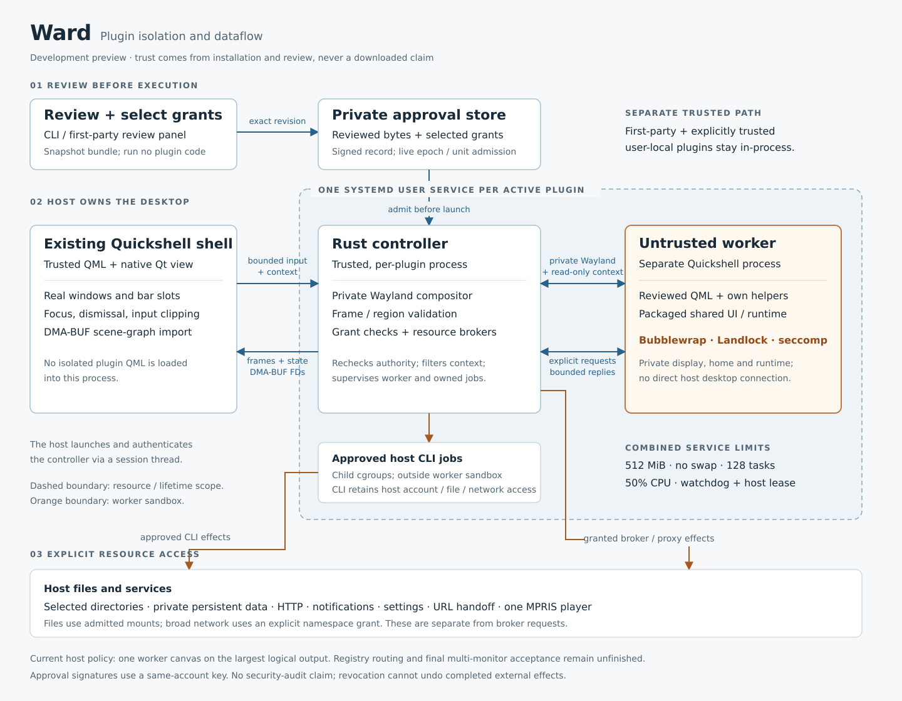

# Ward architecture (development preview)

Ward runs plugin QML outside the desktop shell and admits host access through explicit, revision-bound grants. This reference describes the implementation, not a completed security audit or a feature-parity claim. See the [authoring contract](sandboxed-plugin-authoring.md) for manifest syntax and runtime APIs, and the [implementation inventory](../plans/sandboxed-plugin-grants.md) for remaining resource work.

## Scope and trust

The intended boundary is third-party code distributed through the Omarchy plugin registry. New direct Git/local-folder installs default to Ward; explicit YOLO and trusted-local choices retain a separate in-process path. Omarchy's first-party and existing legacy trusted plugins are not reclassified. Host-owned installation records outside the checkout bind identity, source, commit and execution mode; absent/corrupt records and changed sources block managed code from loading. Once an installation is isolated, a downloaded or edited manifest cannot make it trusted. The host records isolation identity at installation and native review/approval, before first activation; existing native record names also identify older approvals without requiring a working native executable. CLI and shell discovery consult these identities and fail closed if identity discovery fails, including for legacy trusted plugins. Successful review/approval requests a fresh scan; concurrent scan requests are coalesced into a follow-up scan. Missing or malformed checkouts remain listed for cleanup, with independently observed live-controller state retained. Revocation retains installation/isolation identity, saved data and reviewed snapshots. Explicit removal confirms shutdown and purges those resources and the installed checkout; a subsequent installation makes a fresh trust decision. Registry-specific ingress and publisher authentication remain unfinished.

The dashed service boundary is a shared resource and lifetime boundary, not a filesystem sandbox. The worker's orange boundary is the sandbox. The controller, native Qt bridge, policy store, packaged runtime and relevant OS/graphics stack are trusted; plugin QML and its helpers are not.

## Admission and lifetime

1. `omarchy plugin review` validates and snapshots the bundle without running it. The private revision store identifies reviewed bytes by SHA-256; the editable checkout is not the launch source.
2. `approve --revision …` selects only requested resources. Required-but-unselected requests prevent activation; optional ones may be declined. Approval does not start a worker. The CLI and first-party review panel use the same native management path.
3. Enabling creates one host-owned `PluginSession`, with a `PluginView` importer per output. A host-side session thread launches one generated systemd user service and authenticates its controller connection using peer credentials, a pidfd and the service cgroup. The controller admits the stored identity, revision, epoch and unit before starting plugin code. Additional outputs and bar placements do not launch additional services or workers.
4. Revocation invalidates admission and stops owned work. Host connection leases and a systemd watchdog bound orphaned or stalled sessions. `stop` preserves approval; `disable` revokes it. Neither revocation nor process cleanup can undo completed writes or effects delegated to another service.

New enable/placement requests remain provisional until native content is presented. The bar can render their host-owned slots without writing them to `shell.json`; successful startup commits only that request against the latest saved config. Failed or eight-second never-presenting startups remove provisional slots, preserve prior saved intent and unrelated changes, stop owned work, and retain an actionable error for retry. A previously started session is not subject to that initial-start deadline during output changes. Native session cleanup retires only its matching epoch/unit reservation, preserving approval and never clearing a newer session or an interrupted revocation.

A second enable while the same plugin is starting is rejected without replacing the first pending placement. Zero outputs cannot satisfy first-presentation readiness. After a first frame, losing all outputs retains the already-started logical service without restarting its initial deadline.

Approval records sign `{ id, revision, enabled, grants }` and verify it on reads. The signing key is held under the same desktop account: this detects unapproved record edits, but is not a boundary against a determined same-account process able to read the key. Runtime epoch/unit state is separate. A running controller enforces its admitted grant snapshot while rechecking live authority; grants cannot silently widen mid-session.

Filesystem admission rejects the actual store and protected host authority paths, their enclosing directories and resolved aliases; writable selections additionally exclude host configuration and runtime code. Old signed approvals undergo the same checks at admission. Revocation writes durable denial and attempts service stop before signing the disabled record. Signing failure leaves admission denied and requires explicit recovery; failure to persist denial still attempts stop and is reported as failure, never durable success. A non-revoking stop preserves the existing approval signature and needs no private key.

## Three execution domains

| Domain | Responsibility and boundary |
| --- | --- |
| Existing Quickshell desktop | Loads only Omarchy's native host component, never isolated plugin QML. Owns real layer-shell windows, bar slots, focus, dismissal and input clipping. Trusted first-party and explicitly trusted local plugins use the separate in-process path. |
| Per-plugin Rust controller | Runs a private Smithay Wayland compositor, grant brokers and worker supervision. Its systemd service limits the combined controller/worker/owned-job workload to 512 MiB memory, no swap, 128 tasks and 50% CPU, with no automatic restart. |
| Untrusted worker | A separate Quickshell process loads the reviewed plugin and packaged shared UI/runtime. Bubblewrap constructs its filesystem and namespaces; bootstrap applies Landlock and seccomp before loading plugin code. Ordinary QML `Process`, Bash and native modules remain inside this boundary. |

The worker receives a read-only `/plugin` bundle, restricted `/runtime`, private temporary paths and a selected GPU render node. Its Wayland connection is to its own controller, not Hyprland. No host session bus, PipeWire socket, compositor socket or desktop home is exposed by default. A media grant provides a filtered bus proxy, not the host bus. Landlock ABI 9 is required to prevent pathname Unix sockets inside granted directories from turning file access into host IPC; unsupported isolation fails closed.

The shared runtime is a [trusted host-selected directory](ward-runtime.md), supplied over the authenticated host channel by descriptor and mounted read-only. Ward's native build does not package Omarchy assets. Omarchy owns and separately stages the loader and UI compatibility modules; its sandbox-local bootstrap sets `OMARCHY_PATH=/runtime`. Runtime selection never comes from plugin metadata or a worker request.

## Pixels, input and context

The worker submits ordinary Wayland surfaces to the private compositor. Each admitted output has two bounded DMA-BUF presentation slots and one Qt importer in the existing shell. Versioned records validate output identity, topology epoch, dimensions, generations, frame serials, descriptor counts and input regions. Each stream has independent acknowledgements governing buffer reuse; one slow output cannot make another reuse an in-flight buffer. The host receives pixels and bounded state, not worker QObjects or executable QML.

Host-owned topology admits up to eight outputs, 4,096 logical pixels per axis, scales from 1 to 4 in units of 1/120, eight megapixels per output and 32 megapixels in aggregate (256 MiB for the two ARGB buffer sets, before other graphics/process memory). Output-local rendering preserves negative desktop origins, portrait geometry and mixed fractional scales without allocating pixels for desktop gaps. Output IDs never recycle within a session; topology epochs increase. Old input and presentation records cannot revive retired outputs. Importers detach before replacements are created, and retired buffer descriptors remain owned by their outstanding render nodes. Zero outputs removes presentation while retaining the logical service.

In the other direction, the host forwards only input delivered to the plugin's host item and focused keyboard events, including host-resolved key symbols. It owns real focus and clips interaction to allowed regions, including the plugin's own slot over the visible bar. Private layer-shell requests cannot reserve host screen space or independently acquire host focus.

A bounded, detached context carries theme, selected own settings, own-panel commands and up to 32 independent bar placements. One shared loader creates a widget per placement, with one service and one optional overlay. Omarchy owns one active own-panel presentation per plugin: clicks select the originating placement; keyboard/IPC summon uses the focused monitor, then an available configured output. Output loss dismisses its panel and clears held input. Unspecified private layer-shell outputs use the activated output; explicit worker output choices remain subject to host clipping.

Roaming pixels and input are restricted to the active owner output by default. An Omarchy-owned entry setting, `sandboxPresentation.overlayOutputs: "all"`, permits them across admitted outputs; plugin settings and manifests do not choose that policy. Bar regions remain clipped to this plugin's own slots on every output. This setting does not grant desktop observation.

The controller filters context by admitted grants before publishing a read-only snapshot. Optional `desktopGeometry` adds bounded output/workspace/window rectangles with opaque IDs; it adds no titles, app IDs, content or compositor control. A grant-filtered `geometryOutputs` association maps private presentation outputs to observed IDs. Both the observations and association disappear without the grant; required presentation topology does not.

## Resource paths

Resources take different paths; not every grant is a broker RPC:

- Filesystem slots are host-selected mounts under `/grants/<name>`. Storage binds one private per-plugin data directory at worker `$HOME`; without storage, home is temporary. Updates retain identity-based data, and revocation retains files while removing access. Persistent disk quota is not yet enforced.
- Notifications, own-settings writes, HTTP scopes and browser/webapp handoffs use bounded controller-owned request channels. HTTP does not inherit host credentials. Broad `network`, if explicitly selected instead of scoped HTTP or the public proxy, shares the host network namespace, including local services.
- Independent `networkProxy` grants expose a public-destination HTTP/CONNECT streaming transport through a Unix endpoint and sandbox-local TCP bridge. DNS, route checking and numeric-address connection happen in bounded controller-owned jobs; client TLS stays sandboxed. CONNECT is opaque public TCP authority, not per-URL HTTP scope enforcement. The worker retains its private network namespace and normal capability/seccomp restrictions. Revocation closes active connections.
- Media uses a proxy restricted to the exact selected existing MPRIS player and supported operations. It does not provide general audio/device access or permission to publish a player.
- Audio playback, default-input recording and default-output-monitor capture have three independent grants and separate one-way PCM endpoints. The controller relays fixed S16LE/48 kHz/stereo samples through fixed host-owned `pw-cat` streams. Decoding, encoding and volume filtering stay in the worker; no PipeWire socket, device selection, media-file parser or arbitrary host argv is exposed to plugin code. Two playback streams and one of each capture type share a four-stream ceiling and eight-starts-per-second limit. Revocation closes the streams but cannot retract captured samples. Default input can be a user-selected virtual source; host routing remains authoritative. Player publication is separate unfinished work.
- Host exec is an explicit exception: a selected argument-tree leaf admits a complete invocation of a reviewed executable. Verification seals matching executable bytes before launch; child cgroups supervise jobs and descendants. The CLI retains its host account, filesystem, network, libraries and configuration authority. Argument matching is not a semantic safety proof. Every foreground job is owned by its caller and controller, without an execution-duration cutoff. Preparation still has a watchdog, and jobs retain concurrency/output bounds.

For approved host commands, `$OMARCHY_PLUGIN_PATH` identifies a temporary copy of reviewed assets and `$OMARCHY_PLUGIN_DATA` identifies the same directory mounted as worker home. These host paths are not additional worker mounts. See the [path reference](sandboxed-plugin-authoring.md#two-resources-not-four-unrelated-directories).

## Host security feedback

Ward reports a typed `BlockedAction` only when its broker rejects a notification, settings, URL, HTTP or exec request with a known policy-denied status. The authenticated controller channel carries a fixed action code, not worker text, paths or argv. Worker control-message decoding rejects this event type. `Session::Update::Blocked` and Qt's `PluginSession.operationBlocked(uint)` expose it to the trusted host; the host binds it to the current session identity. Both controller and host must be built from the matching revision.

Worker helpers parse the redacted worker grant view, not the full persisted host approval record. Exec lifetime and endpoint availability are adaptation hints; the broker independently checks live admission and the approved command tree. Host filesystem paths/inodes and executable identity/tree fields remain absent from that worker view.

Omarchy's `PluginSecurityFeedback` owns the notification wording and delivery. It needs no worker notification grant and does not accept a worker's self-reported denial as evidence. Ward coalesces pending events and permits two per 30 seconds per session; Omarchy also bounds notifications across sessions to two per 30 seconds with one delivery in flight. This is bounded feedback, not a complete audit log. Failed/unavailable operations, unmounted broker endpoints, raw kernel denials and audio/proxy refusals are not covered. A blocked operation does not automatically terminate the plugin.

## Current limits and source map

The shared loader supports per-placement bar widgets with an optional own service/overlay. Protocol, real private-display mixed-DPI and two-output Qt host tests cover shared state, panel ownership, roaming policy and hotplug. These are not physical-monitor or installed-VM acceptance. Service-only readiness, final popup/input compatibility, default native packaging, disk budgets, full original-plugin acceptance and broader adversarial review remain release work. Missing native support or failed admission never falls back to loading isolated QML in-process.

| Area | Implementation |
| --- | --- |
| Review, revisions and grants | [`management.rs`](../native/ward/src/management.rs), [`revision.rs`](../native/ward/src/revision.rs), [`store.rs`](../native/ward/src/store.rs), [`grants.rs`](../native/ward/src/grants.rs) |
| Admission and process ownership | [`session.rs`](../native/ward/src/session.rs), [`supervisor.rs`](../native/ward/src/supervisor.rs), [`controller.rs`](../native/ward/src/controller.rs) |
| Worker restrictions and trusted runtime | [`worker.rs`](../native/ward/src/worker.rs), [`sandbox.rs`](../native/ward/src/sandbox.rs), [`runtime.rs`](../native/ward/src/runtime.rs) |
| Omarchy worker adapter and staging | [`worker.qml`](../shell/ward-runtime/worker.qml), [`omarchy-ward-stage-runtime`](../bin/omarchy-ward-stage-runtime) |
| Rendering, input and context | [`graphics.rs`](../native/ward/src/graphics.rs), [`topology.rs`](../native/ward/src/topology.rs), [`presentation.rs`](../native/ward/src/presentation.rs), [`pluginsession.cpp`](../native/ward/qt/pluginsession.cpp), [`pluginview.cpp`](../native/ward/qt/pluginview.cpp), [`context.rs`](../native/ward/src/context.rs) |
| Desktop ownership | [`SandboxedPlugins.qml`](../shell/services/SandboxedPlugins.qml), [`SandboxedPluginSession.qml`](../shell/services/native/SandboxedPluginSession.qml), [`SandboxedOutputSurface.qml`](../shell/services/native/SandboxedOutputSurface.qml), [`SandboxedBarWidget.qml`](../shell/services/SandboxedBarWidget.qml) |
| Resource effects | [`requests.rs`](../native/ward/src/requests.rs), [`exec_policy.rs`](../native/ward/src/exec_policy.rs), [`host_job.rs`](../native/ward/src/host_job.rs), [`http.rs`](../native/ward/src/http.rs), [`media.rs`](../native/ward/src/media.rs) |
| Raw audio streams | [`audio.rs`](../native/ward/src/audio.rs), [`sandbox-local file decoder`](../shell/ward-runtime/play) |
| Public streaming proxy | [`network_proxy.rs`](../native/ward/src/network_proxy.rs), shared public-address classification in [`http.rs`](../native/ward/src/http.rs) |

Maintained synthetic coverage lives in [`native/ward/tests/`](../native/ward/tests/) and the [shell integration fixture](../test/shell.d/fixtures/ward-integration/). Concrete plugin trials are separate development evidence, not a substitute for containment or original-feature acceptance.
