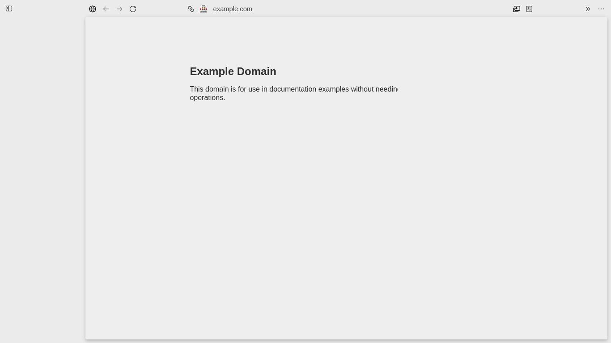

# Zen web apps on Linux

Investigated on 2026-09-15. This note separates installed-source findings from browser behavior that still needs runtime verification.

## Result

Zen includes Firefox's native web-app implementation behind `browser.taskbarTabs.enabled`. Enabling that preference is a valid experiment. The current command-line interface cannot replace Omarchy's arbitrary-URL launcher without changing its behavior: it can open a registered app, but its recovery path creates an app for the site's origin and discards the supplied URL's path. Zen also has an open Linux report about an empty sidebar in app windows. A preference alone therefore does not establish full Omarchy compatibility.

## Installed build and preference

The inspected build is Zen 1.22.1b, based on Gecko 155.0.1, with source stamp `d7441097171a1a9d47ee40a3e6fcd71bd01784a4`. These values come from the installed `/opt/zen-browser-bin/application.ini`. The corresponding Zen source sets `browser.taskbarTabs.enabled` to `false` without locking it. [Zen preference source](https://github.com/zen-browser/desktop/blob/d7441097171a1a9d47ee40a3e6fcd71bd01784a4/prefs/privatefox/disablemozilla.yaml#L45-L46)

Mozilla documents Linux support, disabled by default, and the address-bar button that creates an app once the preference is enabled. Apps share their creating profile and container. Mozilla identifies `taskbartabs/taskbartabs.json` as internal browser storage, not an external integration API. [Firefox web-app documentation](https://firefox-source-docs.mozilla.org/browser/components/taskbartabs/docs/index.html)

The installed `browser/omni.ja` contains these modules and markup:

- `modules/taskbartabs/TaskbarTabsCmd.sys.mjs`
- `modules/taskbartabs/TaskbarTabsUtils.sys.mjs`
- `modules/taskbartabs/TaskbarTabsPageAction.sys.mjs`
- `modules/taskbartabs/TaskbarTabsRegistry.sys.mjs`
- `modules/taskbartabs/TaskbarTabsWindowManager.sys.mjs`
- `chrome/browser/content/browser/browser.xhtml`, including `taskbar-tabs-button`

`TaskbarTabsUtils.isEnabled()` reads the boolean preference. The page-action module accepts Linux, excludes private and popup windows, and shows the button for HTTP or HTTPS pages when the preference is true. This is installed-source evidence that the UI and implementation are present. It does not prove correct rendering with Zen's layout.

## Command-line behavior

Firefox-generated app shortcuts use this shape:

```text
zen -taskbar-tab APP_ID -new-window START_URL -profile PROFILE_PATH -container 0
```

The installed command handler first checks the preference. If it is enabled, the handler reads the app ID, URL and container. It opens the registered app when the ID exists. If the ID is missing, it calls `findOrCreateTaskbarTab(URL, container)` and opens the result. The URL is recovery metadata, not an instruction to navigate an existing app to a different page. The shortcut builder also supplies a profile, which keeps app IDs associated with the correct browser profile. [Mozilla command handler](https://searchfox.org/firefox-main/source/browser/components/taskbartabs/TaskbarTabsCmd.sys.mjs), [shortcut builder](https://searchfox.org/firefox-main/source/browser/components/taskbartabs/TaskbarTabsPin.sys.mjs)

The installed registry creates new entries with `startUrl: manifest.start_url ?? aUrl.prePath`. The command handler supplies no manifest. Thus a request for `https://example.org/tools/report?view=weekly` creates an entry whose start URL is `https://example.org`. Its default scope matches the hostname, and lookup also uses the container. Different paths on the same hostname can resolve to the same app. Supplying a different made-up ID does not prevent this lookup. [Mozilla registry source](https://searchfox.org/firefox-main/source/browser/components/taskbartabs/TaskbarTabsRegistry.sys.mjs)

The native page-action path can obtain the site's manifest before creating an app. No equivalent manifest or exact-start-URL command-line option appears in the installed handler. An internal JavaScript method accepts manifest details, but using browser automation or editing profile storage would create a separate integration with its own maintenance requirements. [Mozilla app service](https://searchfox.org/firefox-main/source/browser/components/taskbartabs/TaskbarTabs.sys.mjs)

Mozilla tracks user-configurable start pages as an open enhancement. A maintainer explains that the current behavior is intentional; the suggested storage-edit workaround carries a future-breakage warning. That issue supports treating exact-path launching as a browser limitation. [Mozilla bug 2035949](https://bugzilla.mozilla.org/show_bug.cgi?id=2035949)

## Zen layout status

Zen issue 14314 remains open. It reports that Zen 1.21.3b on Linux shows an empty sidebar and copies global layout settings into app windows. A user supplied a `userChrome.css` workaround, but the issue does not establish that this is a supported Zen configuration. [Zen issue 14314](https://github.com/zen-browser/desktop/issues/14314)

An earlier Windows rendering issue was closed after a proposed fix, followed by reports that it persisted in later builds. It is historical evidence, not a test result for the installed Linux version. [Zen issue 12044](https://github.com/zen-browser/desktop/issues/12044)

## Integration boundary

An Omarchy preference for a supported Chromium app-mode browser can preserve current exact-URL behavior. Native Zen apps may be useful independently through Zen's own app creation and generated shortcuts. Adding Zen to the same arbitrary-URL launcher requires either a browser-side exact-URL interface or a clearly different launch contract. The current source does not justify silently treating `-taskbar-tab` as Chromium's `--app` equivalent.

## Runtime verification

Tested the installed Zen 1.22.1b in a fresh, isolated profile with `browser.taskbarTabs.enabled=true`, using headless mode and Marionette to inspect the actual browser window. The command requested `https://example.com/path?test=one` with a new taskbar-tab ID. The resulting window had a native `taskbartab` attribute and loaded `https://example.com/`. Zen's generated registry recorded the origin as `startUrl` and created a native desktop shortcut in the isolated data directory. No profile-storage edits were used to create it.

A second fresh-profile test opened a normal HTTPS page, confirmed the address-bar app button was visible, and clicked it. Zen replaced the normal browser window with a native web-app window and created its own desktop shortcut. This verifies the flag and manual app-creation workflow, independently of the command-line recovery test.

A screenshot of the command-line test window shows a wide empty sidebar, consistent with the reported Zen layout issue. The user's regular profile and browsing session were not changed.


