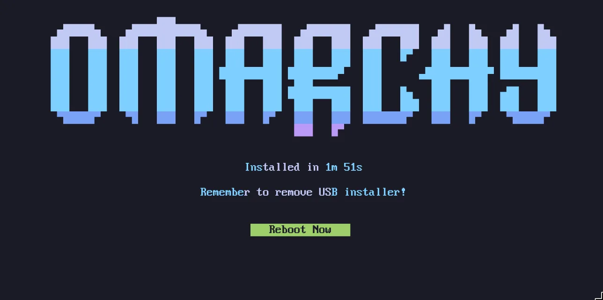

# Getting Started

Omarchy is installed using an ISO. You can choose between a full-disk install, which takes over the entire drive, or a free-space install, which puts Omarchy in the unallocated space on a drive — that's how you dual boot alongside Windows or another OS (see [dual-boot install](50-dual-boot-install.md) — note that you'll need to turn off BitLocker in Windows first). Either way, the installation defaults to full encryption, and the full-disk option will wipe the selected drive, so be sure to take a backup before using an existing one!

[Download the Omarchy ISO](https://omarchy.org/) first, put it on a USB stick (use [balenaEtcher](https://etcher.balena.io/) on Mac/Windows or [caligula](https://github.com/ifd3f/caligula) on Linux), and boot off the stick.

_You must turn off Secure Boot and/or TPM in the BIOS. You have to turn these off to be able to install Omarchy. They're Microsoft security schemes meant for Windows and Microsoft-affiliated Linux distributions._

Then answer the configuration questions, and confirm them like this:

 

Then select a drive for your installation, and sit back and watch the installation show go. It can be done in under a minute on the fastest modern machines, but it shouldn't take more than 5 minutes even on an older computer.

 

Now you're ready to Omarchy!

### Use a wired or 2.4ghz keyboard for installation

The installer cannot use a Bluetooth keyboard until the live system has paired with it, and firmware menus cannot use it at all. Keep a cable or 2.4ghz receiver available while installing.

After installation, a paired Bluetooth keyboard can be added to the encrypted-disk unlock environment with Setup > Security > Bluetooth Disk Unlock. This is opt-in: the keyboard's Bluetooth bond key is copied to the unencrypted boot image, and radio or battery trouble can still prevent it connecting. Keep a wired or 2.4ghz recovery keyboard available.

Setup rebuilds the boot image before reporting success. If rebuilding fails, setup restores the previous configuration, but a partially written boot image may still need repair: fix the reported error and run `sudo limine-mkinitcpio` before rebooting. The `status` command checks configuration only. The installer's `--no-rebuild` option defers boot-image generation; it does not verify that the keyboard can unlock the disk. Test the next boot with your recovery keyboard available.

### Installing for another owner

If you're setting up a machine for someone else — a family member, a new employee, a buyer — you shouldn't be answering the personal questions on their behalf. Hit `Ctrl + C` on the very first screen of the installer (the keyboard selection), and Omarchy will offer to prepare the machine for another owner instead. The system installs right away, but all the personal setup — keyboard layout, username, password — is deferred until the machine boots for the first time. The drive is still encrypted by default, and the password the new owner picks on that first boot becomes the encryption password too. (A machine you've already been using can be handed over without a reinstall too — see [resetting the computer](48-security.md).)

### Unattended installs

The ISO can also install completely on its own — no keyboard, no wizard — when it's handed its configuration on a second drive. That's the way to treat Omarchy as a base image for VMs and fleet machines. See [unattended installs](51-unattended-installs.md).

### No-encryption installations

Omarchy is installed with encryption by default. It's the safe, responsible choice for any computer that can possibly be lost or stolen. You don't want anyone with access to your hardware to be able to get your data!

But in special circumstances, like remote Omarchy installs on protected computers or for throw-away installations without sensitive data, you may want to install without encryption. You can hit `Ctrl + C` on the disk formatting confirmation to switch to an encryption-less installation.

### Help if you're stuck

If you get stuck, you can usually find someone willing to help in the _#omarchy-help_ channel on [the community Discord](https://omarchy.org/discord).
