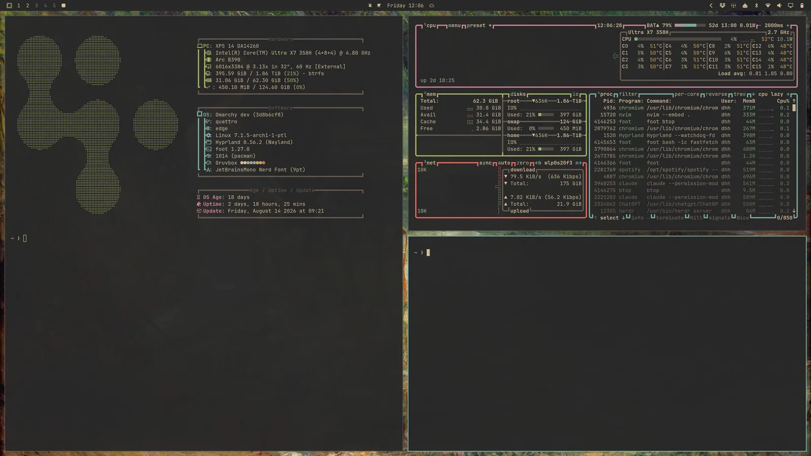
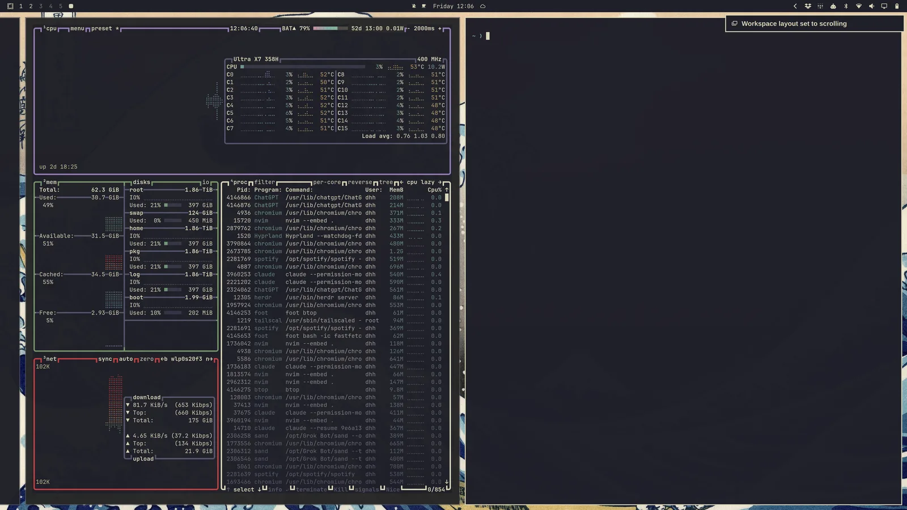

# Navigation

Everything in Omarchy happens via the keyboard — _EVERYTHING!_ When the system first starts, you literally can't do a thing with the mouse alone. But you can hit `Super + Space` to reveal the Omarchy Menu and from here you to do just about everything.

But the Omarchy menu is not even intended to be the main way to operate the system most of the time. We can get faster than that! All the most important applications are bound directly to individual hotkeys. You start the terminal with `Super + Return` and a browser with `Super + Shift + Return`. Try doing one after the other, and you'll see the magic of Hyprland's tiling in action:

 

You can then hit `Super + J` to stack them on top of each other instead of side by side:

 

Hit `Super + J` again to return them to their side-by-side positions. Then try `Super + Shift + Arrow Right` while on the browser to swap the windows.

Now try `Super + Ctrl + T` to start the Activity monitor. That'll appears as a floating window. You can tile it using `Super + T` (and hit that again to make it floating again). Now press `Super + Shift + F` to open the files manager. You'll have a neat four-way setup:

 

You navigate between the window you want to be active with `Super + Arrow`. This will switch focus and move the cursor to the center of the new application.

If you hit `Super + Shift + 2`, you'll move the current focused application onto the second workspace. `Super + Shift + 1` moves it back. (And `Super + Shift + Alt + 2` will move the current focused application onto the second workspace without switching to it).

If you hold down `Super` and use the mouse to click on a window, you'll be able to rearrange where it sits. If you hold `Super` and use the right button on the mouse, you can freely resize the window.

You close a window on `Super + W` or `Super + Q` (and close all windows on `Ctrl + Alt + Delete`).

You can also go full screen with `Super + F` or even just full-width (keeping the top bar) with `Super + Alt + F` or full-screen within a window with `Super + Ctrl + F` (good for YouTube!).

### Dwindle vs scrolling layout

Omarchy's default layout is called dwindle. It keeps all the windows you open on a single workspace visible at all time, even if it has to shrink them down.

 

But you can also choose to turn a workspace into the scrolling layout where windows are lined up side-by-side, beyond the visible edge of the display. You turn a single workspace into this layout via `Super + L`.

 

The choice is per workspace, and it sticks. So you can keep workspace 1 on dwindle for browsing and workspace 2 on scrolling for code, and they'll come back that way after a restart. (The same toggle is under _Trigger > Toggle > Workspace Layout_ in the Omarchy menu).

If you wish to use the scrolling layout as the default, you can set that in `~/.config/hypr/looknfeel.lua`:

```lua
hl.config({
  general = {
    layout = "scrolling",
  },
})
```

### Grouping windows

Windows can be grouped using `Super + G`. Once you're in a group, every window you start while that's active will belong to the group. You can move between these grouped windows using `Super + Ctrl + Arrow Left/Right` or `Super + Alt + 1/2/3/4` to go directly to grouped window in order.

You can move a window out of the grouping with `Super + Alt + G` or disassemble the entire group by hitting `Super + G` again. Finally, you can move windows outside the group into it with `Super + Alt + Arrows`.

### Popping windows

You can pop a window out of its workspace allocation with `Super + O`. That'll pin it as a floating window that follows you on whatever workspace you go to. Great for video players and the like.

 

### Scratchpad workspace

Finally, there's a special scratchpad workspace that drops down over whatever workspace you're currently on, much like a Quake console. Toggle it with `Super + Grave` or `Super + S`, and place a window there using `Super + Shift + Grave` or `Super + Alt + S`.

It works especially well for a terminal running an agent, or for controls you want to interact with quickly without leaving the current workspace. To move a window off the scratchpad, send it directly to another workspace with something like `Super + Shift + 1`.

### Moving around the Omarchy menu

The menu moves on the arrow keys, and on `Ctrl + N`/`Ctrl + P` and `Ctrl + J`/`Ctrl + K` too, so it reads the same way as Neovim or any readline prompt. `Ctrl + H` steps back a level like `Left`, and `Ctrl + L` opens the highlighted entry like `Return`. Every one of those is on by default — nothing to turn on.

If you want different keys, each action takes a list of them under a `keys` block in `~/.config/omarchy/shell.json`, alongside whatever is already in there:

```json
{
  "version": 1,
  "keys": {
    "menu": {
      "down": ["Down", "Ctrl+N", "Ctrl+J"],
      "up": ["Up", "Ctrl+P", "Ctrl+K"]
    }
  }
}
```

That's a complete file if you don't have a `shell.json` yet. If you do — and you will the moment you've moved a bar widget — add just the `keys` block to it rather than pasting over the file. There's no deep merge, so a `shell.json` containing only the above would take your bar layout with it; see [the top bar](05-the-top-bar.md) for that rule in full.

The actions are `up`, `down`, `pageUp`, `pageDown`, `back`, `activate`, and `remove`. Escape always closes the menu and can't be rebound, so a typo here never locks you in. Anything you leave out keeps its default, so a block naming only `down` changes just that. Write bindings as `Ctrl+N`, `Shift+Tab` or `Down` — `Ctrl`, `Shift`, `Alt` and `Super` are the modifiers. Setting an action to `[]` unbinds it.

Paging is a good example of something you can add for yourself. Vim's half-page keys aren't bound by default, but nothing stops you:

```json
"keys": {
  "menu": {
    "pageDown": ["PageDown", "Ctrl+D"],
    "pageUp": ["PageUp", "Ctrl+U"]
  }
}
```

Note that `PageDown` and `PageUp` are listed again alongside them. Naming an action replaces its whole list rather than adding to it, so leaving them out would unbind them.

`Ctrl + U` is a partial case worth knowing about. While there's text in the search field it clears the field, the way it does at a shell prompt, so it only pages once the field is empty. `Ctrl + D` has no such conflict and pages either way.

### It takes some getting used to!

It takes a little while to get used to navigating your desktop like this, but once you do, it'll be hard to go back to a traditional mouse-driven desktop experience!
