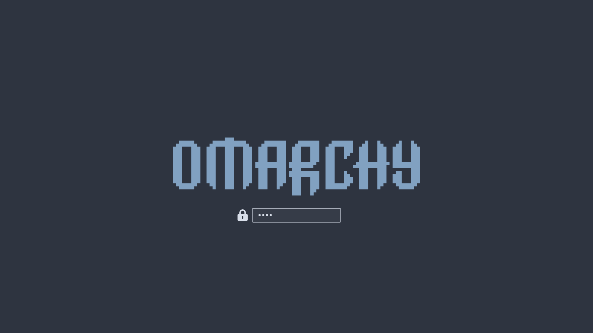

# Themes

Omarchy comes with twenty-two beautiful themes. You can select between them via _Style > Theme_ in the Omarchy Menu (`Super + Space`) or hop directly to the theme selector using `Super + Ctrl + Shift + Space`.

Each theme styles the desktop, terminal, neovim, activity screen (btop), Chromium, and the entire Omarchy shell: top bar, menu, notifications, OSD, and the lock screen. (For Obsidian, you must manually select the Omarchy theme via _Appearance > Themes_ inside the app).

Themes have a set of background images that you can pick between using `Super + Ctrl + Space`.

You can find even more themes on [the extra themes page](https://omarchy.org/themes/) or even [make your own theme](43-making-your-own-theme.md).

 
_Tokyo Night_

 
_Catppuccin_

 
_Lumon_

 
_Ethereal_

 
_Everforest_

 
_Gruvbox_

 
_Miasma_

 
_Hackerman_

 
_Osaka Jade_

 
_Kanagawa_

 
_Nord_

 
_Matte Black_

 
_Vantablack_

 
_Ristretto_

 
_Retro 82_

 
_Flexoki Light_

 
_Rose Pine_

 
_Catppuccin Latte_

 
_White_

### Framework Desktop fan colors

On a Framework Desktop with the ARGB fan, Omarchy lights the fan in your theme's accent color. It reapplies the color whenever you change themes and again at login, so the fan follows the desktop without any setup.

Each theme can carry its own override in `~/.config/omarchy/fan-colors/<theme>.txt`, named after the theme's slug (for example `tokyo-night.txt` for Tokyo Night). The file holds one to eight `#RRGGBB` colors, one per line. Eight colors map to the eight fan zones in order; a single color fills all of them. Blank lines, and lines whose `#` is followed by a space or the end of the line, are ignored as comments; any other line is reported and nothing is applied.

If the fan color looks washed out or off against the rest of the theme, calibrate it per channel in `~/.config/omarchy/fan-colors/calibration.conf`:

```
RED_PERCENT=100
GREEN_PERCENT=100
BLUE_PERCENT=100
```

100 leaves a channel unchanged, a lower value dims it, and a higher value boosts it. Calibration applies to the color Omarchy derives from the theme; a per-theme override file is treated as already tuned and skips it.

### Unlocks
### Unlocks

Themes can also have a custom unlock design, which is used for the boot decryption process. You can select one of these under _Style > Unlock_. They look like this:

 
_Catppuccin_

 
_Catppuccin Latte_

 
_Ethereal_

 
_Everforest_

 
_Flexoki Light_

 
_Gruvbox_

 
_Hackerman_

 
_Kanagawa_

 
_Lumon_

 
_Matte Black_


_Miasma_

 
_Nord_

 
_Osaka Jade_

 
_Retro 82_

 
_Ristretto_


_Rose Pine_

 
_Tokyo Night_

 
_Vantablack_

 
_White_
