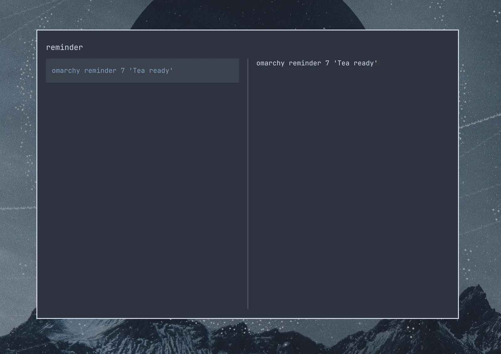

# Unified Clipboard & History

Usually on Linux, you need `Ctrl + Shift + C/V` to copy'n'paste in the terminal and `Ctrl + C/V` to do it everywhere else. That's hard to get used to for anyone who hasn't been born and bred on Linux! So too is the switch from super to ctrl, if you're coming from the Mac.

Omarchy tackles both problems with unified clipboard hotkeys that work (almost) everywhere. They are:

| Hotkey | Command |
| ------- | ----------- |
| Super + C | Copy |
| Super + X | Cut |
| Super + V | Paste |
| Super + Ctrl + V | Clipboard history |

_Note that most agent harnesses will use `Ctrl + V` for pasting images, but `Super + V` for pasting text._

### Clipboard history

The clipboard history is provided by the Omarchy shell and works for both text and images. You trigger it by `Super + Ctrl + V`, select your entry with return, and then that'll be placed on the clipboard ready to paste on `Super + V`.

 

You can also search the history just by starting to type:

 

Press `Ctrl + P` to pin or unpin the selected entry, or click the Pin/Unpin action beside the search field. Pinned text and images appear first and stay saved across restarts, even as older history expires. Copying a pinned item again keeps it pinned.

Pins receive shortcuts `1`–`9`, shown beside each entry. Open clipboard history and press a pin's number to paste it immediately. Numbers stay assigned to the same items when you copy them again or remove another pin. Additional pins remain available through search and selection. Unpinning or deleting an item frees its number for reuse.

Typing searches as usual once you have started a search. To begin a search with a number, press `Ctrl + F` first. `Escape` clears the search and restores numbered shortcuts.

Press `Delete` to remove the selected entry, including a pin. Press `Shift + Delete` to clear history after confirmation; pinned entries are kept.
