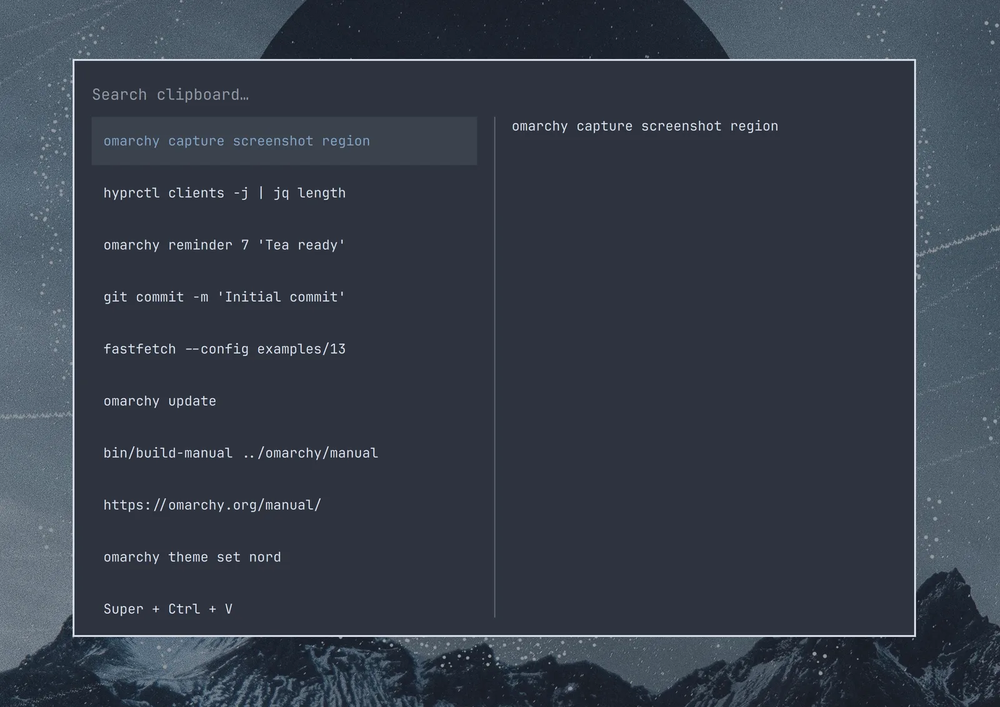
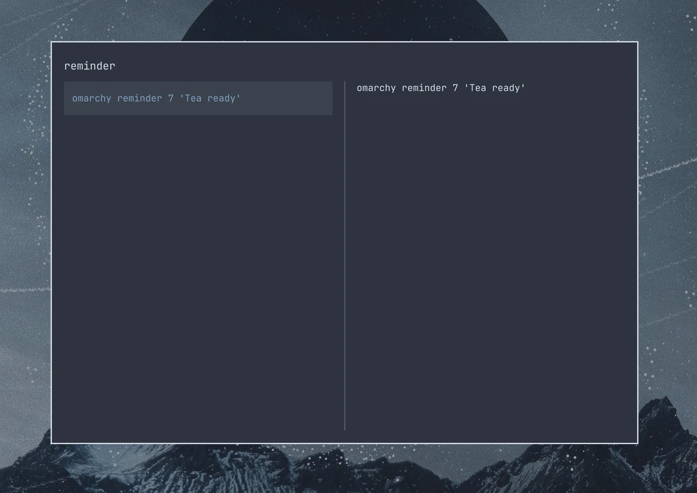

# Unified Clipboard & History

Usually on Linux, you need `Ctrl + Shift + C/V` to copy'n'paste in the terminal and `Ctrl + C/V` to do it everywhere else. That's hard to get used to for anyone who hasn't been born and bred on Linux! So too is the switch from super to ctrl, if you're coming from the Mac.

Omarchy tackles both problems with unified clipboard hotkeys that work (almost) everywhere. They are:

| Hotkey | Command |
| ------- | ----------- |
| Super + C | Copy |
| Super + X | Cut |
| Super + V | Paste |
| Super + Ctrl + V | Clipboard history |

_Note that most agent harnesses will use `Ctrl + V` for pasting images, but `Super + V` for pasting text._

### Clipboard history

The clipboard history is provided by the Omarchy shell and works for both text and images. You trigger it by `Super + Ctrl + V`, select your entry with return, and then that'll be placed on the clipboard ready to paste on `Super + V`.

 

You can also search the history just by starting to type:

 

### Combine text entries

Use `Ctrl + click` or `Ctrl + Space` to select multiple text entries. Each selected row is numbered, and the preview shows the combined text. Entries are joined with a newline in the order you selected them, even if you search or the clipboard history changes.

Press `Enter` to paste the selected texts together, or `Shift + Enter` to place them on the clipboard without pasting. Use `Ctrl + click` or `Ctrl + Space` again to remove an entry from the selection. Each time you open clipboard history, it starts with no entries selected.

Images and file entries keep their individual actions and cannot be added to a text selection.
