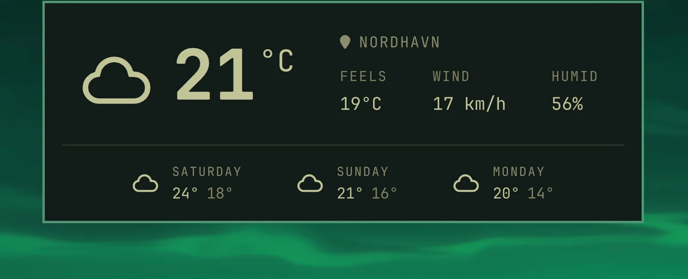

# Notices

You can quickly access the date and time, battery status, and current weather using the hotkey notices.

### Dismissing Notifications

Click the **✕** button on a notification to dismiss it without opening the app or running its action. You can also right-click anywhere on the notification to dismiss it. Left-clicking the notification text keeps its usual action.

### Date & Time

`Super + Ctrl + Alt + T`

 

### Weather

`Super + Ctrl + Alt + W`

 

The location is detected from your IP address, which is usually close enough, but not always. You can pin it down with `omarchy weather location --set Malibu`, or be exact about it by adding coordinates: `omarchy weather location --set Malibu 34.0259,-118.7798`. Run `omarchy weather location` on its own to see where it thinks you are, and `--clear` to go back to auto-detection.

### Battery

`Super + Ctrl + Alt + B`

 
