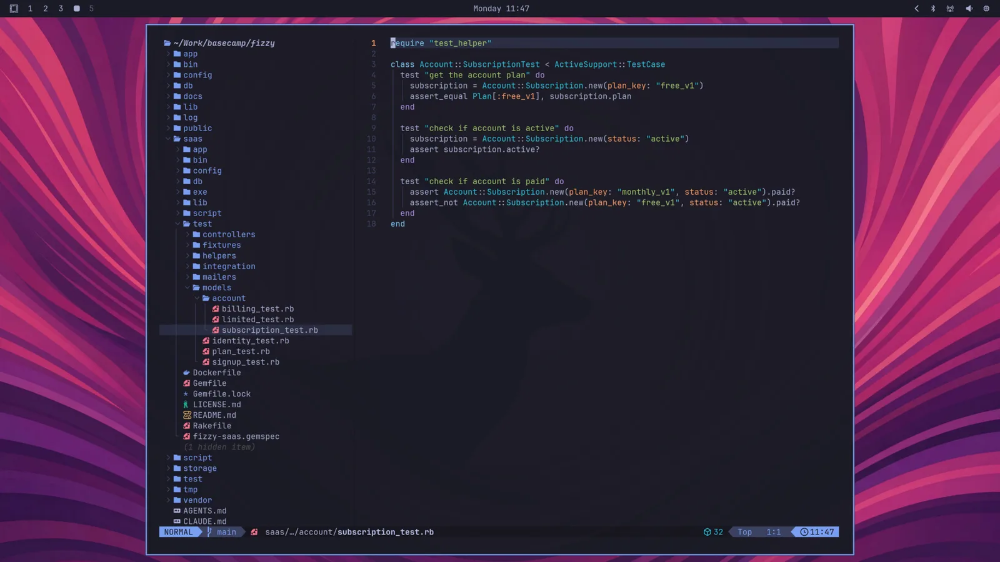

# Fonts

Omarchy uses JetBrainsMono Nerd Font as both the terminal and system font by default.

 

You can change this through the _Style > Font_ menu in the Omarchy menu (`Super + Space`). That sets the monospace **family** everywhere: the terminal, the bar, and anything else that asks for it.

Terminal **size** is per machine, so a laptop and a desktop can share the rest of the config. `omarchy display text size` (and `omarchy font size` for the terminal only) writes overlay files on this computer (`~/.config/ghostty/local`, plus the same idea for Kitty, Foot, and Alacritty). The bar's type scale is `[font] base-size` in `~/.config/omarchy/shell.toml`.

You can install other popular programming fonts via _Install > Style > Font_ in the Omarchy menu: Cascadia Mono, Meslo LG Mono, Fira Code, Victor Code, Bitstream Vera Mono, and Iosevka are all one click away, in their Nerd Font versions so the glyphs in the bar and terminal keep working. After installing one, pick it under _Style > Font_.
