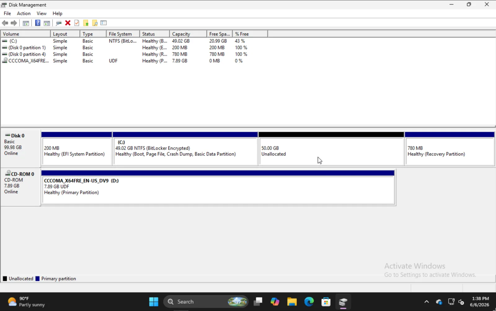

# Dual Boot Install

You're able to install Omarchy to a single partition alongside Windows or other installations.

This installation method still comes with LUKS encryption for the partition by default so it's effectively no different than full drive and simply requires free space to be available on the disk.

## Making Space on Windows

To install alongside Windows, type `disk management` in the start menu and select the option for **Create and format hard disk partitions**.

 

Find the appropriate partition, right click, and choose **Shrink Volume**.

 Input the amount you'd like to shrink the volume by. Note that this will be the size of your future Omarchy install inclusive of the boot partition.

 

When you're finished, you should see something like this where the 50GB section is where we'll install Omarchy in this example.

 

## Installing Omarchy

The install process for Omarchy is effectively the same as normal. After you select your disk, you'll be given the option of **Free space install**. Select that option to prevent wiping the full disk.

 

Confirm that everything looks good and wait for the install to finish like normal. This is also where you could elect to install unencrypted (not recommended) just like on a full-drive install.
 

## Adding Other Installs to the Bootloader

When you finish your Omarchy install, you'll notice that the Limine bootloader is the default now. With this, you can also add options to Limine for your other installs such as Windows.

In order to do that, run `limine-scan` and follow the prompts to add whichever items you'd like to your limine config. Then when you boot, you'll see your normal options for Omarchy, as well as Windows Boot Manager or others.

## BitLocker

The current free-space installer will not proceed when it detects BitLocker on the selected disk. If you encounter this error, boot into Windows, go to **Settings -> Privacy & Security -> Device encryption**, and toggle BitLocker off. Wait for Windows to finish decrypting the volume before retrying the installation. Suspending BitLocker protection is not enough to satisfy this installer check.

After Omarchy is installed, you can turn BitLocker back on for the Windows volume. Make sure you select only the Windows volume and leave the Omarchy partitions unchanged. When enabling it, save the recovery key somewhere accessible outside the encrypted Windows volume.

If you want to start Windows with Limine, run `limine-scan` and successfully boot Windows from the new entry before turning BitLocker back on, because changing the Windows boot path afterward can alter TPM measurements and trigger recovery. Keep the recovery key available, and suspend BitLocker before changing Secure Boot or TPM settings, installing UEFI/BIOS or TPM firmware updates outside Windows, or changing the Windows boot path.

 
