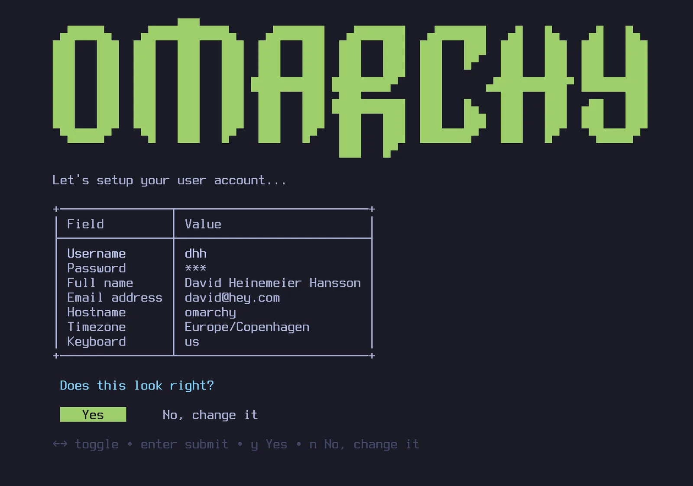
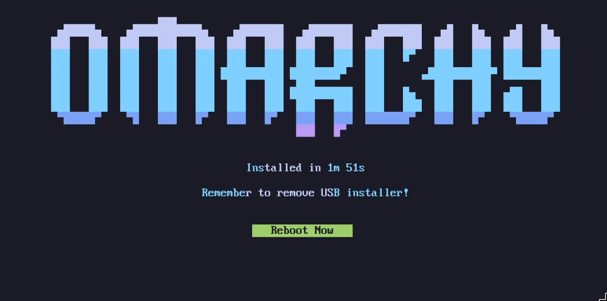

# Начало работы

Omarchy устанавливается с ISO. Можно выбрать установку на весь диск, которая занимает весь накопитель, или установку на свободное место — она встанет в неразмеченную область диска. Так получается дуалбут рядом с Windows или другой ОС (см. [дуалбут-установку](50-dual-boot-install.md) — учти, что в Windows сначала нужно выключить BitLocker). В любом случае установка по умолчанию идёт с полным шифрованием, а вариант «на весь диск» сотрёт выбранный накопитель — сделай бэкап, если на нём что-то есть!

Сначала [скачай ISO Omarchy](https://omarchy.org/), запиши его на флешку (через [balenaEtcher](https://etcher.balena.io/) на Mac/Windows или [caligula](https://github.com/ifd3f/caligula) на Linux) и загрузись с неё.

_Выключи Secure Boot и/или TPM в BIOS. Без этого Omarchy не встанет. Это майкрософтовские схемы безопасности под Окна и аффилированные с Microsoft дистрибутивы Linux._

Затем ответь на вопросы конфигурации и подтверди их вот так:

 

Затем выбери диск для установки — и смотри шоу установки. На самых быстрых современных машинах укладывается меньше чем в минуту, но и на старом железе дольше 5 минут не займёт.

 

Всё, ты готов к Omarchy!

### Только проводная клавиатура или 2.4ghz!

Шифрование всего диска не даст ввести пароль с Bluetooth-клавиатуры на старте. Так же как Bluetooth-клавиатурой не зайти в BIOS на PC. Нужна клавиатура либо со свистком на 2.4ghz, либо проводная (для задержек провод вообще приятнее!). Мне лично нравится [Lofree Flow84](https://www.lofree.co/products/lofree-flow-the-smoothest-mechanical-keyboard)!

### Установка для другого владельца

Если настраиваешь машину кому-то другому — родственнику, новому сотруднику, покупателю — не отвечай на личные вопросы за него. Нажми `Ctrl + C` на самом первом экране установщика (выбор клавиатуры), и Omarchy предложит подготовить машину для другого владельца. Система встанет сразу, а вся личная настройка — раскладка, имя пользователя, пароль — отложится до первой загрузки. Диск всё равно шифруется по умолчанию, и пароль, который новый владелец выберет при первой загрузке, станет и паролем шифрования тоже. (Машину, которой уже пользовались, тоже можно передать без переустановки — см. [сброс компьютера](48-security.md).)

### Установка без присмотра

ISO умеет ставиться и полностью сам — без клавиатуры, без мастера — если отдать ему конфигурацию на втором диске. Так Omarchy превращается в базовый образ для виртуалок и парка машин. См. [установки без присмотра](51-unattended-installs.md).

### Установки без шифрования

По умолчанию Omarchy ставится с шифрованием. Это безопасный, ответственный выбор для любого компьютера, который могут потерять или украсть. Ты же не хочешь, чтобы кто-то с доступом к железу добрался до твоих данных!

Но в особых случаях — например, удалённые установки Omarchy на защищённых машинах или одноразовые установки без чувствительных данных — может захотеться ставиться без шифрования. Нажми `Ctrl + C` на подтверждении разметки диска, чтобы переключиться на установку без шифрования.

### Если застрял — помощь

Если застрял, обычно находится кто-то готовый помочь — в канале _#omarchy-help_ в [Discord сообщества](https://omarchy.org/discord).
