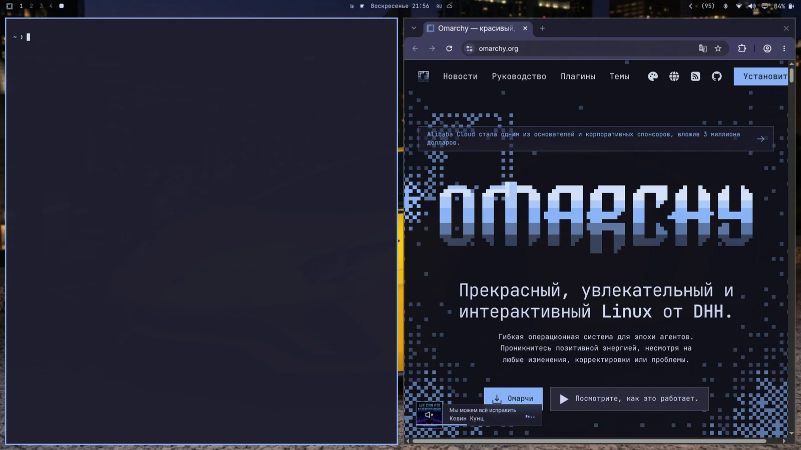
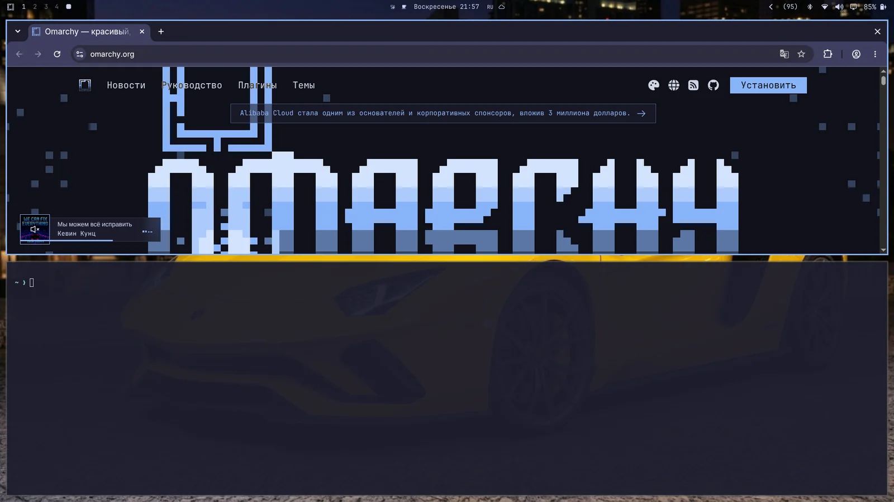
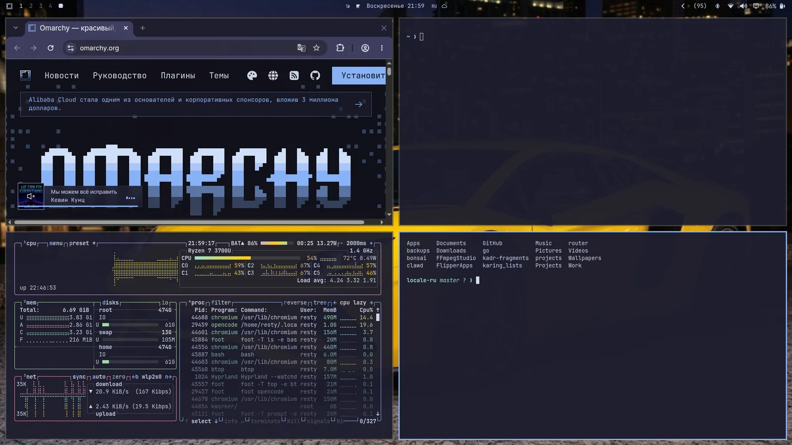
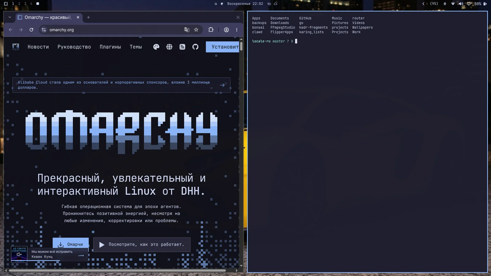
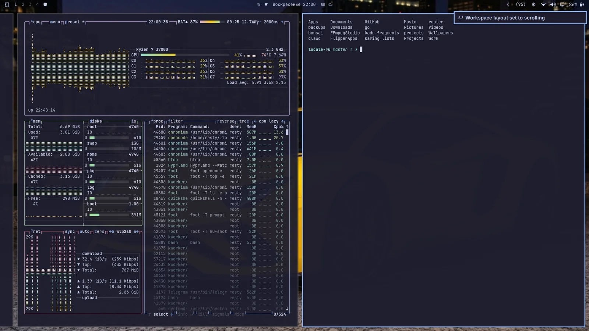
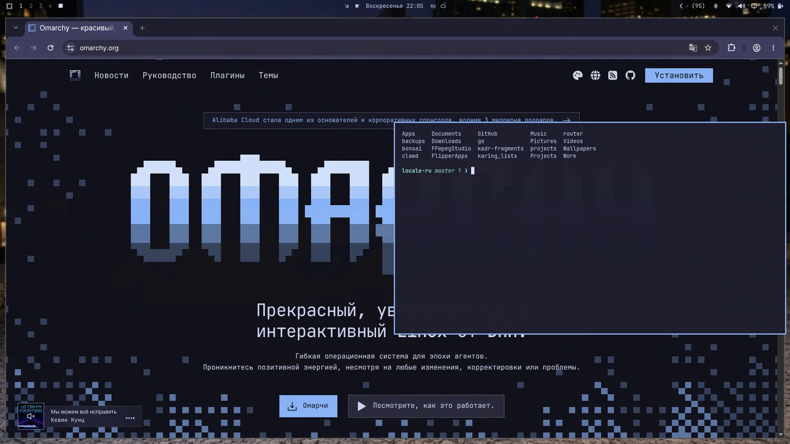

# Навигация

Всё в Omarchy делается с клавиатуры — _ВСЁ!_ Когда система только стартует, мышью в одиночку вообще ничего не сделаешь. Зато можно нажать `Super + Space` — откроется меню Omarchy, а оттуда делается почти всё.

Но меню Omarchy даже не задумано основным способом работы с системой. Можно быстрее! Все важнейшие приложения висят прямо на отдельных хоткеях. Терминал стартует с `Super + Return`, браузер — с `Super + Shift + Return`. Попробуй один за другим — и увидишь магию тайлинга Hyprland в деле:

 

Затем нажми `Super + J` — и они лягут друг на друга вместо бок о бок:

 

Нажми `Super + J` ещё раз — вернутся бок о бок. А потом попробуй `Super + Shift + Стрелка вправо` на браузере — окна поменяются местами.

Теперь нажми `Super + Ctrl + T` — стартует монитор активности. Он вылезет плавающим окном. Его можно затайлить через `Super + T` (и нажать ещё раз — снова станет плавающим). Теперь нажми `Super + Shift + F` — откроется файловый менеджер. Получится аккуратная раскладка на четверо:

 

Между окнами ходишь через `Super + Стрелки`. Фокус перескочит и курсор встанет в центр нового приложения.

Нажмёшь `Super + Shift + 2` — текущее активное приложение уедет на второй стол. `Super + Shift + 1` — вернёт обратно. (А `Super + Shift + Alt + 2` отправит текущее активное приложение на второй стол, не переключаясь на него).

Зажмёшь `Super` и кликнешь окно мышью — сможешь перетащить его куда надо. Зажмёшь `Super` и кликнешь правой кнопкой — свободно поменяешь размер.

Окно закрывается на `Super + W` или `Super + Q` (а все окна сразу — на `Ctrl + Alt + Delete`).

Можно уйти в полный экран через `Super + F`, или даже только на всю ширину (с верхней панелью) через `Super + Alt + F`, или в полный экран внутри окна через `Super + Ctrl + F` (удобно для YouTube!).

### Dwindle против прокручиваемого layout

Дефолтный layout Omarchy называется dwindle. Он держит все открытые окна одного стола видимыми всегда — даже если ради этого их придётся ужать.

 

Но можно превратить стол в прокручиваемый layout, где окна выстроены бок о бок за видимым краем экрана. Один стол переводится в него через `Super + L`.

 

Выбор — на стол, и он липнет. Можно держать стол 1 на dwindle для браузера, а стол 2 на прокрутке для кода — после рестарта вернутся такими же. (Тот же тогл — в меню Omarchy под _Действия > Переключатели > Раскладка окон_).

Хочешь прокручиваемый layout по умолчанию — задай в `~/.config/hypr/looknfeel.lua`:

```lua
hl.config({
  general = {
    layout = "scrolling",
  },
})
```

### Группировка окон

Окна группируются через `Super + G`. Пока группа активна, каждое запускаемое окно будет попадать в неё. Между окнами группы ходишь через `Super + Ctrl + Стрелки влево/вправо` или прыгаешь прямо по порядку через `Super + Alt + 1/2/3/4`.

Окно вытаскивается из группы через `Super + Alt + G`, а вся группа разбирается повторным `Super + G`. Наконец, окна снаружи можно затащить в группу через `Super + Alt + Стрелки`.

### Выдёргивание окон

Окно можно выдернуть из его места на столе через `Super + O`. Оно закрепится плавающим и будет ходить за тобой по столам. Отлично для видеоплееров и такого.

 

### Скрытый стол

Наконец, есть особый скрытый стол, который выпадает поверх текущего — почти как консоль в Quake. Тогл — `Super + Grave` или `Super + S`, окно туда кладётся через `Super + Shift + Grave` или `Super + Alt + S`.

Особенно хорош под терминал с агентом или под контролы, к которым надо быстро дотянуться, не уходя со стола. Чтобы убрать окно со скрытого стола, отправь его прямо на другой стол — например, через `Super + Shift + 1`.

Пока на скрытом столе одно окно, он выпадает центрированной панелью, а не во весь экран. Положишь второе — вернётся на всю ширину, чтобы оба влезли бок о бок.

### Надо привыкнуть!

К такой навигации по столу привыкаешь не сразу, но как привыкнешь — назад к традиционному мышовому столу будет трудно вернуться!
