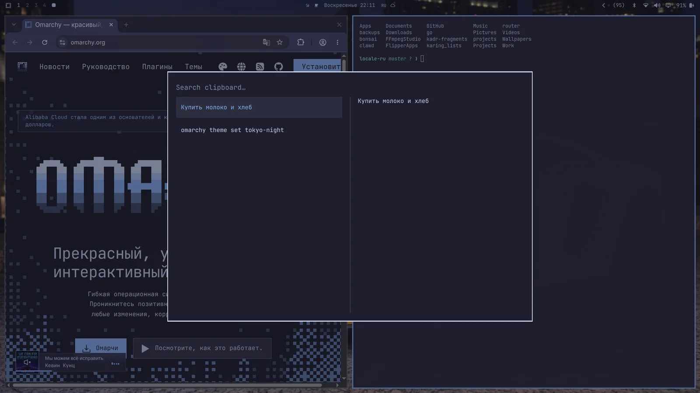
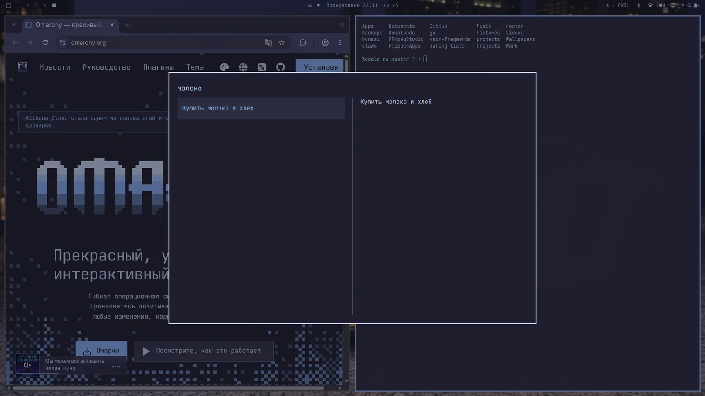

# Единый буфер и история

Обычно на Linux надо `Ctrl + Shift + C/V` для копипасты в терминале и `Ctrl + C/V` везде в остальных местах. К этому тяжело привыкнуть, если не родился и не вырос на Linux! Как и к переходу с super на ctrl, если приехал с Мака.

Omarchy решает обе проблемы едиными хоткеями буфера, которые работают (почти) везде. Вот они:

| Хоткей | Команда |
| ------- | ----------- |
| Super + C | Копировать |
| Super + X | Вырезать |
| Super + V | Вставить |
| Super + Ctrl + V | История буфера |

_Учти: большинство агентских харнесов жмут `Ctrl + V` для вставки картинок, а `Super + V` для вставки текста._

### История буфера

Историю буфера даёт шелл Omarchy, работает и для текста, и для картинок. Жмёшь `Super + Ctrl + V`, выбираешь запись через Return (Enter) — и она ляжет в буфер, готовая вставиться по `Super + V`.

 

Историю можно и искать — просто начни печатать:

 
