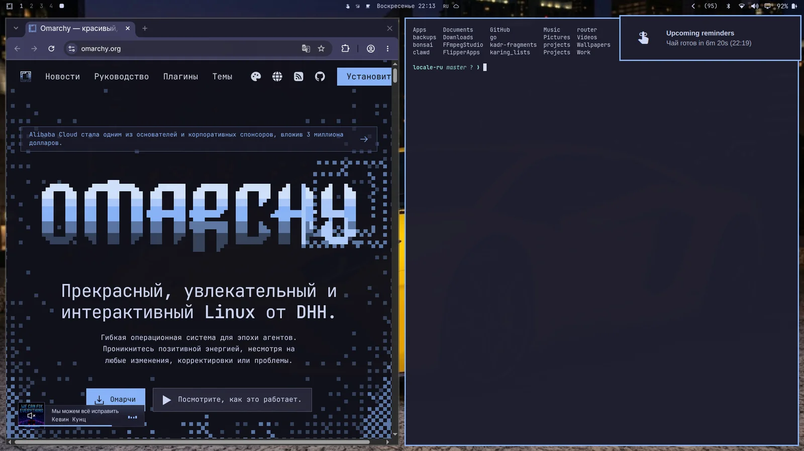

# Напоминания

В Omarchy встроены простые напоминания: таймер обратного отсчёта плюс сообщение. Ставятся через `Super + Ctrl + R`, все поставленные смотрятся через `Super + Ctrl + Alt + R`, чистятся все через `Super + Ctrl + Shift + R`. Всё то же есть в _Действия > Напоминание_. А можно и через cli: `omarchy reminder 7 'Чай готов'`.

 
