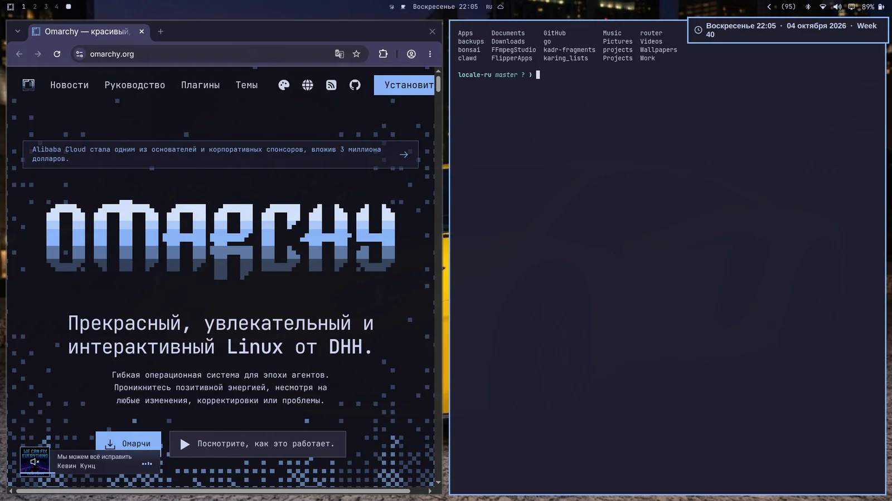
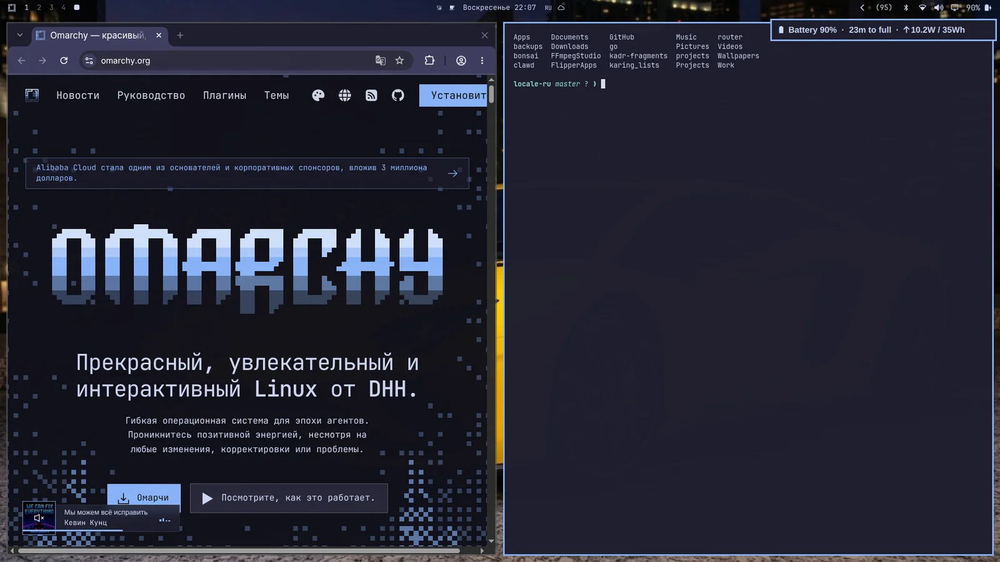

# Заметки

Дата и время, статус батареи и текущая погода — быстрые нотисы по хоткеям.

### Дата и время

`Super + Ctrl + Alt + T`

 

### Погода

`Super + Ctrl + Alt + W`

 

Локация ловится по IP-адресу — обычно достаточно близко, но не всегда. Можно пришпилить руками: `omarchy weather location --set Malibu`, а можно и точно координатами: `omarchy weather location --set Malibu 34.0259,-118.7798`. Запусти `omarchy weather location` как есть — покажет, где он тебя видит, а `--clear` вернёт автоопределение.

### Батарея

`Super + Ctrl + Alt + B`

 
