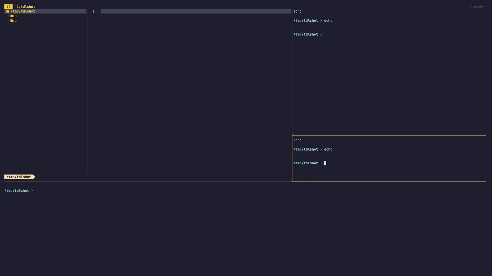
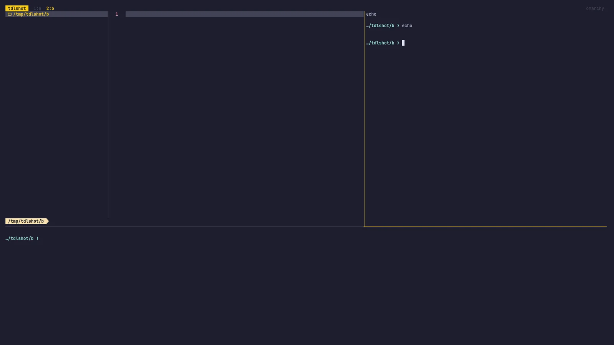
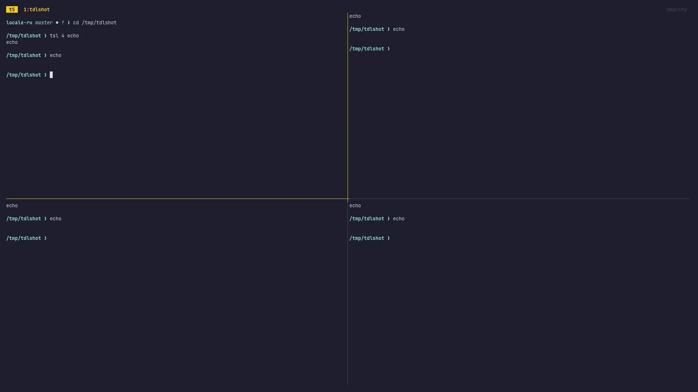

# Терминал

[Foot](https://codeberg.org/dnkl/foot) — дефолтный терминал Omarchy. Быстрый, лёгкий, едет даже на старом железе. Но нативных вкладок и сплитов в нём нет.

Если сидишь на Tmux — может, и пофиг, а если нет — полностью поддерживаются _Alacritty_, _Ghostty_ и _Kitty_ как опции. Выбирай под себя в _Установить > Терминал_ в меню Omarchy.

Новый терминал стартует с `Super + Return`. (Этот хоткей сам смотрит на тот терминал, что поставил через _Установить > Терминал_, а переключаться между поставленными можно в _Настройки > Приложения по умолчанию > Терминал_.)

## Tmux

Tmux даёт единый программируемый интерфейс панелей, окон (они же вкладки) и переживающих сессий — в любом терминале. Работает даже на удалённых хостах: зашёл по SSH на сервер — подходишь так же.

Новая Tmux-сессия в свежем терминале — с `Super + Alt + Return`, а раз Tmux — персистентный процесс, сессию поднимешь, даже закрыв тот терминал. Просто жми `Ctrl + Space` (это префикс-клавиша), потом `s` — увидишь все активные сессии.

В Omarchy из коробки эргономично накатанный конфиг Tmux — хоткеев учить много, так что держи [шпаргалку под рукой](07-hotkeys.md#tmux).

## Layout-функции Tmux

Раз Tmux программируемый — раскладки делаются функциями. В Omarchy из коробки четыре функции под ходовые девелоперские layout.

`tdl [agent]` стартует трёхсторонний IDE-подобный интерфейс: слева `$EDITOR`, справа выбранный AI-агент (вроде `c` под opencode, `cx` под Claude или `codex` под OpenAI), а снизу терминал.

Так `tdl c` стартует вот это (или просто `ic`):

 

Можно стартануть и второго агента через `tdl c cx` (opencode + claude) (или просто `icx`):

 

Есть ещё `tds` — квадрат на четверо: редактор слева вверху, живой вотчер диффа справа вверху, терминал слева внизу и opencode справа внизу.

А ещё эту конфигурацию layout можно стартануть на каждый подкаталог текущей папки через `tdlm [agent]`, а ходить — через `Alt + 1/2/3/4/5/...`:

 

Наконец, рой агентов стартуется через `tsl [panes] [command]`. Так `tsl 4 c` даст сетку четыре на четыре из opencode-агентов:

 
