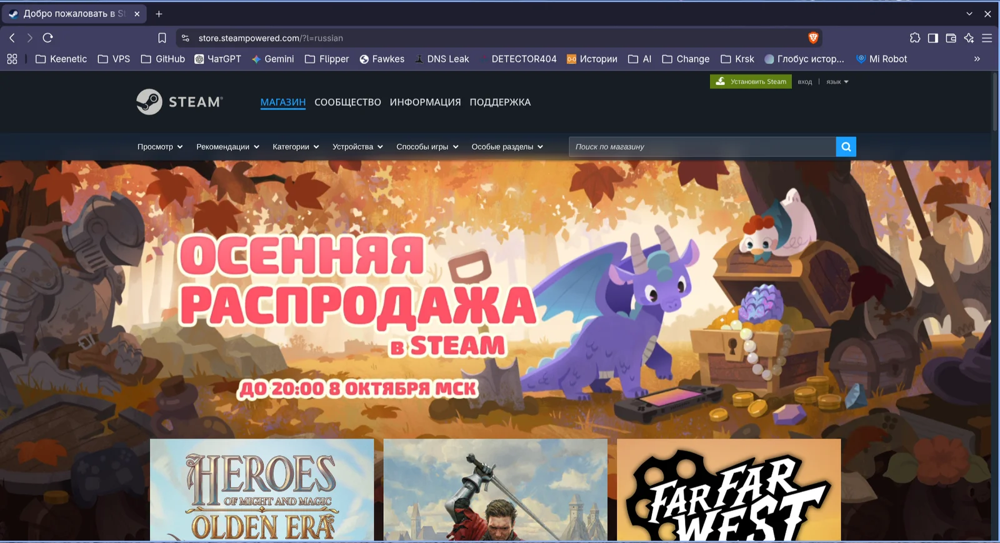
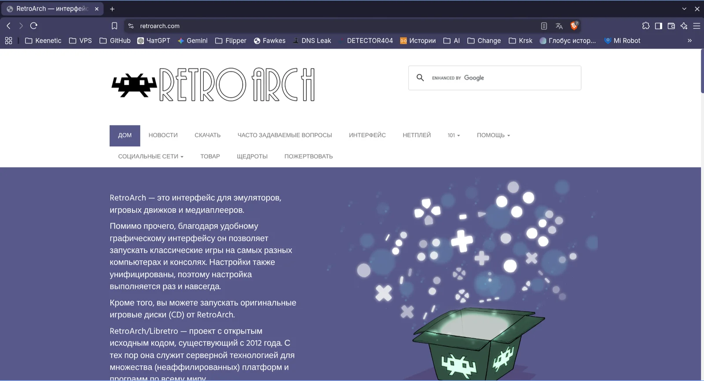
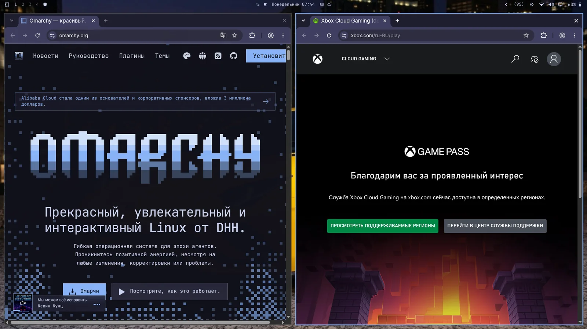
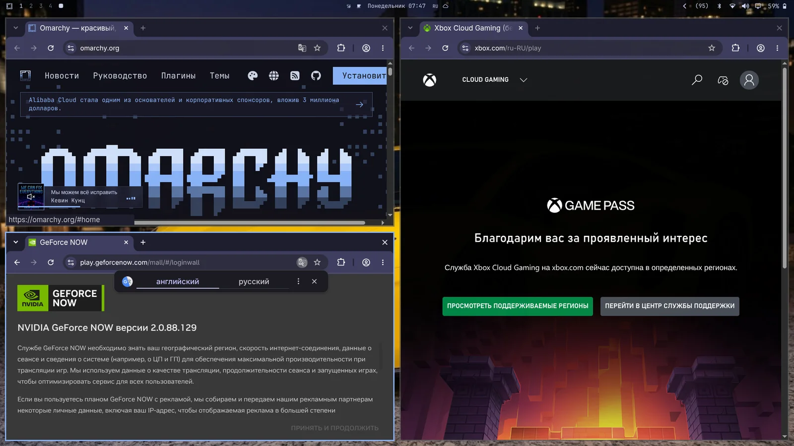
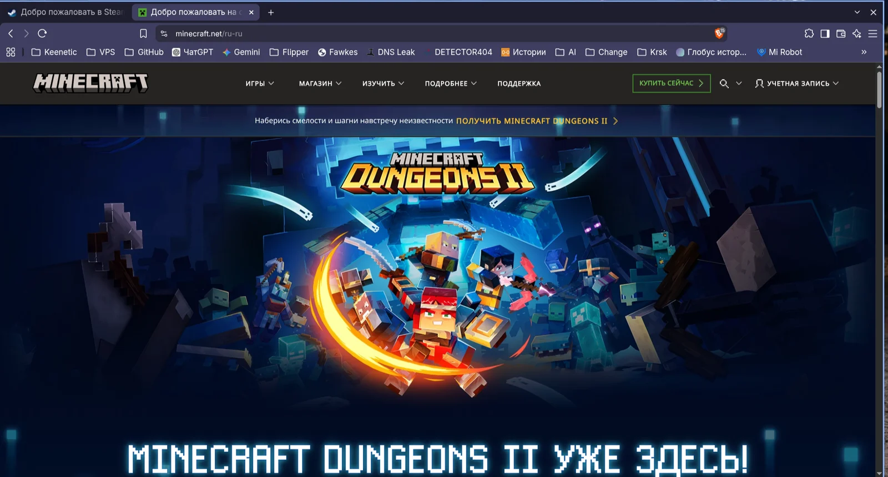
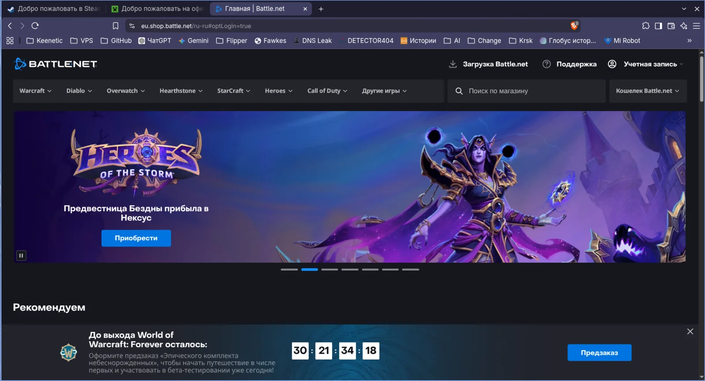

# Гейминг

Omarchy — не только про _пРоДуКТиВнОсТь_, но и про кайф, а что кайфовее гейминга? В Omarchy целый сьют игровых опций — Steam и RetroArch под натив и ретро, Battle.net, Lutris и Heroic под не-стимовские сторы, Moonlight под стриминг с PC, Xbox Cloud Gaming + NVIDIA GeForce NOW под облака, плюс вечнозелёный Minecraft.

Спасибо невероятной работе Valve над [слоем совместимости proton](https://en.wikipedia.org/wiki/Proton_(software)) — на Linux играбельны десятки тысяч современных игр. О, а ты знал, что [Steam Deck](https://store.steampowered.com/steamdeck/) вообще едет на Arch!

Все игровые инсталяторы живут в _Установить > Игры_ в меню Omarchy (`Super + Space`). Откатить — в _Удалить > Игры_.

## Steam

Ставится [Steam](https://store.steampowered.com/) через _Установить > Игры > Steam_ в меню Omarchy (`Super + Space`).

Поставил — запуск Steam с `Super + Space`.

Учти: Steam может стартовать секунд 10–20 и никакого визуала, что грузится, не даст.

 

## RetroArch

Ставится [RetroArch](https://www.retroarch.com/) через _Установить > Игры > RetroArch_ в меню Omarchy (`Super + Space`). Едет с полным набором libretro-ядер — все классические системы покрыты.

RetroArch полностью преднастроен с красивущим CRT Royale-шейдером под тот самый ретро-лук.

Погнали:

1. Кинь BIOS-файлы в `~/Games/bios`, а ROMы — в `~/Games/roms`.
2. Запусти RetroArch с `Super + Space`, напечатав `retro`.
3. Проскань каталог `~/Games/roms` — можно играть.

Любимой игре можно дать свою запись в лаунчере через _Установить > Игры > RetroArch Game Launcher_: выбираешь ядро и ROM — и попадаешь прямо в игру из `Super + Space`.

 

## Xbox Cloud Gaming

Ставится веб-приложение Xbox Cloud Игры через _Установить > Игры > Xbox Cloud Игры_ в меню Omarchy (`Super + Space`). Это «просто» веб-приложение сервиса, но стартует быстро и отлично едет в 1080p.

Если уже есть Xbox Game Pass — годный способ играть в Fortnite и другие тайтлы, что нативно на Linux не бегут.

 

## NVIDIA GeForce Now

Ставится облачный гейминг [NVIDIA GeForce NOW](https://www.nvidia.com/en-us/geforce-now/) через _Установить > Игры > NVIDIA GeForce NOW_ в меню Omarchy (`Super + Space`). Ещё один отличный способ играть в тайтлы, которых нативно на Linux нет.

 

## Minecraft

Ставится Minecraft через _Установить > Игры > Minecraft_ в меню Omarchy (`Super + Space`).

Как Steam: учти, после логина или старта до следующего экрана может пройти время — и никакого фидбека в ожидании не будет.

 

## Геймпады Xbox

Поддержка Bluetooth-геймпадов Xbox ставится через _Установить > Игры > Xbox Controllers_ в меню Omarchy (`Super + Space`). Пейришь геймпады по Bluetooth (`Super + Ctrl + B`) — и они работают во всех играх. Не надо, если геймпад воткнут проводом по USB-C.

## Moonlight (стриминг игр с PC)

[Moonlight-клиент](https://github.com/moonlight-stream/moonlight-qt) предустановлен в Omarchy — стримишь игры с Windows-PC на [Sunshine](https://app.lizardbyte.dev/Sunshine/) сразу. Запуск Moonlight с `Super + Space`.

Если и машина Omarchy, и удалённый игровой PC на проводах — ощущения неотличимы от локальной игры. Крути резу до нативной, рефреш на 120Hz, битрейт в максимум — лучший способ играть в соревновательные шутеры вроде Fortnite на Linux.

Машину Omarchy можно превратить и в хост: прогони `omarchy install service sunshine` — поставит Sunshine и откроет Moonlight-порты стриминга под LAN и Tailscale.

## Battle.net

Ставится [Battle.net](https://eu.shop.battle.net/en-us) через _Установить > Игры > Battle.net_ в меню Omarchy (`Super + Space`). Даст тайтлы вроде Diablo, Starcraft и World of Warcraft отдельным инсталлом под GE-Proton — без Steam, Lutris и Heroic.

 

## Lutris (игры Windows)

Ставится [Lutris](https://lutris.net/) через _Установить > Игры > Lutris_ в меню Omarchy (`Super + Space`). Lutris — способ играть в игры Окна из сторов вроде EA и Ubisoft Connect, у которых своего инсталятора выше нет.

Установка слегка джанки и временами выглядит, будто ничего не происходит, — просто потерпи, в фоне работает.

## Heroic Launcher (Epic Games)

Ставится [Heroic Launcher](https://heroicgameslauncher.com/) через _Установить > Игры > Heroic (Epic Games)_ в меню Omarchy (`Super + Space`). Heroic гоняет тайтлы Epic Games вроде OddSparks, что без античита, — плюс игры GOG и Amazon Prime Игры. Увы, это значит без Fortnite и Rocket League — пока Тим Суини не придёт на Linux, ближе не будет.

Как Lutris: при установке игр может казаться медленным и джанки. Дай время.
