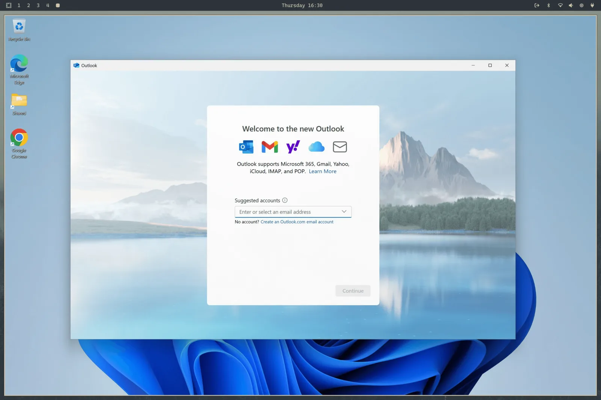

# Windows VM

В Omarchy лёгкий способ гонять Окна через Docker VM. Ставится через _Установить > Окна_ в меню Omarchy (`Super + Space`).

Машине нужна KVM-виртуализация — у большинства есть, но иногда выключена в BIOS, и инсталлер так и скажет. И место на диске захочется: сколько отдашь Windows, плюс гигов 10 на сам образ.

Инсталлер спросит, сколько RAM, сколько ядер CPU и сколько диска отдать (64GB и выше — разумный минимум), потом юзернейм и пароль Windows. Оставишь пустыми — получишь `docker` / `admin`. Скачивание долгое — 10–15 минут норма — а прогресс смотрится в браузере на `http://127.0.0.1:8006`. Браузер спросит те же юзернейм с паролем, прежде чем открыть консоль.

 

## Пользование

Поставилась — запускай _Окна_ из лаунчера. Это стартует VM, если ещё не бежит, и цепляет тебя по RDP в полный экран. На холодную дай 15–30 секунд.

RDP-сессия несёт звук, твой микрофон и общий буфер — копирование текста между Linux и Windows просто работает. Резолюция ходит за окном, а Omarchy пробрасывает твой дисплейный скейлинг — так что на HiDPI-экране не мыльная каша.

Закроешь RDP-окно — VM гаснет сама. Хочешь оставить бежать — скажем, там что-то воркает — запускай через `omarchy windows vm launch --keep-alive` вместо этого.

Остальные контролы на той же команде:

```bash
omarchy windows vm status    # is it running?
omarchy windows vm stop      # shut it down
omarchy windows vm launch    # start and connect
```

## Шаринг файлов

Каталог `~/Windows` в домашнем каталоге шарится в VM автоматом. Клади туда файлы, чтобы были доступны Windows. К остальной файловой системе у VM доступа нет — с виндовой стороны ничего гадкого не пролезет. Её собственный виртуальный диск лежит в `~/.windows`.

Те знакомые домашние пути сидят на своих файловых системах. Могут быть и симлинками на каталоги, которыми владеешь, — удобно, когда виртуальный диск живёт на диске побольше. Инсталлер меряет свободное место на файловой системе, где реально лежит `~/.windows`, — не обязательно на той, где домашний каталог.

Держи дисковый и шареный пути отдельными непересекающимися каталогами. Снос осознанно вычищает дисковый каталог, а шареный бережёт. Прямо перед удалением Omarchy делает bounded containment check и отказывается сносить что-либо, если проверка таймаутит или не может доказать, что деревья раздельные.

Перед стартом VM Omarchy открывает и пинит оба каталога, потом хоткей-маунтит точные иноды каталогов на приватные пер-юзерные якоря под `/var/lib/omarchy/windows/mounts`. Docker видит только те рут-защищённые якоря. Так кастомные места дисков сохраняются, а другой процесс от тебя не подменит проверенный путь, пока привилегированный контейнер его ест. Существующие дисковый и шареный каталоги при миграции поджимаются до mode `0700`, чтобы другие локальные аккаунты не бродили по содержимому.

Порты VM висят только на localhost — из сети до виндовой машины никто не дотянется. Веб-консоль тоже требует настроенные виндовые юзернейм с паролем — другой локальный аккаунт не погоняет VM через порт 8006.

## Лимиты и лицензирование

GPU-пасстру тут нет — под гейминг или видеомонтаж не годится. Отличный способ гонять Microsoft Office или что там ещё кровь из носу надо.

Ставится Windows 11 Pro, неактивированная. Под гейтед-фичи понадобится свой ключ.

Если компьютер приехал с Windows — OEM-ключ так и сидит в прошивке даже после установки Omarchy. Печатается через `omarchy windows key`. Тот ключ привязан к этой машине: активирует переставленную на этом железе Windows, а VM обычно не активирует.

Распределение ресурсов меняется позже перепрогоном `omarchy-windows-vm install` — перепишет конфиг VM из твоих ответов. Сам compose-файл теперь живёт в `/var/lib/omarchy/windows/docker-compose.yml` и принадлежит руту — так задумано: процесс от тебя не перепишет его и не заставит привилегированный подъём примонтить весь твой диск в контейнер. Ручки править надо (например, чтобы примонтить USB-девайс) — правь через `sudo`, все опции — на [проекте Dockur Windows](https://github.com/dockur/windows).

Снести всё целиком — через _Удалить > Окна_ в меню Omarchy. Это удаляет диск VM и все его данные — так что всё дорогое вытащи из `~/Windows` сначала.
