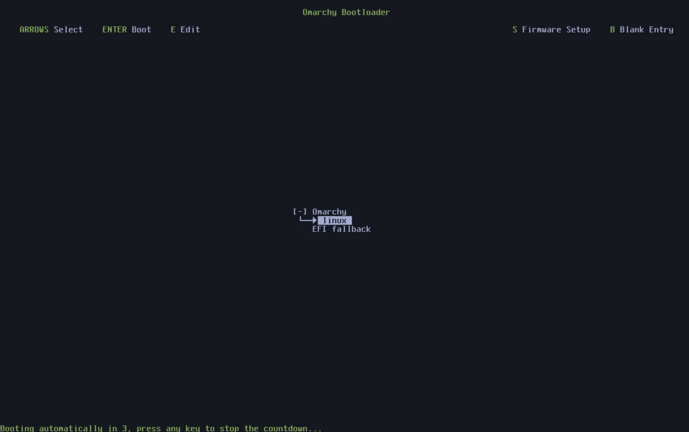

# Обновления

Omarchy и пакеты держатся свежими через _Обновить > Omarchy_ в меню Omarchy (`Super + Space`).

Сама Omarchy стоит обычными pacman-пакетами из [репозитория пакетов Omarchy](https://github.com/omacom-io/omarchy-pkgs) — так что обновление ставит [последний релиз Omarchy](https://github.com/omacom/omarchy/releases), прогоняет висящие миграции, чтобы свести систему с последним, и обновляет все системные пакеты из [арч-зеркала Omarchy](https://github.com/omacom-io/omarchy-mirror) и [AUR](https://aur.archlinux.org/) (если AUR-пакеты ставил).

Как выйдут новые релизы — справа от часов появится иконка круговой стрелки. Кликни — стартует процесс обновления.

### Четыре канала

Omarchy обновляется по четырём каналам: stable, RC, edge и dev. Новые установки стартуют на stable — он трекает [официальные релизы](https://github.com/omacom/omarchy/releases/) и [стабильное арч-зеркало Omarchy](https://github.com/omacom-io/omarchy-mirror), которое едет на месяц позади последнего, — так ловим новые несовместимости, требующие правок конфигов, раньше, чем они устроят проблемы людям.

А хочешь помогать ловить такие потенциальные проблемы — едь на edge-канале. Он держит пакеты Omarchy на последних дев-сборках и даёт обновляться до последних арч-пакетов, как только вышли. Так стоит, только если опытен в Linux и знаешь, как поднимать систему с проблемами.

Перед каждым крупным релизом делаем финальную валидацию на RC-канале. Интересно помочь с финальным полишем — заходи в #omarchy-release-candidates в Discord.

Наконец, есть dev-канал: он линкует Omarchy прямо на git-чекаут исходников в `~/omarchy` вместе с edge-пакетами. Этот канал — только если опытный линуксоид, работаешь прямо на Omarchy и готов терпеть поломки.

Между каналами переключаешься через _Обновить > Канал_ в меню Omarchy (или `omarchy-channel-set` в терминале).

### Обновления прошивок

Протухают не только пакеты. Многие ноуты и периферия везут BIOS, SSD и док-прошивки через Linux Vendor Прошивка Сервисы, а _Обновить > Прошивка_ в меню Omarchy подтянет и поставит то, что твоё железо ждёт. В первый прогон ставит `fwupd`. Кучу прошивок пишется только через ребут — не удивляйся, если попросят.

### Ворнинг про прямые pacman/yay-обновы

Знаком с Arch — руки потянутся просто прогнать `pacman -Syu` или `yay -Syu` самому, но так пропустишь снапшот, миграции и апдейты конфигов, которые Omarchy гоняет вместе с новыми пакетами. Потому Omarchy прямо стопарит прямое обновление системы и показывает на `omarchy update` вместо. (Если реально знаешь что делаешь — гард скажет, как обойти на одну транзакцию.)

### Откат плохих обнов

Глюкнуло после обновы — систему можно откатить на снапшот, снятый до неё. Просто ребутнись и выбери в загрузочном меню снапшот до старта обновы.

Если каким-то образом побились конфиги — можно и переустановить Omarchy через `omarchy reinstall` в терминале. Переустановит все дефолтные пакеты Omarchy, посадит на stable и даунгрейднет слишком новые пакеты, а конфиги сбросит. Учти: все твои юзерские правки дефолтов Omarchy при этом затрутся!
