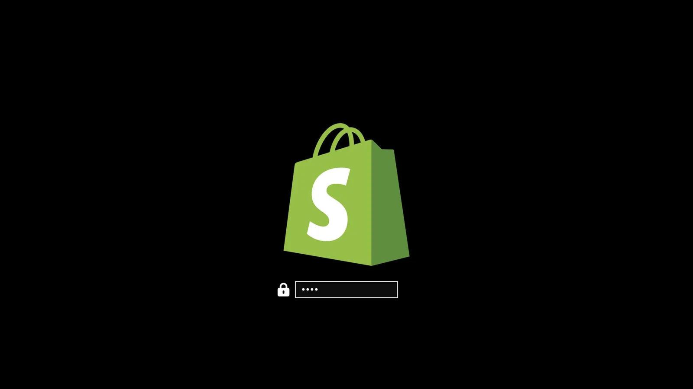
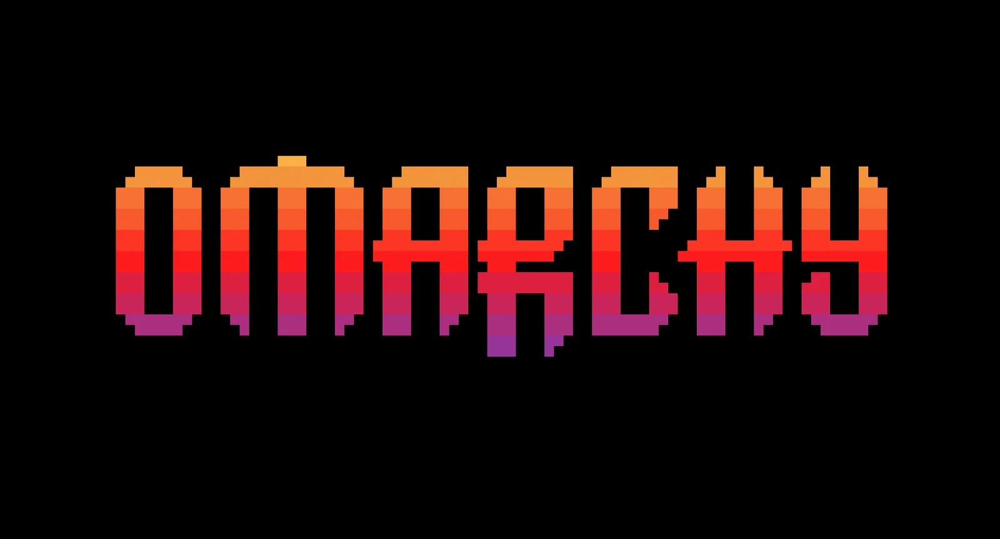
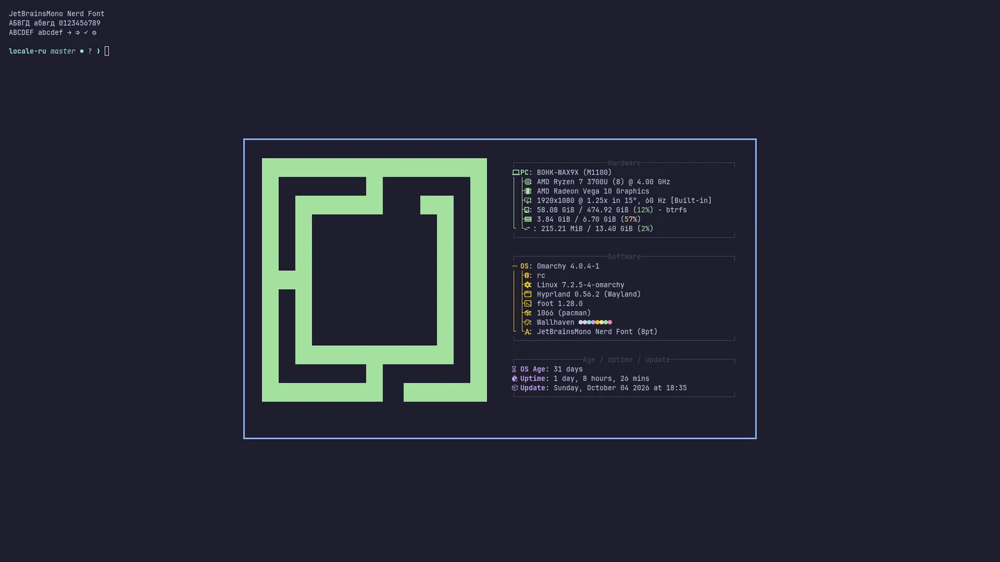

# Брендинг

В Omarchy ставится свой логотип компании или личная картинка — и на boot-анлок, и на скринсейвер, и на экран about.

### Boot-анлок

Через `omarchy plymouth preview` смотрится, как встанут кастомные лого и цвета. Берёт цвет фона, цвет текста, лого-png и путь превью-картинки:

```
omarchy plymouth preview '#1d2021' '#ebdbb2' logo.png preview.png
```

Применяется сетап через `omarchy plymouth set '#1d2021' '#ebdbb2' logo.png` — заодно те же цвета с лого отдадутся экрану логина SDDM. Откатить — через `omarchy plymouth reset`.

 

### Скринсейвер

Лого под скринсейвер меняется в _Оформление > Заставка_. Это ASCII-лого — текст правится прямо, а можно скормить png или svg картинку — сконвертим в ASCII. Выглядит довольно клёво.

 

В том меню три записи:

- **Edit Text** открывает `~/.config/omarchy/branding/screensaver.txt` в твоём редакторе. Печатай или вставляй что хочешь — ASCII-арт, своё имя, грубое слово. Сохранил-вышел — скринсейвер стартует сразу, смотрится.
- **Set From Image** открывает файликер под png или svg, конвертит в ASCII и кажет результат. Лого с чётким силуэтом работают сильно лучше фоток.
- **Restore Default** возвращает лого Omarchy.

### Экран About

Те же три опции — в _Оформление > About_ под экран _About_ из меню Omarchy, и работают идентично: файл — `~/.config/omarchy/branding/about.txt`, а окно About всплывает после каждой правки. About-арт конвертится мельче скринсейверного — ему в окно влезать, а не дисплей заливать.

Пока окно открыто, по арту каждые несколько секунд проскальзывает зелёный блик и снова оставляет его в покое. Свой арт его тоже получит, если каждый символ в нём в одну колонку шириной, — всё, что даёт _Set From Image_, такое. Арт из эмодзи или double-width символов стоит still, и экран стоит still, если держишь свой fastfetch-конфиг: still-лого в тех случаях — анимация уступает дорогу, а не падает, потому что слайдить блик по ним — уронить остаток строки не туда.

 

### Конверт картинок сам

Оба _Set From Image_ внутри просто зовут `omarchy transcode ascii` — можно гнать напрямую, если нужен контроль над конвертом:

```
omarchy transcode ascii ~/logo.svg ~/.config/omarchy/branding/screensaver.txt --width 100
```

Берёт `--width` и `--height` в терминальных колонках и строках, `--mode` либо `braille` (дефолт, сильно тоньше), либо `block`, `--threshold`-процент, решающий какие пиксели зачесть за лого, и `--invert` под светлое лого на тёмном фоне. Если конверсия вылезла пятном — первым делом крути порог.

### Слова вместо лого

`omarchy ascii` рисует текст в Delta Corps Priest 1 — FIGlet-шрифте, которым нарисован сам вордмарк Omarchy. Так скринсейвер может говорить что-то, а не казать картинку:

```
omarchy ascii "Back in five" > ~/.config/omarchy/branding/screensaver.txt
```

Текст берёт аргументами, а нет их — читает из пайпа. Шрифт несёт буквы и пробелы только — рисовался без цифр и пунктуации — так что остальное дропается и называется в stderr, а не тихо глотается.
