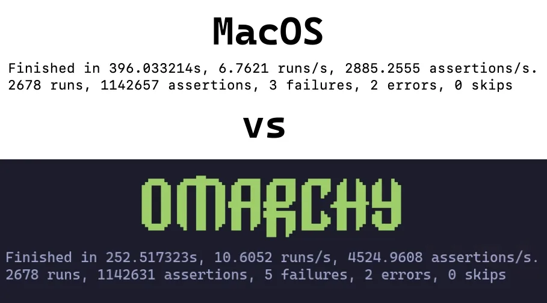

# Поддержка Mac

В Omarchy встроенная поддержка **Intel Mac**. Пара известных лимитов на сейчас, но если в курсе и ок — вдохнёшь новую жизнь в старые Маки, налив Omarchy.

Учти: установка на Mac с M-серией прямо сейчас напрямую не поддерживается. Про состояние — в #omarchy-on-other в нашем [Discord](https://discord.gg/tXFUdasqhY).

В простом тесте выжали 36% прироста перфа на MacBook Pro 2019, просто поставив Omarchy.

 

### Установка Omarchy на Mac

Omarchy на сейчас умеет быть **единственной** ОС. При установке диск вайпается, и MacOS больше не загрузится.

Восстановить позже можно через Internet Recovery, если захочешь.

Для этой части считаем, что [Начало работы](02-getting-started.md) уже прочитано и флешка готова. Нет — иди сделай сейчас.

#### Выключить Secure Boot

Без выключения эппловского Secure Boot ни загрузочная флешка, ни ОС не загрузятся. Выключается так:

1. Выключи Mac
2. Включи и _немедленно_ жми и держи Command-R, пока не покажется экран загрузки
3. Выбери юзера и введи пароль если спросит
4. На экране рекавери выбери **Utilities > Startup Security Utility** в менубаре
5. Введи пароль, когда попросит аутентификацию
6. Выбери "No Security" в опциях Secure Boot
7. Выбери "Allow booting from external or removable media" в опциях External Boot

#### Старт установки

1. Воткни USB-флешку
2. Ребутни Mac и _немедленно_ жми и держи Option, пока не покажется экран загрузочных девайсов
3. Выбери оранжевый EFI Boot девайс
4. Дальше [ставь как обычно](02-getting-started.md)

Инсталлер чует железо Mac и накатывает нужные фиксы сам: Broadcom Wi-Fi драйверы с прошивкой, SPI-драйвер клавы на моделях MacBook, которым надо, и NVMe-фикс суспенда тем же моделям.

### Известные лимиты

Члены комьюнити постоянно пилят решения этих челленджей — если что-то из этого проблемно, заходи в #omarchy-on-other в нашем [Discord](https://discord.gg/tXFUdasqhY) за свежаком по способам разрулить.

#### Девайсы с чипом T1

Чип Apple T1 вышел в конце 2016 и стоял эксклюзивно в первом поколении MacBook Pro с Touch Bar.
- MacBook Pro 13-inch (2016, two Thunderbolt 3 ports) – Model: A1706
- MacBook Pro 13-inch (2016, four Thunderbolt 3 ports) – Model: A1708
- MacBook Pro 15-inch (2016) – Model: A1707

#### Известные ишью

- Touch Bar не функционален
- Звук не работает

#### Девайсы с чипом T2

Чип Apple T2 Security вышел в 2017. Чип T2 снят с переходом на Apple silicon (M-чипы) с 2020.
- iMac Pro (2017) – Model: A1862
- MacBook Pro 13-inch (2018, four Thunderbolt 3 ports) – Model: A1989
- MacBook Pro 15-inch (2018, four Thunderbolt 3 ports) – Model: A1990
- MacBook Air (Retina, 13-inch, 2018) – Model: A1932
- Mac mini (2018) – Model: A1998
- MacBook Pro 13-inch (2019, two Thunderbolt 3 ports) – Model: A2159
- MacBook Pro 13-inch (2019, four Thunderbolt 3 ports) – Model: A2178
- MacBook Pro 15-inch (2019, four Thunderbolt 3 ports) – Model: A1990
- MacBook Pro 13-inch (2020, two Thunderbolt 3 ports) – Model: A2265
- MacBook Pro 15-inch (2020, four Thunderbolt 3 ports) – Model: A1990

На этих моделях инсталлер автоматом ставит пропатченное ядро `linux-t2`, T2-аудио-конфиг, Broadcom Wi-Fi/Bluetooth прошивки Apple и контроль вентилей через `t2fanrd`. Тачбар едет на встроенной в ядро поддержке в стиле Boot Camp.
