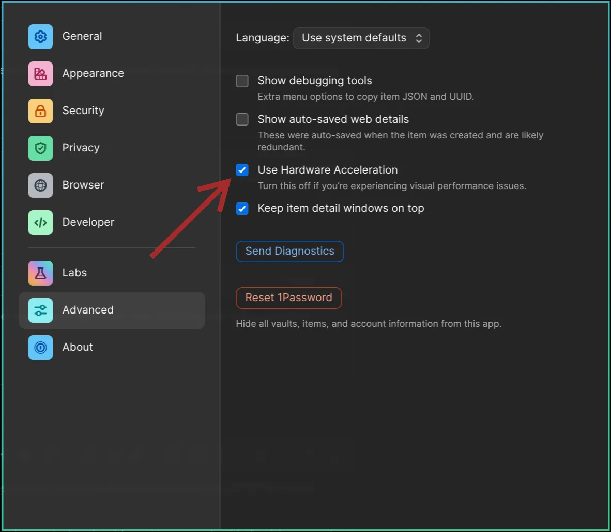

# Траблшутинг

### Систему сломало обновлением!

Сначала попробуй [откатить систему](47-system-snapshots.md) на версию до недавней обновы. Не помогло — прогони `omarchy-debug`, чтобы поделиться проблемой в #omarchy-help в Discord. А если и это мимо — дефолтные конфиги с пакетами переустанавливаются через `omarchy-reinstall`.

### Чего некоторые приложения такие крупные на дисплее?

Omarchy считает 2x hi-res дисплей — под него в `~/.config/hypr/monitors.lua` ставится `GDK_SCALE` в 2. А на 1x-дисплее поменяй `local omarchy_gdk_scale = 2` на 1 (и ребутни оверсайзнутые приложения). См. [мануал по мониторам](33-monitors.md).

Под Spotify жми `Ctrl + Minus` — ужать UI (а `Ctrl + Plus` — увеличить).

### Чего не работает Caps Lock?

В Omarchy Caps Lock назначен xcompose-клавишей. Так делаются [быстрые эмодзи](07-hotkeys.md#быстрые-эмодзи) и [прочие автоподстановки](07-hotkeys.md#быстрые-подстановки). Реально скучаешь по Caps Lock — перевесь xcompose-клавишу в другое место правкой `~/.config/hypr/input.lua`: скажем, на правый альт:

```
hl.config({
  input = {
    kb_options = "compose:ralt",
  },
})
```

### Вайфай, блютуз, звук или тачпад только что сдохли

Раньше ребута попробуй перезапустить глючащий кусок отдельно. В _Обновить > Оборудование_ в меню Omarchy лежат Wi-Fi, Bluetooth, Audio и Trackpad — перезагрузка одного чинит большинство «пять минут назад работало»: блютуз-гарнитура не переконнекчивается, тачпад сдох после суспенда, звук пропал когда выдернул монитор.

### Чего внешние колонки не играют?

Наверное, не выставлены первичным выходом. Кликни иконку динамика справа в панели — откроется попап громкости, где выбирается устройство вывода (и миксы по приложениям тоже).

### Звук ноутбучных динамиков кривой

На некоторых ноутах Omarchy автоматом применяет тюнинг динамиков, правящий АЧХ встроенных. `omarchy audio tuning status` скажет, висит ли такой на твоей машине, а `omarchy audio tuning off` выключит, если хочешь слышать динамики сырыми.

### Чего не логинится и не sudoится по паролю?

Наверное, накосячил с вводом слишком много раз и залочился. Если это на локскрине — жми `Ctrl + Alt + F2` под новый TTY, логинься рутом и прогоняй `faillock --reset --user [твой-юзернейм]`. Сбросит локаут — и погнали.

### Чего не вылезают промпты авторизации 1Password под 1Password SSH Agent / CLI?

Причин бывает 2:

Чтобы богатый промпт одобрения показался, в Settings > Advanced > Use Hardware Acceleration должно быть включено. _Учти: надо ребутнуться, чтобы заработало._

 

А не запускал 1Password с загрузки — промпт не покажется.
