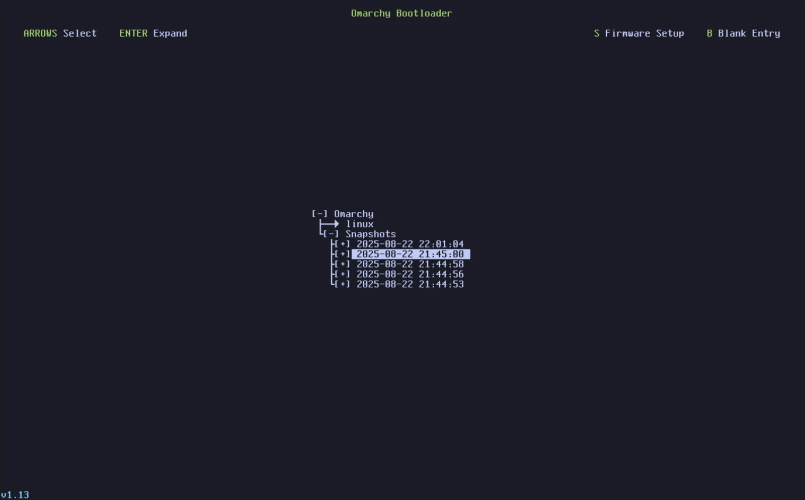
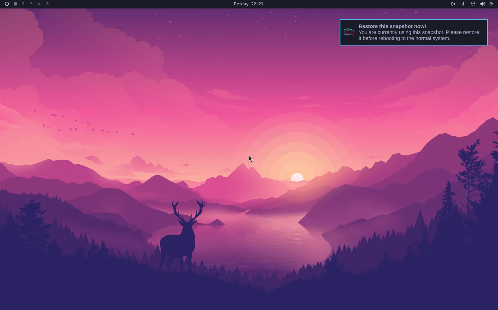

# Системные снапшоты

Снапшоты снимаем автоматом при каждом обновлении Omarchy, а захочешь свой — `omarchy-snapshot create`.

Загрузиться и откатиться в снапшот — выбрать его в загрузчике Limine. (Если сейчас загружаешься сразу в экран расшифровки диска Omarchy — выбери Limine вариантом загрузки через BIOS сначала.)

На том экране выбираешь снапшот, в который грузиться, по дате и версии. Версия Omarchy на момент снапшота видна в левом нижнем углу.

 

Внутри прилетит уведомление, что сидишь в загружаемом снапшоте, — клик по нему стартанёт процесс восстановления. А можно и через `omarchy-snapshot restore`.

 

Откатит корневую файловую систему, но не `/home`. То есть сносит сломанное системное обновление, но потерянные личные файлы не вернёт.

А значит, и каталог `~/.config` остаётся как был. Так что откатываясь на раннюю версию библиотеки или приложения, что хранит конфиги в новом формате, — разруливай руками.

_Учти: фича только на установках с загрузчиком Limine — дефолт со времён Omarchy 2.0. На GRUB или systemd-boot её нет._

### Пропуск boot-меню

Меню загрузки не трогаешь вообще и хочешь, чтобы машина шла сразу на экран расшифровки диска, — прогони _Настройки > Прямая загрузка_ в меню Omarchy. Добавит EFI-запись прямо на Omarchy — прошивка грузит её, не останавливаясь на Limine.

Компромисс тот, что вверху: с прямой загрузкой дорога к снапшоту лежит через выбор Limine в boot-меню BIOS сначала. Прогони _Настройки > Прямая загрузка_ ещё раз — запись снесётся, вернёшься к загрузке через Limine. Некоторые прошивки косо смотрят на кастомные EFI-записи — сетап отказывается бежать на прошивках American Megatrends и Apple.
