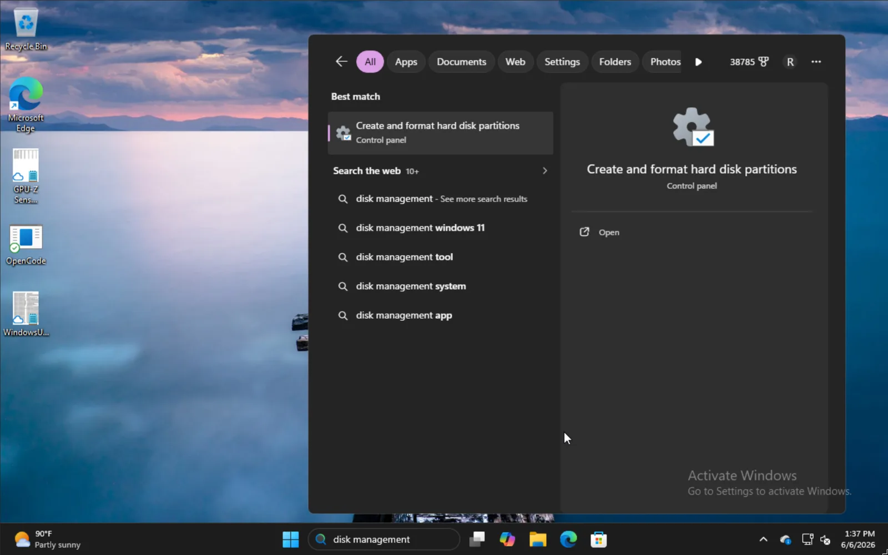
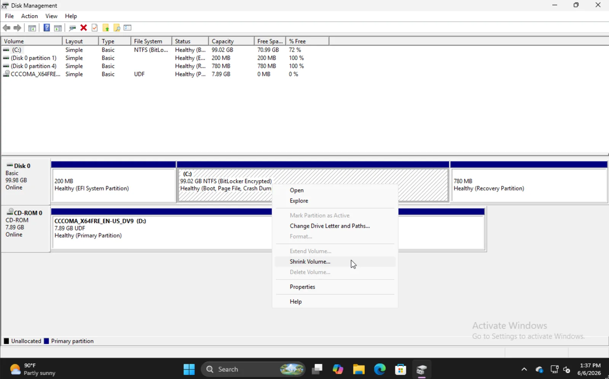
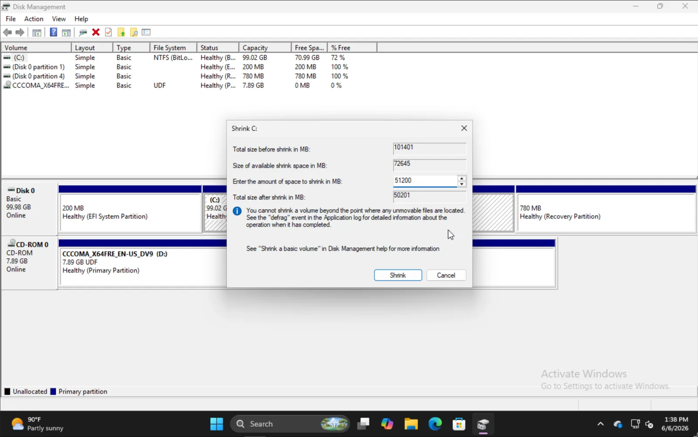
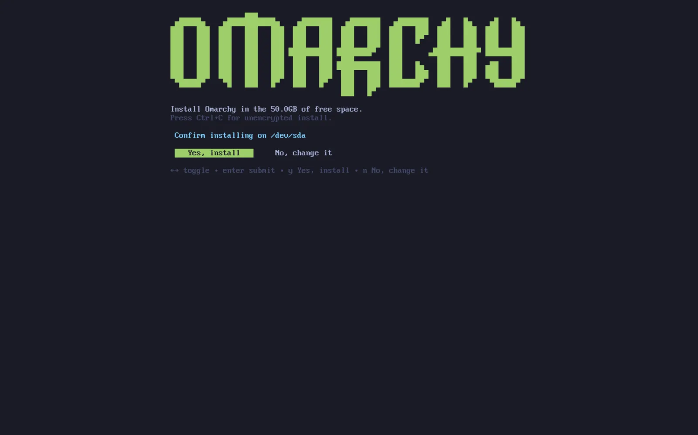

# Дуалбут-установка

Omarchy ставится на один раздел рядом с Windows или другими установками.

Этот способ установки всё равно идёт с LUKS-шифрованием раздела по умолчанию — фактически не отличается от всего диска, просто нужно свободное место на диске.

## Место под Windows

Чтобы встать рядом с Windows, напечатай `disk management` в стартовом меню и выбери опцию **Create and format hard disk partitions**.

 

Найди подходящий раздел, правый клик — **Shrink Volume**.

 Вбей объём, на который ужаться. Учти: это будет размер будущей установки Omarchy вместе с загрузочным разделом.

 

Как закончишь — увидишь что-то вроде этого, где секция на 50GB — там в примере встанет Omarchy.

 

## Установка Omarchy

Процесс установки Omarchy фактически тот же, что обычно. Выбрал диск — дадут опцию **Free space install**. Выбери её, чтобы не вайпать весь диск.

 

Подтверди, что всё хорошо, и жди конца установки как обычно. Тут же можно выбраться ставить нешифрованно (не рекомендуется) — как на установке на весь диск.
 

## Другие установки в загрузчик

Как закончишь установку Omarchy — заметишь, что загрузчик Limine теперь дефолт. Туда же добавляются опции под другие твои установки вроде Windows.

Для этого прогони `limine-scan` и иди по промптам, добавляя что хочешь в свой limine-конфиг. Потом при загрузке увидишь обычные опции Omarchy и Windows Boot Manager или другие.

## Битлокер

Важно: этот способ установки несовместим с Bitlocker — он шифрует весь диск, а не раздел. Вылезла ошибка, что Bitlocker включён, — грузись в Windows, иди в **Settings -> Privacy & Security -> Device encryption** и туши Bitlocker. Расшифровка диска может занять время.

 
