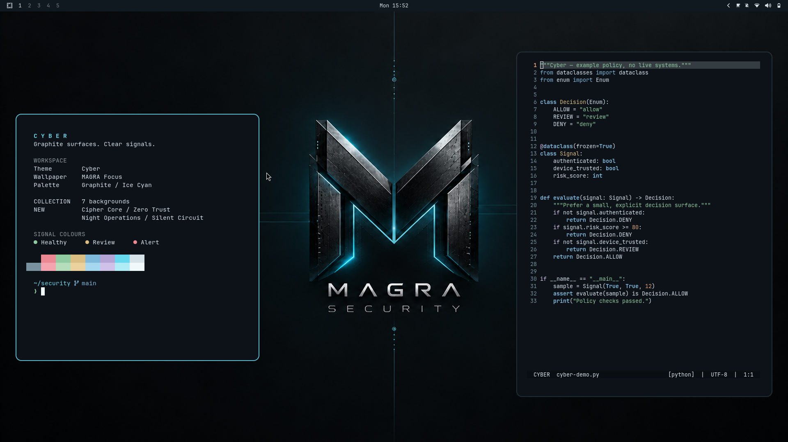

# Cyber

A quiet cybersecurity theme for Omarchy 4. Graphite surfaces, ice-cyan accents and four original, unbranded wallpapers plus three retained MAGRA wallpapers inspired by cryptography, segmented networks and computing infrastructure.



## Install

```sh
omarchy theme install https://github.com/bifrost0x/omarchy-cyber-theme
```

Or paste the repository URL into **Install → Style → Theme**, then choose **Cyber**. Switch between the seven wallpapers through **Style → Background**.

## Wallpapers

| Wallpaper | Design |
| --- | --- |
| **[MAGRA Focus](backgrounds/00-magra-focus.png)** — default | The existing graphite MAGRA monogram wallpaper |
| **[MAGRA Night](backgrounds/01-magra-night.png)** | The darker MAGRA alternative |
| **[MAGRA City](backgrounds/02-magra-city.png)** | The original cinematic MAGRA city scene |
| **[Cipher Core](backgrounds/03-cipher-core.png)** | A dark titanium cryptographic core and delicate cyan data paths |
| **[Zero Trust](backgrounds/04-zero-trust.png)** | Glass network nodes, fine filaments and an isolated central cluster |
| **[Night Operations](backgrounds/05-night-operations.png)** | A monumental subterranean server vault |
| **[Silent Circuit](backgrounds/06-silent-circuit.png)** | Restrained graphite silicon and a travelling cyan signal |

The four new Cyber wallpapers contain no company logos, slogans or lettering. The three MAGRA designs remain available by request, and **MAGRA Focus remains the default**. Each is supplied at **3840 × 2400** for 16:10 screens; Omarchy crops to fill other aspect ratios. The four new images were created with the built-in image generator at 1586 × 992 and exported with Lanczos upscaling; the three existing wallpapers are retained byte-for-byte. They are not native 4K renders.

## Palette and surfaces

| Role | Colour |
| --- | --- |
| Background | `#0d1218` |
| Foreground | `#d6e3e9` |
| Accent | `#67d8ed` |
| Selection | `#234552` |
| Success | `#8fcaa0` |
| Warning | `#d9bd82` |
| Error | `#ec8894` |

Omarchy generates terminal, editor and application colours from `colors.toml`. Matching shell surfaces cover the bar, menus, launcher, notifications and lock screen. Abstract circuit artwork is available for **Style → Unlock**; the preview is rendered with Omarchy's own preview renderer.

The theme contains appearance data only. It does not install startup scripts, terminal banners, window-management overrides or authentication code. The desktop preview uses ordinary terminal output and a public example file.

## Compatibility

Checked on Omarchy 4.0.4-1 / Hyprland 0.56.2 and the upstream template engine recorded in [VALIDATION.md](VALIDATION.md). Omarchy 3 is not supported by this release.

## Releases and provenance

Version 1.1.0 introduces the **Cyber** name and adds four unbranded wallpapers alongside the three original MAGRA backgrounds. The original v1.0.0 remains in Git history for existing installations. See [ARTWORK.md](ARTWORK.md) for origins and [LICENSE](LICENSE) for the MIT license and upstream attribution.
