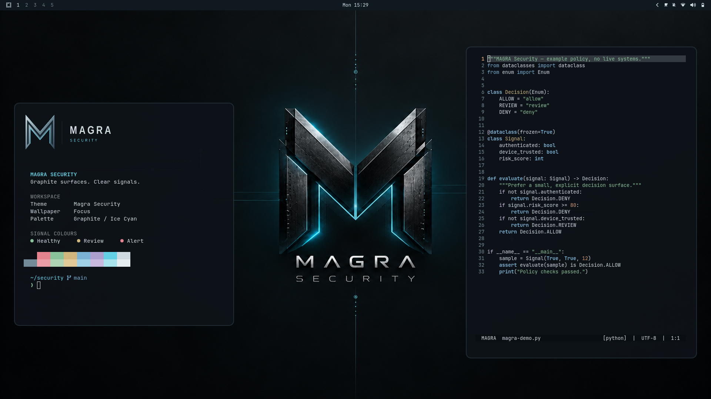

# MAGRA Security

A quiet cybersecurity workspace: graphite surfaces, ice-cyan accents, a metallic monogram, and readable application colours. Built for Omarchy 4.



## Install

```sh
omarchy theme install https://github.com/bifrost0x/omarchy-magra-security-theme
```

Alternatively, paste the repository URL into **Install → Style → Theme**. Choose **Magra Security** in the theme picker. Switch wallpapers through **Style → Background**.

## The complete visual theme

- **Focus** — the MAGRA monogram on a quiet graphite field. The first wallpaper.
- **Night** — a restrained, darker alternative.
- **City** — the original cinematic cybersecurity scene.
- Matching terminal, editor and application colours generated by Omarchy from `colors.toml`.
- Coordinated bar, menus, notifications, tooltips, launcher and lock-screen surfaces.
- Transparent MAGRA artwork for **Style → Unlock**, with a rendered preview.
- The editable vector wordmark and terminal artwork in `assets/`.

| Role | Colour |
| --- | --- |
| Background | `#0d1218` |
| Foreground | `#d6e3e9` |
| Accent | `#67d8ed` |
| Selection | `#234552` |
| Success | `#8fcaa0` |
| Warning | `#d9bd82` |
| Error | `#ec8894` |

The theme uses Omarchy's normal colour generation. It contains no startup scripts or custom authentication code. Installing it changes appearance; selecting a boot-unlock design remains an explicit Omarchy action.

## Resolution and artwork

The three wallpapers are 3840 × 2400 (16:10) exports. Omarchy crops them to fill 16:9 displays. They were generated with AI assistance and upscaled; they are not claimed to be native 4K renders. The vector terminal mark is separately drawn, so it stays sharp at arbitrary sizes.

The desktop preview is a real 1920 × 1080 Omarchy capture. The unlock preview is rendered using Omarchy's own preview renderer.

## Desktop additions

The author's complete workstation also uses a terminal banner, a compact prompt, animated wallpaper screensaver and borderless fullscreen below a persistent bar. Those behavioural additions are maintained separately from the installable visual theme. They are not prerequisites for this theme and are not installed by its theme command.

## Compatibility

Validated with Omarchy 4.0.4 and Hyprland 0.56.2, plus the current Omarchy template engine recorded in `VALIDATION.md`. Omarchy 3's older Waybar/Hyprlock configuration is not supported by this release.

## License and provenance

MIT; see [LICENSE](LICENSE). Original MAGRA artwork was prepared for this theme with the commissioning user's approval. Omarchy-derived configuration retains its upstream copyright notice. MAGRA naming identifies the design; redistribution does not imply endorsement by the brand or by Omarchy.

See [ARTWORK.md](ARTWORK.md) for the asset inventory and [VALIDATION.md](VALIDATION.md) for checks and limits.
