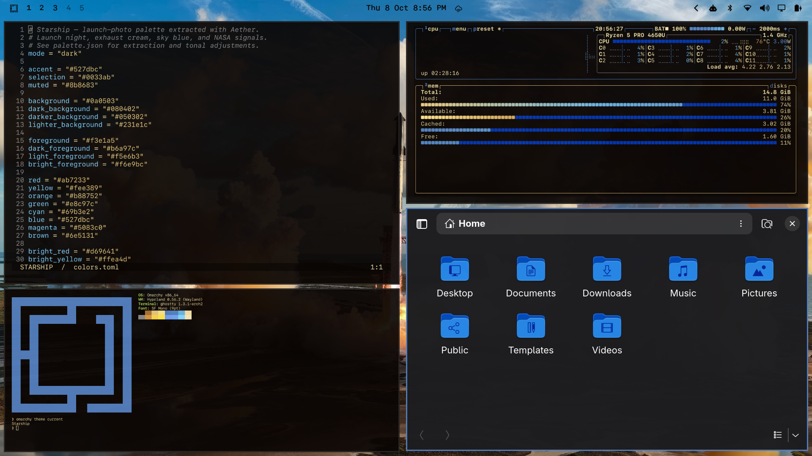

# Starship for Omarchy

Launch-night surfaces, exhaust cream, sky blue, and a little NASA. An Omarchy 4 theme with **28 wallpapers**: the 16 supplied SpaceX photographs and all 12 backgrounds from [Steve Derico’s Space theme](https://github.com/stevederico/omarchy-space-theme). Its **Starship launch** photograph is the default wallpaper and the source of the base palette.



## Install

```bash
omarchy theme install https://github.com/cube-one-ber/omarchy-starship-theme
```

The theme appears as **Starship** in Omarchy's theme picker. Select it through **Style → Theme**, or apply it with `omarchy theme set starship`.

Cycle the included wallpapers with:

```bash
omarchy theme bg next
```

## Palette

The base, text, accent, and ANSI colours come from **Aether 4.32.0**, using the default Starship launch photo imported from the Space theme. Theme generation runs with `--no-apply`, writing only to a temporary directory:

```bash
aether --extract-palette /path/to/0-starship-launch.jpg --json
aether --generate /path/to/0-starship-launch.jpg --no-apply --output /tmp/starship-palette
```

[`palette.json`](palette.json) preserves the extracted palette, generated variables, token mappings, and the earlier extractions from the original 16 photographs. Aether derives colours from image analysis and adjusts tones. Muted text uses its `--lighten` utility for readability.

| Colour | Hex | Role |
| --- | --- | --- |
| Launch night | `#0A0503` | Base background |
| Warm shadow | `#231E1C` | Raised surfaces and inactive borders |
| Exhaust cream | `#F3E1A5` | Foreground |
| Sky blue | `#527DBC` | Accent and active borders |
| Plume amber | `#AB7233` | ANSI red |
| Exhaust gold | `#E8C97C` | ANSI green |
| Sunlit steam | `#FEE389` | ANSI yellow |
| Sky cyan | `#69B3E2` | ANSI cyan |
| NASA blue / PMS 286 | `#0033AB` | Selection background |
| NASA red / PMS 185 | `#E60D2E` | Bar attention states |

The launch photo supplies the palette’s base. The small NASA accents use the Pantone designations and screen values in the [Artemis Generation Spacesuits guide, p. 35](https://www.nasa.gov/wp-content/uploads/2023/03/artemis-generation-spacesuits-508.pdf).

Normal ANSI text colours and muted text exceed 4.5:1 contrast on the launch-night background.

## Omarchy support

Uses Omarchy's semantic `colors.toml` format and its built-in app templates, like the stock themes. Omarchy generates the terminal, Hyprland, Neovim, Helix, btop, browser, and other supported app colours from the palette. `shell.bar.toml` sets a launch-night bar with NASA red attention states, and `icons.theme` selects Yaru blue icons. Neovim uses Omarchy's built-in Aether integration.

Requires **Omarchy 4.0 or later**, including support for `shell.*.toml` section overrides. The repository contains the palette and colour-only overrides; terminal configs and Lua files are generated by Omarchy on installation.

`preview.png` is a 1920 × 1080 screenshot of a real Omarchy session showing Neovim, Ghostty with Omarchy’s standard fastfetch logo, btop, and GTK4 Nautilus with only the standard home folders.

## Photography

The original 16 supplied SpaceX photographs retain their original dimensions, including the portrait photograph. All 12 Space theme backgrounds are also included at their supplied dimensions, with its `0-starship-launch.jpg` first in our cycling order as `00-starship-launch.webp`. Some shots appear in both collections as different-resolution variants.

The Space theme describes its 6K files as Topaz High Fidelity V2 upscales; Starship retains those supplied variants and adds no further AI processing. `7-starship.jpg` has an unknown original source in that repository, which is recorded in the manifest. Images are encoded as sRGB WebP without colour filters.

[`wallpapers.json`](wallpapers.json) records each source, dimensions, original and distributed checksums, and the pinned Space theme source commit. Omarchy fits the selected photograph to the display. See [photography credits](NOTICE.md).

Theme configuration and the custom icon are MIT licensed. The SpaceX photographs retain their original rights and are excluded from that licence. See [SpaceX's media policy](https://www.spacex.com/trademark) and [photography credits](NOTICE.md). This is an independent, non-commercial community theme.
